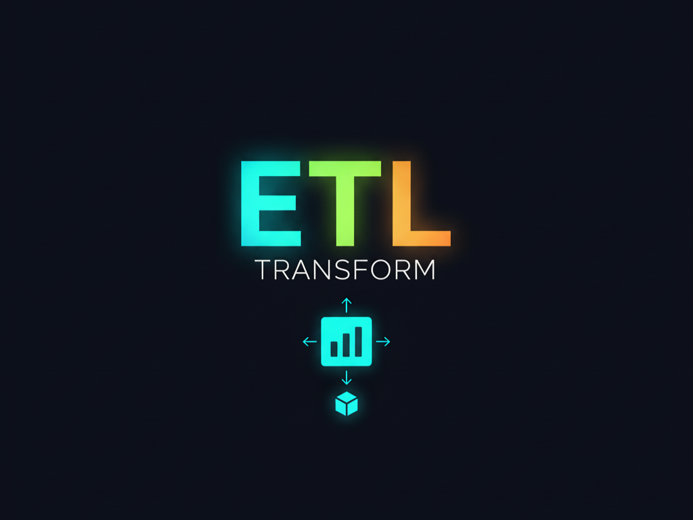

<!-- PORTFOLIO-FEATURED
title: Extrator de Dados ESL Cloud (ETL)
description: Sistema de automação ETL (Java) para extrair dados de 2 APIs (GraphQL, Data Export) do ESL Cloud e carregar em SQL Server, com sistema robusto de deduplicação, validação de completude e execução paralela resiliente.
technologies: Java 17, Maven, SQL Server (mssql-jdbc), Jackson, SLF4J, HikariCP
demo: N/A (Backend CLI Tool)
highlight: true
image: public/foto1.png
-->

<p align="center">
  
</p>

# Extrator de Dados ESL Cloud

**Sistema de Automação ETL (Extract, Transform, Load)** desenvolvido em Java para extrair dados das APIs GraphQL e Data Export do ESL Cloud e carregá-los em SQL Server, com coleta automática de métricas de execução, sistema robusto de deduplicação e validação completa de integridade dos dados.

**Versão:** 2.3.1 | **Última Atualização:** 23/01/2026 | **Status:** ✅ Estável e em Produção

---

## 📋 Índice

1. [Visão Geral](#visão-geral)
2. [Arquitetura do Sistema](#arquitetura-do-sistema)
3. [APIs e Entidades Completas](#apis-e-entidades-completas)
4. [Processo de Extração (ETL)](#processo-de-extração-etl)
5. [Sistema de Validação e Completude](#sistema-de-validação-e-completude)
6. [Sistema de Deduplicação e MERGE](#sistema-de-deduplicação-e-merge)
7. [Estrutura de Dados por Entidade](#estrutura-de-dados-por-entidade)
8. [Scripts de Automação](#scripts-de-automação)
9. [Configuração e Instalação](#configuração-e-instalação)
10. [Como Usar](#como-usar)
11. [Tecnologias Utilizadas](#tecnologias-utilizadas)
12. [Estrutura de Arquivos](#estrutura-de-arquivos)
13. [Problemas Resolvidos](#problemas-resolvidos)

---

## 🎯 Visão Geral

### O Que Este Projeto Faz?

Este projeto é um **sistema de automação ETL** que:

1. **Extrai dados** de 2 APIs do ESL Cloud (GraphQL, Data Export) em **execução paralela**
2. **Transforma** os dados JSON em entidades estruturadas
3. **Carrega** os dados em um banco SQL Server usando operações MERGE (UPSERT)
4. **Valida completude** comparando contagens entre API e banco de dados
5. **Valida gaps** verificando IDs sequenciais faltantes
6. **Valida janela temporal** garantindo que nenhum registro foi criado durante a extração
7. **Garante integridade** através de sistema robusto de deduplicação
8. **Registra métricas** de execução e gera logs detalhados
9. **Exporta dados** para CSV para análise externa

### Objetivo Principal

Automatizar a extração de dados operacionais do ESL Cloud (sistema de gestão de transportes) para um banco de dados SQL Server, permitindo:
- Análise de dados históricos
- Relatórios customizados
- Integração com outros sistemas
- Auditoria e rastreabilidade
- Dashboards no Power BI

### Características Principais

- ✅ **2 APIs Integradas**: GraphQL e Data Export
- ✅ **8 Entidades Extraídas**: Coletas, Fretes, Manifestos, Cotações, Localização de Carga, Contas a Pagar, Faturas por Cliente, Ocorrências (preparado)
- ✅ **Execução Paralela**: Processamento simultâneo de múltiplas APIs com threads dedicadas
- ✅ **Sistema MERGE Robusto**: Previne duplicados falsos e preserva duplicados naturais
- ✅ **Deduplicação Inteligente**: Remove duplicados da API antes de salvar
- ✅ **Validação de Completude**: Compara contagens entre API e banco automaticamente
- ✅ **Validação de Gaps**: Detecta IDs sequenciais faltantes
- ✅ **Validação Temporal**: Garante integridade durante a extração
- ✅ **Paginação Completa**: Garante 100% de cobertura dos dados
- ✅ **Logs Estruturados**: Rastreamento completo de todas as operações
- ✅ **Métricas Automáticas**: Coleta de performance e estatísticas
- ✅ **Exportação CSV**: Exportação completa de todos os dados
- ✅ **Detecção Automática**: Java e Maven detectados automaticamente
- ✅ **Scripts Batch**: Automação completa via scripts .bat

---

## 🆕 Novidades 2.3.1 (23/01/2026)

- ✅ **Correção Crítica na Validação de Limites por Intervalo**:
  - **Bug Corrigido**: Sistema estava aplicando regra de limitação baseada no período total (ex: 366 dias = 12 horas) mesmo quando dividindo em blocos menores
  - **Solução**: Validação agora usa tamanho do **bloco** (30 dias) em vez do período total
  - **Tamanho do Bloco**: Alterado de `31` para `30` dias para garantir regra de "sem limite" (< 31 dias)
  - **Impacto**: Extrações por intervalo agora executam sequencialmente sem esperas longas, mesmo para períodos grandes (ex: 2 anos)
  - **Documentação**: Comentários, Javadoc e scripts atualizados para refletir estratégia correta
  - **Verificação Completa**: Sistema verificado profundamente, correção aplicada apenas onde necessário

## 🆕 Novidades 2.3 (14/01/2026)

- ✅ **Sistema de Logging Aprimorado**:
  - **Logs Detalhados**: Sistema de logging completamente reformulado com métricas detalhadas, estatísticas consolidadas e formatação visual aprimorada
  - **ExtractionLogger Melhorado**: Logs de extração agora incluem tempo de execução, taxa de registros/segundo, páginas processadas e estatísticas de deduplicação
  - **Resumos Consolidados**: Resumos gerais no final das extrações GraphQL e DataExport com estatísticas totais e detalhamento por entidade
  - **LoggingService Aprimorado**: Logs de arquivo agora incluem cabeçalhos formatados, estatísticas detalhadas (tamanho, linhas) e rodapés informativos
- ✅ **Validação de Tabelas Essenciais**:
  - **Validação Automática**: Sistema agora valida existência de tabelas essenciais (`log_extracoes`, `page_audit`, `dim_usuarios`) antes de iniciar extrações
  - **Mensagens Claras**: Erros informativos indicando exatamente quais tabelas faltam e como resolver
  - **Fail-Fast**: Sistema interrompe imediatamente se tabelas essenciais não existirem, evitando falhas em cascata
- ✅ **Proteção de Paginação Melhorada**:
  - **Detecção Inteligente de Última Página**: Proteção de cursor repetido agora detecta páginas incompletas e trata como última página válida
  - **Prevenção de Loops Infinitos**: Melhorada lógica para evitar interrupção prematura quando API retorna cursor repetido na última página
- ✅ **View PowerBI Atualizada**:
  - **JOIN com cancellation_user_id**: View `vw_coletas_powerbi` agora faz JOIN com `dim_usuarios` para ambos `cancellation_user_id` e `destroy_user_id`
  - **Campos de Nome de Usuário**: Adicionados campos `[Usuario Cancel. Nome]` e `[Usuario Exclusao Nome]` na view
- ✅ **Scripts de Diagnóstico**:
  - **Script SQL de Diagnóstico**: Criado script para diagnosticar campos NULL em coletas (`027_diagnosticar_campos_null_coletas.sql`)
  - **Análise de Erros**: Documentação completa de análise de erros com soluções propostas
- ✅ **Correções de cSpell**:
  - Adicionadas palavras em português: `diretorio`, `resetar`, `conteudo`, `retencao`, `operacao`

## 🆕 Novidades 2.2 (12/01/2026)

- ✅ **Refatoração Completa dos Repositórios**:
  - **Separação DDL/DML**: Remoção completa de métodos DDL (criação de tabelas/views) dos repositórios Java
  - **Schema Versionado**: Estrutura do banco gerenciada exclusivamente via scripts SQL versionados (`database/`)
  - **Padronização**: Todos os repositórios agora seguem padrão consistente com `AbstractRepository`
  - **Validação Fail-Fast**: Verificação de existência de tabelas com erro claro se não encontradas
  - **Melhorias de Código**: Adicionado logging, validações e tratamento de erros padronizado
- ✅ **ContasAPagarRepository Refatorado**:
  - Agora estende `AbstractRepository` para consistência
  - Beneficia-se de batch commits, tratamento de erros individual e logging detalhado
- ✅ **Sistema de Auditoria Corrigido**:
  - **Comparação Histórica**: Auditoria agora compara dados do banco com `registros_extraidos` do `log_extracoes` (ao invés de buscar dados atuais da API)
  - **Correção CONTAS_A_PAGAR**: Contagem agora usa `issue_date` ao invés de `data_extracao` (mesma lógica da API)
  - **Janela Temporal**: Usa últimas 24 horas para comparação, garantindo precisão mesmo com pequenas diferenças de timestamp
  - **Relatórios Melhorados**: Relatórios de auditoria mais detalhados e organizados, com informações completas sobre registros esperados vs encontrados
- ✅ **Qualidade de Código**:
  - Logging padronizado em todos os repositórios
  - Validações de null consistentes
  - Uso padronizado de helpers do `AbstractRepository`
  - Código mais limpo e manutenível

## 🆕 Novidades 2.1 (09/01/2026)

- ✅ **Sistema de Validação Completo**:
  - Validação de completude (contagens API vs Banco)
  - Validação de gaps (IDs sequenciais)
  - Validação de janela temporal (registros criados durante extração)
- ✅ **Execução Paralela**: Processamento simultâneo de APIs GraphQL e Data Export
- ✅ **Detecção Automática de Ambiente**:
  - `mvn.bat` detecta automaticamente Java (JDK 17, 25, etc.)
  - Suporte para M2_HOME e MAVEN_HOME
  - Mensagens de erro claras e informativas
- ✅ **Scripts Batch Melhorados**: 
  - Carregamento automático de variáveis de ambiente
  - Validação de pré-requisitos
  - Mensagens de erro detalhadas
- ✅ **Validação Automática Pós-Extração**: 
  - Verificação de completude para todas as 8 entidades
  - Relatório detalhado de validação
  - Status: ✅ OK, ❌ INCOMPLETO, ⚠️ DUPLICADOS, 💥 ERROS

### Views para Power BI

As views abaixo são criadas/atualizadas automaticamente pelo `ExportadorCSV` e refletem os campos canônicos para análise no Power BI.

```sql
-- Fretes
CREATE OR ALTER VIEW dbo.vw_fretes_powerbi AS
SELECT
    id AS [ID],
    chave_cte AS [Chave CT-e],
    numero_cte AS [Nº CT-e],
    serie_cte AS [Série],
    cte_issued_at AS [CT-e Emissão],
    servico_em AS [Data frete],
    criado_em AS [Criado em],
    valor_total AS [Valor Total do Serviço],
    valor_notas AS [Valor NF],
    peso_notas AS [Kg NF],
    subtotal AS [Valor Frete],
    invoices_total_volumes AS [Volumes],
    taxed_weight AS [Kg Taxado],
    real_weight AS [Kg Real],
    cubages_cubed_weight AS [Kg Cubado],
    total_cubic_volume AS [M3],
    pagador_nome AS [Pagador],
    pagador_documento AS [Pagador Doc],
    pagador_id AS [Pagador ID],
    remetente_nome AS [Remetente],
    remetente_documento AS [Remetente Doc],
    remetente_id AS [Remetente ID],
    origem_cidade AS [Origem],
    origem_uf AS [UF Origem],
    destinatario_nome AS [Destinatario],
    destinatario_documento AS [Destinatario Doc],
    destinatario_id AS [Destinatario ID],
    destino_cidade AS [Destino],
    destino_uf AS [UF Destino],
    filial_nome AS [Filial],
    filial_cnpj AS [Filial CNPJ],
    tabela_preco_nome AS [Tabela de Preço],
    classificacao_nome AS [Classificação],
    centro_custo_nome AS [Centro de Custo],
    usuario_nome AS [Usuário],
    numero_nota_fiscal AS [NF],
    reference_number AS [Referência],
    id_corporacao AS [Corp ID],
    id_cidade_destino AS [Cidade Destino ID],
    data_previsao_entrega AS [Previsão de Entrega],
    modal AS [Modal],
    status AS [Status],
    tipo_frete AS [Tipo Frete],
    service_type AS [Service Type],
    insurance_enabled AS [Seguro Habilitado],
    gris_subtotal AS [GRIS],
    tde_subtotal AS [TDE],
    freight_weight_subtotal AS [Frete Peso],
    ad_valorem_subtotal AS [Ad Valorem],
    toll_subtotal AS [Pedágio],
    itr_subtotal AS [ITR],
    modal_cte AS [Modal CT-e],
    redispatch_subtotal AS [Redispatch],
    suframa_subtotal AS [SUFRAMA],
    payment_type AS [Tipo Pagamento],
    previous_document_type AS [Doc Anterior],
    products_value AS [Valor Produtos],
    trt_subtotal AS [TRT],
    fiscal_cst_type AS [ICMS CST],
    fiscal_cfop_code AS [CFOP],
    fiscal_tax_value AS [Valor ICMS],
    fiscal_pis_value AS [Valor PIS],
    fiscal_cofins_value AS [Valor COFINS],
    nfse_series AS [Série NFS-e],
    nfse_number AS [Nº NFS-e],
    insurance_id AS [Seguro ID],
    other_fees AS [Outras Tarifas],
    km AS [KM],
    payment_accountable_type AS [Tipo Contábil Pagamento],
    insured_value AS [Valor Segurado],
    globalized AS [Globalizado],
    sec_cat_subtotal AS [SEC/CAT],
    globalized_type AS [Tipo Globalizado],
    price_table_accountable_type AS [Tipo Contábil Tabela],
    insurance_accountable_type AS [Tipo Contábil Seguro],
    metadata AS [Metadata],
    data_extracao AS [Data de extracao]
FROM dbo.fretes;
```

```sql
-- Cotações
CREATE OR ALTER VIEW dbo.vw_cotacoes_powerbi AS
SELECT
    sequence_code AS [N° Cotação],
    requested_at AS [Data Cotação],
    branch_nickname AS [Filial],
    requester_name AS [Solicitante],
    customer_name AS [Cliente Pagador],
    customer_doc AS [CNPJ/CPF Cliente],
    origin_city AS [Cidade Origem],
    origin_state AS [UF Origem],
    destination_city AS [Cidade Destino],
    destination_state AS [UF Destino],
    volumes AS [Volume],
    real_weight AS [Peso real],
    taxed_weight AS [Peso taxado],
    invoices_value AS [Valor NF],
    total_value AS [Valor frete],
    price_table AS [Tabela],
    user_name AS [Usuário],
    company_name AS [Empresa],
    operation_type AS [Tipo de operação],
    origin_postal_code AS [CEP Origem],
    destination_postal_code AS [CEP Destino],
    metadata AS [Metadata],
    data_extracao AS [Data de extracao],
    CASE
      WHEN cte_issued_at IS NOT NULL OR nfse_issued_at IS NOT NULL THEN 'Convertida'
      WHEN disapprove_comments IS NOT NULL AND LEN(disapprove_comments) > 0 THEN 'Reprovada'
      ELSE 'Pendente'
    END AS [Status Conversão],
    disapprove_comments AS [Motivo Perda],
    freight_comments AS [Observações para o frete],
    cte_issued_at AS [CT-e/Data de emissão],
    nfse_issued_at AS [Nfse/Data de emissão],
    customer_nickname AS [Pagador/Nome fantasia],
    sender_document AS [Remetente/CNPJ],
    sender_nickname AS [Remetente/Nome fantasia],
    receiver_document AS [Destinatário/CNPJ],
    receiver_nickname AS [Destinatário/Nome fantasia],
    discount_subtotal AS [Descontos/Subtotal parcelas],
    itr_subtotal AS [Trechos/ITR],
    tde_subtotal AS [Trechos/TDE],
    collect_subtotal AS [Trechos/Coleta],
    delivery_subtotal AS [Trechos/Entrega],
    other_fees AS [Trechos/Outros valores]
FROM dbo.cotacoes;
```

## 🏗️ Arquitetura do Sistema

### Padrão Arquitetural

O sistema segue um **padrão de orquestração** com runners especializados e execução paralela:

```
Main.java (Orquestrador)
    ├── ExecutarFluxoCompletoComando.java
    │   ├── Execução Paralela (2 threads)
    │   │   ├── GraphQLRunner.java (Thread 1)
    │   │   │   ├── Coletas
    │   │   │   └── Fretes
    │   │   └── DataExportRunner.java (Thread 2)
    │   │       ├── Manifestos
    │   │       ├── Cotações
    │   │       ├── Localização de Carga
    │   │       ├── Contas a Pagar
    │   │       └── Faturas por Cliente
    │   ├── Validação de Completude
    │   ├── Validação de Gaps
    │   └── Validação de Janela Temporal
    └── Outros Comandos (Auditoria, Validação, etc.)
```

### Componentes Principais

#### 1. **Orquestrador (`Main.java`)**
- Ponto de entrada do sistema
- Interpreta argumentos da linha de comando
- Delega execução para comandos especializados
- Gerencia logging e tratamento de erros

#### 2. **Comandos (`comandos/*.java`)**
- **ExecutarFluxoCompletoComando**: Executa extração completa com validação
- **ValidarManifestosComando**: Valida integridade de manifestos
- **ExecutarAuditoriaComando**: Executa auditoria de dados
- **TestarApiComando**: Testa conectividade com APIs
- **ValidarAcessoComando**: Valida acesso às APIs

#### 3. **Runners (`runners/*.java`)**
- **GraphQLRunner**: Executa extração de dados via API GraphQL (execução paralela)
- **DataExportRunner**: Executa extração de dados via API Data Export (execução paralela)

#### 4. **Clientes de API (`api/*.java`)**
- **ClienteApiGraphQL**: Cliente HTTP para API GraphQL
- **ClienteApiDataExport**: Cliente HTTP para API Data Export
- Implementam paginação, retry, timeout e tratamento de erros
- Throttling mínimo de 2200ms entre requisições

#### 5. **Validação (`auditoria/*.java`)**
- **CompletudeValidator**: Valida completude comparando contagens API vs Banco
- **AuditoriaService**: Serviço de auditoria completo
- **AuditoriaValidator**: Validador de auditoria
- Validação de gaps (IDs sequenciais)
- Validação de janela temporal

#### 6. **DTOs e Mappers (`modelo/*.java`)**
- **DTOs (Data Transfer Objects)**: Representam dados da API
- **Mappers**: Convertem DTOs em Entities
- Capturam campos explícitos + metadata JSON completo

#### 7. **Entities (`db/entity/*.java`)**
- Representam linhas nas tabelas do banco
- Contêm campos essenciais para indexação
- Incluem coluna `metadata` (JSON completo) para resiliência

#### 8. **Repositories (`db/repository/*.java`)**
- Implementam persistência no banco
- Executam operações MERGE (UPSERT)
- Validam dados antes de salvar
- Tratam erros e registram logs
- **⚠️ IMPORTANTE**: NÃO criam tabelas automaticamente - estrutura deve ser criada via scripts SQL (`database/`)
- Todos os repositórios principais estendem `AbstractRepository` para consistência
- Sistema fail-fast: verificam existência de tabelas e falham com erro claro se não encontradas

#### 9. **Utilitários (`util/*.java`)**
- **ExportadorCSV**: Exporta dados para CSV
- **GerenciadorConexao**: Gerencia conexões com banco (HikariCP)
- **CarregadorConfig**: Carrega configurações
- **LoggingService**: Sistema de logging estruturado
- **GerenciadorRequisicaoHttp**: Gerencia requisições HTTP com retry e throttling

---

## 🔌 APIs e Entidades Completas

### API GraphQL

**Autenticação:** `Authorization: Bearer {{token_graphql}}`

**Endpoint:** `POST {{base_url}}/graphql`

**Cliente:** `ClienteApiGraphQL.java`

#### 1. Coletas (`ColetaEntity`)

**Query:** `BuscarColetasExpandidaV2`

**Tipo GraphQL:** `Pick`

**Classes Relacionadas:**
- **DTO**: `ColetaNodeDTO.java` (modelo/graphql/coletas/)
- **Mapper**: `ColetaMapper.java` (modelo/graphql/coletas/)
- **Entity**: `ColetaEntity.java` (db/entity/)
- **Repository**: `ColetaRepository.java` (db/repository/)

**Características:**
- **Chave Primária**: `id` (VARCHAR)
- **Chave de Negócio**: `sequence_code` (BIGINT)
- **Campos Principais**: 22 campos mapeados
- **Metadata**: `metadata` (JSON completo)
- **Filtro**: 2 dias (dia anterior + dia atual)
- **Paginação**: Cursor-based (`first` e `after`)

**Repository:**
- **MERGE**: Usa `id` como chave de matching
- **Tabela**: `coletas`
- **Criação Automática**: Sim

#### 2. Fretes (`FreteEntity`)

**Query:** `BuscarFretesExpandidaV3`

**Tipo GraphQL:** `FreightBase`

**Classes Relacionadas:**
- **DTO**: `FreteNodeDTO.java` (modelo/graphql/fretes/)
- **Mapper**: `FreteMapper.java` (modelo/graphql/fretes/)
- **Entity**: `FreteEntity.java` (db/entity/)
- **Repository**: `FreteRepository.java` (db/repository/)

**Características:**
- **Chave Primária**: `id` (BIGINT)
- **Campos Principais**: 22+ campos mapeados
- **Metadata**: `metadata` (JSON completo)
- **Filtro**: Últimas 24 horas
- **Paginação**: Cursor-based (`first` e `after`)

**Repository:**
- **MERGE**: Usa `id` como chave de matching
- **Tabela**: `fretes`
- **Criação Automática**: Sim

---

### API Data Export

**Autenticação:** `Authorization: Bearer {{token_dataexport}}`

**Endpoint Base:** `GET {{base_url}}/api/analytics/reports/{templateId}/data`

**Cliente:** `ClienteApiDataExport.java`

#### 3. Manifestos (`ManifestoEntity`)

**Template ID:** `6399`

**Classes Relacionadas:**
- **DTO**: `ManifestoDTO.java` (modelo/dataexport/manifestos/)
- **Mapper**: `ManifestoMapper.java` (modelo/dataexport/manifestos/)
- **Entity**: `ManifestoEntity.java` (db/entity/)
- **Repository**: `ManifestoRepository.java` (db/repository/)

**Características:**
- **Chave Primária**: `id` (BIGINT, auto-incrementado)
- **Chave de Negócio**: `(sequence_code, pick_sequence_code, mdfe_number)` (chave composta)
- **Chave Única**: `(sequence_code, identificador_unico)` (constraint UNIQUE)
- **Campos Principais**: 40 campos mapeados
- **Metadata**: `metadata` (JSON completo)
- **Filtro**: Últimas 24 horas
- **Paginação**: `page` e `per` (até 10000 registros por página)
- **Timeout**: 120 segundos por página
- **Especial**: Suporta múltiplos MDF-es e duplicados naturais

**Repository:**
- **MERGE**: Usa `(sequence_code, pick_sequence_code, mdfe_number)` como chave de matching
- **Tabela**: `manifestos`
- **Constraint UNIQUE**: `(sequence_code, identificador_unico)`
- **Criação Automática**: Sim
- **Deduplicação**: Sim (antes de salvar)

#### 4. Cotações (`CotacaoEntity`)

**Template ID:** `6906`

**Classes Relacionadas:**
- **DTO**: `CotacaoDTO.java` (modelo/dataexport/cotacao/)
- **Mapper**: `CotacaoMapper.java` (modelo/dataexport/cotacao/)
- **Entity**: `CotacaoEntity.java` (db/entity/)
- **Repository**: `CotacaoRepository.java` (db/repository/)

**Características:**
- **Chave Primária**: `sequence_code` (BIGINT)
- **Campos Principais**: 19+ campos mapeados
- **Metadata**: `metadata` (JSON completo)
- **Filtro**: Últimas 24 horas
- **Paginação**: `page` e `per` (até 1000 registros por página)

**Repository:**
- **MERGE**: Usa `sequence_code` como chave de matching
- **Tabela**: `cotacoes`
- **Criação Automática**: Sim
- **Deduplicação**: Sim (antes de salvar)

#### 5. Localização de Carga (`LocalizacaoCargaEntity`)

**Template ID:** `8656`

**Classes Relacionadas:**
- **DTO**: `LocalizacaoCargaDTO.java` (modelo/dataexport/localizacaocarga/)
- **Mapper**: `LocalizacaoCargaMapper.java` (modelo/dataexport/localizacaocarga/)
- **Entity**: `LocalizacaoCargaEntity.java` (db/entity/)
- **Repository**: `LocalizacaoCargaRepository.java` (db/repository/)

**Características:**
- **Chave Primária**: `sequence_number` (BIGINT)
- **Campos Principais**: 17 campos mapeados
- **Metadata**: `metadata` (JSON completo)
- **Filtro**: Últimas 24 horas
- **Paginação**: `page` e `per` (até 10000 registros por página)

**Repository:**
- **MERGE**: Usa `sequence_number` como chave de matching
- **Tabela**: `localizacao_cargas`
- **Criação Automática**: Sim
- **Deduplicação**: Sim (antes de salvar)

#### 6. Contas a Pagar (`ContasAPagarDataExportEntity`)

**Template ID:** `8636`

**Classes Relacionadas:**
- **DTO**: `ContasAPagarDTO.java` (modelo/dataexport/contasapagar/)
- **Mapper**: `ContasAPagarMapper.java` (modelo/dataexport/contasapagar/)
- **Entity**: `ContasAPagarDataExportEntity.java` (db/entity/)
- **Repository**: `ContasAPagarRepository.java` (db/repository/)

**Características:**
- **Chave Primária**: `sequence_code` (BIGINT)
- **Campos Principais**: documento, emissão, tipo, valores (`valor_original`, `valor_a_pagar`, `valor_pago`), status_pagamento, competência (mês/ano), datas (criação, liquidação, transação), fornecedor, filial, centro de custo, conta contábil, observações
- **Metadata**: `metadata` (JSON completo)
- **Filtro**: Últimas 24 horas
- **Paginação**: `page` e `per` (até 100 registros por página)

**Repository:**
- **MERGE**: Usa `sequence_code` como chave de matching
- **Tabela**: `contas_a_pagar`
- **Criação Automática**: Sim (com índices e view para PowerBI)

#### 7. Faturas por Cliente (`FaturaPorClienteEntity`)

**Template ID:** `4924`

**Classes Relacionadas:**
- **DTO**: `FaturaPorClienteDTO.java` (modelo/dataexport/faturaporcliente/)
- **Mapper**: `FaturaPorClienteMapper.java` (modelo/dataexport/faturaporcliente/)
- **Entity**: `FaturaPorClienteEntity.java` (db/entity/)
- **Repository**: `FaturaPorClienteRepository.java` (db/repository/)

**Características:**
- **Chave Primária**: `unique_id` (NVARCHAR)
- **Campos Principais**: valores (`valor_frete`, `valor_fatura`), documentos fiscais (CT-e, NFS-e), fatura (número, emissão, vencimento, baixa), classificação (filial, tipo frete, estado), envolvidos (pagador, remetente, destinatário, vendedor), listas (notas fiscais, pedidos)
- **Metadata**: `metadata` (JSON completo)
- **Filtro**: Últimas 24 horas
- **Paginação**: `page` e `per` (até 100 registros por página)

**Repository:**
- **MERGE**: Usa `unique_id` como chave de matching
- **Tabela**: `faturas_por_cliente`
- **Criação Automática**: Sim (com índices e view para PowerBI)

#### 8. Ocorrências (Data Export) — Preparado

- Template ID: A definir
- Classes preparadas:
  - `OcorrenciaDTO.java` (modelo/dataexport/ocorrencias/)
  - `OcorrenciaMapper.java` (modelo/dataexport/ocorrencias/)
- Observação: implementação de Entity e Repository será adicionada na próxima versão

---

## 🔄 Processo de Extração (ETL)

### Fluxo Completo

```
1. INICIALIZAÇÃO
   ├── Carregar configurações (tokens, URLs, credenciais DB)
   ├── Validar conexão com banco de dados
   ├── Inicializar pool de conexões HikariCP
   └── Inicializar sistema de logging

2. EXTRAÇÃO PARALELA (Extract)
   ├── Thread 1: API GraphQL
   │   ├── Coletas
   │   └── Fretes
   └── Thread 2: API Data Export
       ├── Manifestos
       ├── Cotações
       ├── Localização de Carga
       ├── Contas a Pagar
       └── Faturas por Cliente
   
   Para cada API:
   ├── Construir requisição HTTP
   ├── Adicionar autenticação (Bearer token)
   ├── Aplicar filtros de data (últimas 24h)
   ├── Executar requisição com retry (até 5 tentativas)
   ├── Aplicar throttling (mínimo 2200ms entre requisições)
   ├── Processar paginação (se necessário)
   └── Retornar lista de DTOs
   
   Resultado: Lista de DTOs (JSON deserializado)

3. TRANSFORMAÇÃO (Transform)
   ├── Para cada DTO:
   │   ├── Mapper converte DTO → Entity
   │   ├── Calcular campos derivados
   │   ├── Validar dados obrigatórios
   │   ├── Truncar strings longas (se necessário)
   │   └── Calcular identificador único (apenas para manifestos)
   │
   └── Resultado: Lista de Entities (prontas para salvar)

4. DEDUPLICAÇÃO (Opcional - para algumas entidades)
   ├── Manifestos: Usa (sequence_code + identificador_unico)
   ├── Cotações: Usa sequence_code
   ├── Localização de Carga: Usa sequence_number
   ├── Outras entidades: Não aplica deduplicação (MERGE já previne duplicados)
   └── Resultado: Lista de Entities únicas

5. CARREGAMENTO (Load)
   ├── Para cada Entity:
   │   ├── Verificar se tabela existe (criar se não existir)
   │   ├── Executar MERGE (UPSERT)
   │   │   ├── Se registro existe → UPDATE
   │   │   └── Se registro não existe → INSERT
   │   ├── Validar rowsAffected > 0
   │   └── Registrar sucesso/falha
   │
   └── Resultado: Contagem de registros processados

6. REGISTRO DE LOG
   ├── Criar LogExtracaoEntity
   ├── Registrar: entidade, timestamps, status, contagens
   └── Salvar no banco (tabela log_extracoes)

7. VALIDAÇÃO DE COMPLETUDE
   ├── Obter totais das APIs
   ├── Obter totais do banco de dados
   ├── Comparar contagens por entidade
   └── Gerar relatório: ✅ OK, ❌ INCOMPLETO, ⚠️ DUPLICADOS, 💥 ERROS

8. VALIDAÇÃO DE GAPS
   ├── Verificar IDs sequenciais faltantes
   └── Reportar gaps encontrados

9. VALIDAÇÃO DE JANELA TEMPORAL
   ├── Verificar se algum registro foi criado durante a extração
   └── Garantir integridade dos dados

10. EXPORTAÇÃO CSV (Opcional)
    ├── Para cada entidade:
    │   ├── Executar SELECT * FROM tabela (ou view PowerBI)
    │   ├── Escrever cabeçalho CSV
    │   ├── Escrever dados CSV
    │   └── Validar integridade
    │
    └── Resultado: Arquivos CSV em pasta exports/
```

### Paginação

O sistema implementa paginação robusta para garantir 100% de cobertura:

- **API GraphQL**: Usa `first` e `after` (cursor-based)
- **API Data Export**: Usa `page` e `per` no corpo JSON

**Características:**
- Timeout dinâmico por template (120s para Manifestos)
- Retry automático em caso de falha (até 5 tentativas)
- Backoff exponencial entre tentativas
- Throttling mínimo de 2200ms entre requisições
- Logs detalhados de cada página processada
- Detecção de fim de paginação

---

## ✅ Sistema de Validação e Completude

### Validação de Completude

O sistema valida automaticamente a completude dos dados extraídos comparando as contagens entre a API e o banco de dados:

**Processo:**
1. **Obter Totais das APIs**: Busca contagens totais de cada entidade nas APIs
2. **Obter Totais do Banco**: Conta registros salvos no banco de dados
3. **Comparar**: Compara contagens por entidade
4. **Relatório**: Gera relatório detalhado com status:
   - ✅ **OK**: Contagens idênticas (API = Banco)
   - ❌ **INCOMPLETO**: Contagens diferentes (API ≠ Banco)
   - ⚠️ **DUPLICADOS**: Registros duplicados detectados
   - 💥 **ERROS**: Erros durante a validação

**Exemplo de Saída:**
```
✅ OK contas_a_pagar: ESL Cloud=695, Banco=695
✅ OK fretes: ESL Cloud=1454, Banco=1454
✅ OK localizacao_cargas: ESL Cloud=1453, Banco=1453
✅ OK faturas_por_cliente: ESL Cloud=1453, Banco=1453
✅ OK cotacoes: ESL Cloud=377, Banco=377
✅ OK manifestos: ESL Cloud=529, Banco=529
✅ OK faturas_graphql: ESL Cloud=284, Banco=284
✅ OK coletas: ESL Cloud=386, Banco=386

📊 Validação de completude concluída: ✅ 8 OK, ❌ 0 INCOMPLETO, ⚠️ 0 DUPLICADOS, 💥 0 ERROS
```

### Validação de Gaps

Verifica se há IDs sequenciais faltantes nas entidades que possuem sequências:

**Processo:**
1. Identifica entidades com campos sequenciais
2. Verifica gaps na sequência
3. Reporta gaps encontrados

**Status:** ✅ OK ou ⚠️ Gaps detectados

### Validação de Janela Temporal

Garante que nenhum registro foi criado durante a extração, o que poderia causar inconsistências:

**Processo:**
1. Registra timestamp de início da extração
2. Registra timestamp de fim da extração
3. Verifica se algum registro foi criado durante esse período
4. Reporta violações encontradas

**Status:** ✅ OK (nenhum registro criado durante extração)

---

## 🔐 Sistema de Deduplicação e MERGE

### Visão Geral

O sistema implementa **duas camadas de proteção** contra duplicados:

1. **Deduplicação Antes de Salvar**: Remove duplicados da resposta da API
2. **MERGE (UPSERT)**: Atualiza registros existentes ou insere novos

### Deduplicação por Entidade

#### Entidades com Deduplicação

**Manifestos** (`DataExportRunner.deduplicarManifestos()`):
- **Chave**: `sequence_code + "_" + identificador_unico`
- **Método**: `Collectors.toMap` com merge function
- **Resultado**: Mantém o primeiro registro encontrado

**Cotações** (`DataExportRunner.deduplicarCotacoes()`):
- **Chave**: `sequence_code`
- **Método**: `Collectors.toMap` com merge function
- **Resultado**: Mantém o primeiro registro encontrado

**Localização de Carga** (`DataExportRunner.deduplicarLocalizacoes()`):
- **Chave**: `sequence_number`
- **Método**: `Collectors.toMap` com merge function
- **Resultado**: Mantém o primeiro registro encontrado

#### Entidades sem Deduplicação

**Contas a Pagar, Faturas por Cliente, Coletas, Fretes**:
- Não aplicam deduplicação antes de salvar
- O MERGE já previne duplicados usando a chave primária

### MERGE (UPSERT) por Entidade

#### Entidades com MERGE Simples (Chave Primária)

**Contas a Pagar (Data Export)** (`ContasAPagarRepository`):
- **Chave de Matching**: `sequence_code`
- **Tabela**: `contas_a_pagar`
- **Operação**: `MERGE ... ON target.sequence_code = source.sequence_code`

**Faturas por Cliente (Data Export)** (`FaturaPorClienteRepository`):
- **Chave de Matching**: `unique_id`
- **Tabela**: `faturas_por_cliente`
- **Operação**: `MERGE ... ON target.unique_id = source.unique_id`

**Coletas** (`ColetaRepository`):
- **Chave de Matching**: `id`
- **Tabela**: `coletas`
- **Operação**: `MERGE ... ON target.id = source.id`

**Fretes** (`FreteRepository`):
- **Chave de Matching**: `id`
- **Tabela**: `fretes`
- **Operação**: `MERGE ... ON target.id = source.id`

**Cotações** (`CotacaoRepository`):
- **Chave de Matching**: `sequence_code`
- **Tabela**: `cotacoes`
- **Operação**: `MERGE ... ON target.sequence_code = source.sequence_code`

**Localização de Carga** (`LocalizacaoCargaRepository`):
- **Chave de Matching**: `sequence_number`
- **Tabela**: `localizacao_cargas`
- **Operação**: `MERGE ... ON target.sequence_number = source.sequence_number`

#### Entidade com MERGE Complexo (Chave Composta)

**Manifestos** (`ManifestoRepository`):
- **Chave de Matching**: `(sequence_code, pick_sequence_code, mdfe_number)`
- **Tabela**: `manifestos`
- **Operação**: `MERGE ... ON target.sequence_code = source.sequence_code AND COALESCE(target.pick_sequence_code, -1) = COALESCE(source.pick_sequence_code, -1) AND COALESCE(target.mdfe_number, -1) = COALESCE(source.mdfe_number, -1)`
- **Constraint UNIQUE**: `(sequence_code, identificador_unico)`
- **Especial**: Preserva múltiplos MDF-es e duplicados naturais

### Por Que Manifestos Usam Chave Composta?

**Problema Original:**
- Manifestos podem ter múltiplos MDF-es (mesmo `sequence_code`, diferentes `mdfe_number`)
- Manifestos podem ter múltiplas coletas (mesmo `sequence_code`, diferentes `pick_sequence_code`)
- Usar apenas `sequence_code` como chave causaria perda de dados (sobrescreveria registros)

**Solução:**
- Usar `(sequence_code, pick_sequence_code, mdfe_number)` como chave de matching no MERGE
- Isso garante que múltiplos MDF-es e coletas sejam preservados
- O `identificador_unico` é usado apenas na constraint UNIQUE, não no MERGE

### Identificador Único de Manifestos

**Cálculo** (`ManifestoEntity.calcularIdentificadorUnico()`):

1. **Prioridade 1**: Se `pick_sequence_code` E `mdfe_number` estão preenchidos
   - Usar `pick_sequence_code + "_MDFE_" + mdfe_number`
   - **CRÍTICO**: Incluir mdfe_number para diferenciar múltiplos MDF-es com mesmo pick
   - Exemplo: `identificador_unico = "72433_MDFE_3545"`

2. **Prioridade 2**: Se apenas `pick_sequence_code` está preenchido (mdfe_number é NULL)
   - Usar `pick_sequence_code` como identificador
   - Exemplo: `identificador_unico = "72288"`

3. **Prioridade 3**: Se apenas `mdfe_number` está preenchido (pick_sequence_code é NULL)
   - Usar `sequence_code + "_MDFE_" + mdfe_number`
   - Exemplo: `identificador_unico = "48990_MDFE_1503"`

4. **Prioridade 4**: Se ambos são NULL
   - Calcular hash SHA-256 do metadata **excluindo campos voláteis**
   - Exemplo: `identificador_unico = "a1b2c3d4e5f6..."`

**Campos Voláteis Excluídos do Hash:**
- Timestamps: `mobile_read_at`, `departured_at`, `closed_at`, `finished_at`
- Quilometragens: `vehicle_departure_km`, `closing_km`, `traveled_km`
- Contadores: `finalized_manifest_items_count`
- MDF-e: `mft_mfs_number`, `mft_mfs_key`, `mdfe_status`
- Ajustes: `mft_aoe_comments`, `mft_aoe_rer_name`

**Por que excluir campos voláteis?**
- Esses campos podem mudar **durante** a extração
- Se incluídos no hash, causariam diferentes hashes para o mesmo manifesto
- Resultado: Duplicados falsos no banco

---

## 📊 Estrutura de Dados por Entidade

### Arquitetura Híbrida

O sistema usa uma **arquitetura híbrida** para cada entidade:

1. **Campos Essenciais**: Colunas dedicadas para campos mais usados em relatórios
2. **Coluna Metadata**: JSON completo do objeto original (garante 100% de completude)

### Tabelas do Banco de Dados

#### 1. `contas_a_pagar`

**Chave Primária**: `sequence_code` (BIGINT)

**Estrutura:**
```sql
CREATE TABLE contas_a_pagar (
    sequence_code BIGINT PRIMARY KEY,
    document_number VARCHAR(100),
    issue_date DATE,
    tipo_lancamento NVARCHAR(100),
    valor_original DECIMAL(18,2),
    valor_juros DECIMAL(18,2),
    valor_desconto DECIMAL(18,2),
    valor_a_pagar DECIMAL(18,2),
    valor_pago DECIMAL(18,2),
    status_pagamento NVARCHAR(50),
    mes_competencia INT,
    ano_competencia INT,
    data_criacao DATETIMEOFFSET,
    data_liquidacao DATE,
    data_transacao DATE,
    nome_fornecedor NVARCHAR(255),
    nome_filial NVARCHAR(255),
    nome_centro_custo NVARCHAR(255),
    valor_centro_custo DECIMAL(18,2),
    classificacao_contabil NVARCHAR(100),
    descricao_contabil NVARCHAR(255),
    valor_contabil DECIMAL(18,2),
    area_lancamento NVARCHAR(255),
    observacoes NVARCHAR(MAX),
    descricao_despesa NVARCHAR(MAX),
    nome_usuario NVARCHAR(255),
    reconciliado BIT,
    metadata NVARCHAR(MAX),
    data_extracao DATETIME2 DEFAULT GETDATE()
);
CREATE INDEX IX_fp_data_export_issue_date ON contas_a_pagar(issue_date);
CREATE INDEX IX_fp_data_export_status ON contas_a_pagar(status_pagamento);
CREATE INDEX IX_fp_data_export_fornecedor ON contas_a_pagar(nome_fornecedor);
CREATE INDEX IX_fp_data_export_filial ON contas_a_pagar(nome_filial);
CREATE INDEX IX_fp_data_export_competencia ON contas_a_pagar(ano_competencia, mes_competencia);
```

#### 2. `faturas_por_cliente`

**Chave Primária**: `unique_id` (NVARCHAR)

**Estrutura:**
```sql
CREATE TABLE faturas_por_cliente (
    unique_id NVARCHAR(100) PRIMARY KEY,
    valor_frete DECIMAL(18,2),
    valor_fatura DECIMAL(18,2),
    numero_cte BIGINT,
    chave_cte NVARCHAR(100),
    numero_nfse BIGINT,
    status_cte NVARCHAR(255),
    data_emissao_cte DATETIMEOFFSET,
    numero_fatura NVARCHAR(50),
    data_emissao_fatura DATE,
    data_vencimento_fatura DATE,
    data_baixa_fatura DATE,
    filial NVARCHAR(255),
    tipo_frete NVARCHAR(100),
    classificacao NVARCHAR(100),
    estado NVARCHAR(50),
    pagador_nome NVARCHAR(255),
    pagador_documento NVARCHAR(50),
    remetente_nome NVARCHAR(255),
    destinatario_nome NVARCHAR(255),
    vendedor_nome NVARCHAR(255),
    notas_fiscais NVARCHAR(MAX),
    pedidos_cliente NVARCHAR(MAX),
    metadata NVARCHAR(MAX),
    data_extracao DATETIME2 DEFAULT GETDATE()
);
CREATE INDEX IX_fpc_vencimento ON faturas_por_cliente(data_vencimento_fatura);
CREATE INDEX IX_fpc_pagador ON faturas_por_cliente(pagador_nome);
CREATE INDEX IX_fpc_filial ON faturas_por_cliente(filial);
CREATE INDEX IX_fpc_chave_cte ON faturas_por_cliente(chave_cte);
```

#### 3. `coletas`

**Chave Primária**: `id` (VARCHAR)

**Campos Principais**: 22 campos + 1 metadata

**Estrutura:**
```sql
CREATE TABLE coletas (
    id VARCHAR(50) PRIMARY KEY,
    sequence_code BIGINT,
    request_date DATE,
    service_date DATE,
    status NVARCHAR(50),
    total_value DECIMAL(18,2),
    total_weight DECIMAL(18,2),
    total_volumes INT,
    cliente_id BIGINT,
    cliente_nome NVARCHAR(200),
    local_coleta NVARCHAR(500),
    cidade_coleta NVARCHAR(100),
    uf_coleta VARCHAR(2),
    usuario_id BIGINT,
    usuario_nome NVARCHAR(200),
    request_hour VARCHAR(10),
    service_start_hour VARCHAR(10),
    finish_date DATE,
    service_end_hour VARCHAR(10),
    requester NVARCHAR(200),
    taxed_weight DECIMAL(18,2),
    comments NVARCHAR(MAX),
    metadata NVARCHAR(MAX),
    data_extracao DATETIME2 DEFAULT GETDATE()
);
```

#### 4. `fretes`

**Chave Primária**: `id` (BIGINT)

**Campos Principais**: 22+ campos + 1 metadata

**Estrutura:**
```sql
CREATE TABLE fretes (
    id BIGINT PRIMARY KEY,
    servico_em DATETIME2,
    criado_em DATETIME2,
    status NVARCHAR(50),
    modal NVARCHAR(50),
    tipo_frete NVARCHAR(50),
    valor_total DECIMAL(18,2),
    valor_notas DECIMAL(18,2),
    peso_notas DECIMAL(18,2),
    id_corporacao BIGINT,
    id_cidade_destino BIGINT,
    data_previsao_entrega DATE,
    pagador_id BIGINT,
    pagador_nome NVARCHAR(200),
    remetente_id BIGINT,
    remetente_nome NVARCHAR(200),
    origem_cidade NVARCHAR(100),
    origem_uf VARCHAR(2),
    destinatario_id BIGINT,
    destinatario_nome NVARCHAR(200),
    destino_cidade NVARCHAR(100),
    destino_uf VARCHAR(2),
    metadata NVARCHAR(MAX),
    data_extracao DATETIME2 DEFAULT GETDATE()
);
```

#### 5. `manifestos`

**Chave Primária**: `id` (BIGINT, auto-incrementado)

**Chave de Negócio**: `(sequence_code, pick_sequence_code, mdfe_number)`

**Constraint UNIQUE**: `(sequence_code, identificador_unico)`

**Campos Principais**: 40 campos + 1 metadata

**Estrutura:**
```sql
CREATE TABLE manifestos (
    id BIGINT IDENTITY(1,1) PRIMARY KEY,
    sequence_code BIGINT NOT NULL,
    identificador_unico NVARCHAR(100) NOT NULL,
    status NVARCHAR(50),
    created_at DATETIMEOFFSET,
    departured_at DATETIMEOFFSET,
    closed_at DATETIMEOFFSET,
    finished_at DATETIMEOFFSET,
    mdfe_number INT,
    mdfe_key NVARCHAR(100),
    mdfe_status NVARCHAR(50),
    distribution_pole NVARCHAR(255),
    classification NVARCHAR(255),
    vehicle_plate NVARCHAR(10),
    vehicle_type NVARCHAR(255),
    vehicle_owner NVARCHAR(255),
    driver_name NVARCHAR(255),
    branch_nickname NVARCHAR(255),
    vehicle_departure_km INT,
    closing_km INT,
    traveled_km INT,
    invoices_count INT,
    invoices_volumes INT,
    invoices_weight DECIMAL(18, 3),              -- ✅ DECIMAL (antes: NVARCHAR)
    total_taxed_weight DECIMAL(18, 3),           -- ✅ DECIMAL (antes: NVARCHAR)
    total_cubic_volume DECIMAL(18, 6),           -- ✅ DECIMAL (antes: NVARCHAR)
    invoices_value DECIMAL(18, 2),               -- ✅ DECIMAL (antes: NVARCHAR)
    manifest_freights_total DECIMAL(18, 2),      -- ✅ DECIMAL (antes: NVARCHAR)
    pick_sequence_code BIGINT,
    contract_number NVARCHAR(50),
    daily_subtotal DECIMAL(18, 2),               -- ✅ DECIMAL (antes: NVARCHAR)
    total_cost DECIMAL(18, 2),
    operational_expenses_total DECIMAL(18, 2),   -- ✅ DECIMAL (antes: NVARCHAR)
    inss_value DECIMAL(18, 2),                   -- ✅ DECIMAL (antes: NVARCHAR)
    sest_senat_value DECIMAL(18, 2),             -- ✅ DECIMAL (antes: NVARCHAR)
    ir_value DECIMAL(18, 2),                     -- ✅ DECIMAL (antes: NVARCHAR)
    paying_total DECIMAL(18, 2),                 -- ✅ DECIMAL (antes: NVARCHAR)
    creation_user_name NVARCHAR(255),
    adjustment_user_name NVARCHAR(255),
    metadata NVARCHAR(MAX),
    data_extracao DATETIME2 DEFAULT GETDATE(),
    CONSTRAINT UQ_manifestos_sequence_identificador UNIQUE (sequence_code, identificador_unico)
);

CREATE INDEX IX_manifestos_sequence_code ON manifestos(sequence_code);
```

**✅ Tipos Numéricos:** Todos os campos numéricos (valores monetários, pesos, volumes) usam `DECIMAL` para permitir análises numéricas no banco de dados.

#### 6. `cotacoes`

**Chave Primária**: `sequence_code` (BIGINT)

**Campos Principais**: 19+ campos + 1 metadata

**Estrutura:**
```sql
CREATE TABLE cotacoes (
    sequence_code BIGINT PRIMARY KEY,
    requested_at DATETIME2,
    operation_type NVARCHAR(50),
    customer_doc VARCHAR(20),
    customer_name NVARCHAR(200),
    origin_city NVARCHAR(100),
    origin_state VARCHAR(2),
    destination_city NVARCHAR(100),
    destination_state VARCHAR(2),
    price_table NVARCHAR(100),
    volumes INT,
    taxed_weight DECIMAL(18,2),
    invoices_value DECIMAL(18,2),
    total_value DECIMAL(18,2),
    user_name NVARCHAR(200),
    branch_nickname NVARCHAR(200),
    company_name NVARCHAR(200),
    requester_name NVARCHAR(200),
    real_weight DECIMAL(18,2),
    metadata NVARCHAR(MAX),
    data_extracao DATETIME2 DEFAULT GETDATE()
);
```

#### 7. `localizacao_cargas`

**Chave Primária**: `sequence_number` (BIGINT)

**Campos Principais**: 17 campos + 1 metadata

**Estrutura:**
```sql
CREATE TABLE localizacao_cargas (
    sequence_number BIGINT PRIMARY KEY,
    service_at DATETIME2,
    freight_id BIGINT,
    latitude DECIMAL(10,8),
    longitude DECIMAL(11,8),
    address NVARCHAR(500),
    city NVARCHAR(100),
    state VARCHAR(2),
    postal_code VARCHAR(10),
    country VARCHAR(50),
    accuracy DECIMAL(10,2),
    speed DECIMAL(10,2),
    heading DECIMAL(10,2),
    altitude DECIMAL(10,2),
    device_id VARCHAR(50),
    device_type NVARCHAR(50),
    metadata NVARCHAR(MAX),
    data_extracao DATETIME2 DEFAULT GETDATE()
);
```

#### 8. `log_extracoes`

**Chave Primária**: `id` (BIGINT, auto-incrementado)

**Estrutura:**
```sql
CREATE TABLE log_extracoes (
    id BIGINT IDENTITY(1,1) PRIMARY KEY,
    entidade NVARCHAR(50) NOT NULL,
    timestamp_inicio DATETIME2 NOT NULL,
    timestamp_fim DATETIME2 NOT NULL,
    status NVARCHAR(20) NOT NULL, -- COMPLETO, INCOMPLETO, ERRO_API
    registros_extraidos INT NOT NULL,
    paginas_processadas INT,
    mensagem NVARCHAR(MAX)
);
```

---

## 🛠️ Scripts de Automação

O projeto inclui scripts batch (.bat) para facilitar a execução:

### Scripts Principais

#### 1. `01-executar_extracao_completa.bat`
**Finalidade:** Executa a extração completa de todas as APIs com validação automática.

**Funcionalidades:**
- Compila o projeto automaticamente
- Carrega variáveis de ambiente do usuário
- Valida pré-requisitos (JAR, variáveis de ambiente)
- Executa extração completa com validação
- Exibe mensagens de sucesso/erro

**Uso:**
```batch
01-executar_extracao_completa.bat
```

#### 2. `02-testar_api_especifica.bat`
**Finalidade:** Testa conectividade com uma API específica.

**Uso:**
```batch
02-testar_api_especifica.bat
```

#### 3. `03-loop_extracao_30min.bat`
**Finalidade:** Executa extração em loop a cada 30 minutos.

**Uso:**
```batch
03-loop_extracao_30min.bat
```

#### 4. `04-executar_auditoria.bat`
**Finalidade:** Executa auditoria completa dos dados.

**Uso:**
```batch
04-executar_auditoria.bat
```

#### 5. `05-compilar_projeto.bat`
**Finalidade:** Compila o projeto sem executar.

**Uso:**
```batch
05-compilar_projeto.bat
```

#### 6. `06-exportar_csv.bat`
**Finalidade:** Exporta todos os dados para CSV.

**Uso:**
```batch
06-exportar_csv.bat
```

#### 7. `07-validar-manifestos.bat`
**Finalidade:** Valida integridade de manifestos.

**Uso:**
```batch
07-validar-manifestos.bat
```

#### 8. `08-auditar_api.bat`
**Finalidade:** Audita APIs específicas.

**Uso:**
```batch
08-auditar_api.bat
```

#### 9. `04-extracao_por_intervalo.bat`
**Finalidade:** Executa extração por intervalo de datas com divisão automática em blocos.

**Características:**
- Divide períodos grandes automaticamente em blocos de **30 dias**
- Cada bloco de 30 dias é tratado como "< 31 dias" (sem limite de horas)
- Permite extrair períodos grandes (ex: 2 anos) sem esperas longas
- Validação de limites aplicada por **bloco**, não pelo período total

**Uso:**
```batch
# Modo interativo
04-extracao_por_intervalo.bat

# Com parâmetros
04-extracao_por_intervalo.bat YYYY-MM-DD YYYY-MM-DD [api] [entidade]

# Exemplos
04-extracao_por_intervalo.bat 2024-01-01 2025-12-31
04-extracao_por_intervalo.bat 2024-01-01 2025-12-31 graphql
04-extracao_por_intervalo.bat 2024-01-01 2025-12-31 dataexport manifestos
```

**Nota:** Para períodos grandes, o sistema divide automaticamente em blocos de 30 dias e executa sequencialmente sem esperas, respeitando as regras de limitação da API ESL.

#### 10. `mvn.bat`
**Finalidade:** Wrapper do Maven com detecção automática de Java e Maven.

**Funcionalidades:**
- Detecta automaticamente Java (JDK 17, 25, etc.)
- Suporta M2_HOME e MAVEN_HOME
- Adiciona Java ao PATH automaticamente
- Mensagens de erro claras e informativas

**Uso:**
```batch
mvn.bat clean package
mvn.bat -DskipTests clean package
```

---

## ⚙️ Configuração e Instalação

### Pré-requisitos

1. **Java 17+** (JDK)
   - Instalado em `C:\Program Files\Java\jdk-*` ou `C:\Program Files\Eclipse Adoptium\jdk-*`
   - Ou configurado via variável de ambiente `JAVA_HOME`

2. **Maven 3.6+**
   - Instalado e configurado no PATH
   - Ou configurado via variável de ambiente `M2_HOME` ou `MAVEN_HOME`

3. **SQL Server**
   - Banco de dados configurado e acessível
   - Credenciais configuradas

### Configuração de Variáveis de Ambiente

Configure as seguintes variáveis de ambiente no Windows:

#### Variáveis Obrigatórias

```batch
# Banco de Dados (⚠️ NUNCA commitar credenciais reais no Git)
DB_URL=jdbc:sqlserver://localhost:1433;databaseName=nome_banco
DB_USER=usuario_banco
DB_PASSWORD=senha_banco_aqui

# APIs (⚠️ NUNCA commitar tokens reais no Git)
API_BASEURL=https://exemplo.eslcloud.com.br
API_GRAPHQL_TOKEN=seu_token_graphql_aqui
API_DATAEXPORT_TOKEN=seu_token_dataexport_aqui
```

#### Variáveis Opcionais (para Maven)

```batch
# Maven (opcional - o script detecta automaticamente)
M2_HOME=C:\Program Files\Apache\Maven\apache-maven
MAVEN_HOME=C:\Program Files\Apache\Maven\apache-maven

# Java (opcional - o script detecta automaticamente)
JAVA_HOME=C:\Program Files\Java\jdk-17
```

### Como Configurar Variáveis de Ambiente no Windows

1. Abra **Configurações do Sistema** → **Variáveis de Ambiente**
2. Em **Variáveis do Usuário**, clique em **Novo**
3. Adicione cada variável com seu valor
4. Clique em **OK** para salvar
5. **Reinicie o terminal** para aplicar as mudanças

### Verificação de Configuração

Execute o script de validação:

```batch
03-validar_config.bat
```

Este script verifica se todas as variáveis necessárias estão configuradas.

---

## 🚀 Como Usar

### 1. Compilar o Projeto

#### Opção 1: Usando Script Batch (Recomendado)

```batch
05-compilar_projeto.bat
```

#### Opção 2: Usando Maven Diretamente

```bash
mvn clean package -DskipTests
```

**Resultado:** JAR gerado em `target/extrator.jar`

### 2. Executar Extração

#### Opção 1: Script Batch (Recomendado)

```batch
# Extração completa (todas as APIs) com validação automática
01-executar_extracao_completa.bat

# Testar API específica
02-testar_api_especifica.bat

# Validar manifestos
07-validar-manifestos.bat

# Exportar CSV
06-exportar_csv.bat

# Executar auditoria
06-relatorio-completo-validacao.bat
```

#### Opção 2: Linha de Comando

```bash
# Extração completa com validação
java -jar target/extrator.jar --fluxo-completo

# Validar acesso
java -jar target/extrator.jar --validar

# Validar manifestos
java -jar target/extrator.jar --validar-manifestos

# Executar auditoria
java -jar target/extrator.jar --auditoria
# Ou usar o script batch que gera relatório completo:
# 06-relatorio-completo-validacao.bat

# Ver ajuda
java -jar target/extrator.jar --ajuda
```

### 3. Validar Dados

```sql
-- Verificar coletas
SELECT TOP 10 
    id, 
    sequence_code, 
    status, 
    total_value
FROM coletas
ORDER BY data_extracao DESC;

-- Verificar fretes
SELECT TOP 10 
    id, 
    servico_em, 
    status, 
    valor_total
FROM fretes
ORDER BY data_extracao DESC;

-- Verificar manifestos
SELECT TOP 10 
    sequence_code, 
    status, 
    created_at, 
    mdfe_number,
    invoices_value,        -- ✅ Agora é DECIMAL (permite SUM, AVG)
    total_cost,            -- ✅ Agora é DECIMAL (permite SUM, AVG)
    paying_total,          -- ✅ Agora é DECIMAL (permite SUM, AVG)
    data_extracao
FROM manifestos
ORDER BY data_extracao DESC;

-- Verificar contas a pagar (Data Export)
SELECT TOP 10 
    sequence_code,
    document_number,
    valor_a_pagar,
    status_pagamento,
    nome_fornecedor,
    nome_filial,
    data_extracao
FROM contas_a_pagar
ORDER BY data_extracao DESC;

-- Verificar faturas por cliente (Data Export)
SELECT TOP 10 
    unique_id,
    numero_fatura,
    valor_fatura,
    valor_frete,
    chave_cte,
    numero_nfse,
    pagador_nome,
    filial,
    data_vencimento_fatura,
    data_extracao
FROM faturas_por_cliente
ORDER BY data_extracao DESC;

-- Análises numéricas (agora possível com tipos DECIMAL)
SELECT 
    branch_nickname,
    COUNT(*) as total_manifestos,
    SUM(invoices_value) as soma_valor_notas,
    AVG(invoices_value) as media_valor_notas,
    SUM(total_cost) as soma_custo_total,
    SUM(paying_total) as soma_valor_pagar
FROM manifestos
WHERE invoices_value IS NOT NULL
GROUP BY branch_nickname
ORDER BY soma_valor_notas DESC;

-- Verificar cotações
SELECT TOP 10 
    sequence_code, 
    customer_name, 
    total_value
FROM cotacoes
ORDER BY data_extracao DESC;

-- Verificar localização de carga
SELECT TOP 10 
    sequence_number, 
    service_at, 
    latitude, 
    longitude
FROM localizacao_cargas
ORDER BY data_extracao DESC;

-- Verificar logs de extração
SELECT TOP 10 
    entidade,
    timestamp_inicio,
    timestamp_fim,
    status,
    registros_extraidos
FROM log_extracoes
ORDER BY timestamp_fim DESC;

-- Verificar duplicados naturais (manifestos com múltiplos MDF-es)
SELECT 
    sequence_code,
    COUNT(*) as total_mdfes,
    STRING_AGG(CAST(mdfe_number AS VARCHAR), ', ') as mdfe_numbers
FROM manifestos
WHERE mdfe_number IS NOT NULL
GROUP BY sequence_code
HAVING COUNT(*) > 1
ORDER BY total_mdfes DESC;
```

---

## 🛠️ Tecnologias Utilizadas

### Linguagem e Framework

- **Java 17** (LTS)
- **Maven 3.6+** (Gerenciamento de dependências)
- **Spring Boot 3.5.6** (Parent POM, mas sem dependências web)

### Bibliotecas Principais

- **Jackson** (`jackson-databind`, `jackson-datatype-jsr310`)
  - Serialização/deserialização JSON
  - Suporte a tipos de data/hora

- **SQL Server JDBC Driver** (`mssql-jdbc`)
  - Conexão com banco de dados
  - Execução de queries SQL

- **HikariCP** (`HikariCP`)
  - Pool de conexões de alta performance
  - Gerenciamento automático de conexões

- **SLF4J + Logback** (`slf4j-api`, `logback-classic`)
  - Sistema de logging estruturado

- **Apache POI** (`poi`, `poi-ooxml`)
  - Processamento de arquivos Excel (para validação)

- **JUnit 5** (`junit-jupiter`)
  - Testes unitários

### Ferramentas de Build

- **Maven Assembly Plugin**: Gerar JAR com dependências
- **Maven Compiler Plugin**: Compilação Java 17
- **Spring Boot Maven Plugin**: Empacotamento do JAR

---

## 📁 Estrutura de Arquivos

```
script-automacao/
├── src/
│   ├── main/
│   │   ├── java/
│   │   │   └── br/com/extrator/
│   │   │       ├── Main.java                    # Orquestrador principal
│   │   │       ├── api/                         # Clientes de API
│   │   │       │   ├── ClienteApiGraphQL.java
│   │   │       │   ├── ClienteApiDataExport.java
│   │   │       │   ├── PaginatedGraphQLResponse.java
│   │   │       │   └── ResultadoExtracao.java
│   │   │       ├── runners/                     # Runners especializados
│   │   │       │   ├── GraphQLRunner.java
│   │   │       │   └── DataExportRunner.java
│   │   │       ├── modelo/                      # DTOs e Mappers
│   │   │       │   ├── graphql/
│   │   │       │   │   ├── coletas/
│   │   │       │   │   │   ├── ColetaNodeDTO.java
│   │   │       │   │   │   ├── ColetaMapper.java
│   │   │       │   │   │   └── [DTOs auxiliares]
│   │   │       │   │   └── fretes/
│   │   │       │   │       ├── FreteNodeDTO.java
│   │   │       │   │       ├── FreteMapper.java
│   │   │       │   │       └── [DTOs auxiliares]
│   │   │       │   └── dataexport/
│   │   │       │       ├── manifestos/
│   │   │       │       ├── cotacao/
│   │   │       │       ├── localizacaocarga/
│   │   │       │       ├── contasapagar/
│   │   │       │       ├── faturaporcliente/
│   │   │       │       └── ocorrencias/
│   │   │       ├── db/
│   │   │       │   ├── entity/                  # Entities (tabelas)
│   │   │       │   │   ├── ColetaEntity.java
│   │   │       │   │   ├── ContasAPagarDataExportEntity.java
│   │   │       │   │   ├── CotacaoEntity.java
│   │   │       │   │   ├── FaturaPorClienteEntity.java
│   │   │       │   │   ├── FreteEntity.java
│   │   │       │   │   ├── LocalizacaoCargaEntity.java
│   │   │       │   │   ├── LogExtracaoEntity.java
│   │   │       │   │   └── ManifestoEntity.java
│   │   │       │   └── repository/              # Repositories (persistência)
│   │   │       │       ├── AbstractRepository.java
│   │   │       │       ├── ColetaRepository.java
│   │   │       │       ├── ContasAPagarRepository.java
│   │   │       │       ├── CotacaoRepository.java
│   │   │       │       ├── FaturaPorClienteRepository.java
│   │   │       │       ├── FreteRepository.java
│   │   │       │       ├── LocalizacaoCargaRepository.java
│   │   │       │       ├── LogExtracaoRepository.java
│   │   │       │       └── ManifestoRepository.java
│   │   │       ├── comandos/                    # Comandos CLI
│   │   │       │   ├── ExecutarFluxoCompletoComando.java
│   │   │       │   ├── ValidarManifestosComando.java
│   │   │       │   ├── ExecutarAuditoriaComando.java
│   │   │       │   ├── TestarApiComando.java
│   │   │       │   └── [outros comandos]
│   │   │       ├── servicos/                    # Serviços auxiliares
│   │   │       │   ├── ExtracaoServico.java
│   │   │       │   └── LoggingService.java
│   │   │       ├── auditoria/                   # Auditoria e Validação
│   │   │       │   ├── AuditoriaService.java
│   │   │       │   ├── AuditoriaValidator.java
│   │   │       │   ├── AuditoriaRelatorio.java
│   │   │       │   ├── CompletudeValidator.java
│   │   │       │   └── [outros validadores]
│   │   │       └── util/                        # Utilitários
│   │   │           ├── ExportadorCSV.java
│   │   │           ├── GerenciadorConexao.java
│   │   │           ├── CarregadorConfig.java
│   │   │           ├── LoggingService.java
│   │   │           └── GerenciadorRequisicaoHttp.java
│   │   └── resources/
│   │       ├── config.properties                # Configurações
│   │       ├── logback.xml                      # Configuração de logging
│   │       └── sql/                             # Scripts SQL
│   └── test/
│       └── java/                                # Testes unitários
├── docs/                                        # Documentação completa
├── logs/                                        # Logs de execução
├── exports/                                     # CSVs exportados
├── relatorios/                                  # Relatórios de auditoria
├── backups/                                     # Backups do projeto
├── scripts/                                      # Scripts auxiliares
├── 01-executar_extracao_completa.bat           # Script principal
├── 02-testar_api_especifica.bat
├── 03-loop_extracao_30min.bat
├── 03-validar_config.bat
├── 06-relatorio-completo-validacao.bat
├── 05-compilar_projeto.bat
├── 06-exportar_csv.bat
├── 07-validar-manifestos.bat
├── 08-auditar_api.bat
├── 04-extracao_por_intervalo.bat
├── mvn.bat                                      # Wrapper Maven
├── pom.xml                                      # Configuração Maven
└── README.md                                    # Este arquivo
```

---

## 🔧 Problemas Resolvidos

### 1. Duplicados Falsos em Manifestos

**Problema:**
- Mesmo manifesto sendo salvo múltiplas vezes
- Causa: Campos voláteis mudando durante extração
- Impacto: Dados duplicados no banco

**Solução:**
- Exclusão de campos voláteis do hash do `identificador_unico`
- MERGE usando chave de negócio `(sequence_code, pick_sequence_code, mdfe_number)`
- Deduplicação antes de salvar

**Status:** ✅ Resolvido

### 2. Perda de Múltiplos MDF-es

**Problema:**
- Manifestos com múltiplos MDF-es perdendo registros
- Causa: MERGE usando apenas `sequence_code`
- Impacto: Dados incompletos

**Solução:**
- MERGE usando `(sequence_code, pick_sequence_code, mdfe_number)`
- Preservação de duplicados naturais (múltiplos MDF-es)

**Status:** ✅ Resolvido

### 3. Tipos de Dados Numéricos (String → DECIMAL)

**Problema:**
- Campos numéricos (`invoices_value`, `total_cost`, `paying_total`, etc.) salvos como `NVARCHAR(50)`
- Causa: Impossibilidade de realizar análises numéricas (SUM, AVG, comparações)
- Impacto: Dados não podem ser usados para relatórios e análises financeiras

**Solução:**
- Alteração de 11 campos numéricos de `String` para `BigDecimal` em `ManifestoEntity.java`
- Conversão automática de strings para `BigDecimal` em `ManifestoMapper.java`
- Criação de tabela com tipos `DECIMAL(18,2)` ou `DECIMAL(18,3)` em `ManifestoRepository.java`
- Uso de `setBigDecimalParameter()` no MERGE para garantir tipos corretos

**Status:** ✅ Resolvido

### 4. Detecção Automática de Java e Maven

**Problema:**
- Scripts dependiam de variáveis de ambiente configuradas manualmente
- Erros pouco informativos quando Java ou Maven não eram encontrados
- Dificuldade de configuração inicial

**Solução:**
- `mvn.bat` detecta automaticamente Java instalado (JDK 17, 25, etc.)
- Suporte para `M2_HOME` e `MAVEN_HOME`
- Mensagens de erro claras e informativas
- Adição automática de Java ao PATH

**Status:** ✅ Resolvido

### 5. Validação de Completude Automática

**Problema:**
- Não havia validação automática se todos os dados foram extraídos corretamente
- Difícil identificar quando dados estavam incompletos

**Solução:**
- Sistema de validação de completude comparando contagens API vs Banco
- Validação de gaps (IDs sequenciais)
- Validação de janela temporal (registros criados durante extração)
- Relatório detalhado com status: ✅ OK, ❌ INCOMPLETO, ⚠️ DUPLICADOS, 💥 ERROS

**Status:** ✅ Resolvido

---

## 📝 Changelog

### v2.3.0 (14/01/2026)
- Sistema de logging completamente reformulado com métricas detalhadas e resumos consolidados
- Validação automática de tabelas essenciais antes de iniciar extrações
- Proteção de paginação melhorada com detecção inteligente de última página
- View PowerBI atualizada com JOIN para cancellation_user_id
- Scripts de diagnóstico para campos NULL em coletas
- Correções de cSpell (palavras em português)

### v2.2.1 (12/01/2026)

- ✅ **Sistema de Auditoria Corrigido**:
  - Comparação histórica: Auditoria agora compara dados do banco com `registros_extraidos` do `log_extracoes` (ao invés de buscar dados atuais da API)
  - Isso garante que a auditoria reflete o estado real no momento da extração, mesmo que novos dados sejam adicionados à API depois
- ✅ **Correção CONTAS_A_PAGAR**:
  - Contagem na auditoria agora usa `issue_date` ao invés de `data_extracao` (mesma lógica da API)
  - Garante contagem precisa dos registros de contas a pagar
- ✅ **Relatórios de Auditoria Melhorados**:
  - Relatórios mais detalhados e organizados
  - Informações completas sobre registros esperados vs encontrados
  - Melhor formatação e apresentação dos dados

### v2.2 (12/01/2026)

- ✅ **Refatoração Completa dos Repositórios**:
  - Separação DDL/DML: Remoção completa de métodos DDL (criação de tabelas/views) dos repositórios Java
  - Schema versionado: Estrutura do banco gerenciada exclusivamente via scripts SQL versionados (`database/`)
  - Padronização: Todos os repositórios principais estendem `AbstractRepository` para consistência
  - Validação fail-fast: Verificação de existência de tabelas com erro claro se não encontradas
  - Melhorias de código: Adicionado logging, validações e tratamento de erros padronizado
- ✅ **ContasAPagarRepository Refatorado**: Agora estende `AbstractRepository` para consistência
- ✅ **Qualidade de Código**: Logging padronizado, validações consistentes, uso padronizado de helpers

### v2.1 (09/01/2026)

- ✅ **Sistema de Validação Completo**:
  - Validação de completude (contagens API vs Banco)
  - Validação de gaps (IDs sequenciais)
  - Validação de janela temporal (registros criados durante extração)
- ✅ **Execução Paralela**: Processamento simultâneo de APIs GraphQL e Data Export
- ✅ **Detecção Automática de Ambiente**:
  - `mvn.bat` detecta automaticamente Java (JDK 17, 25, etc.)
  - Suporte para M2_HOME e MAVEN_HOME
  - Mensagens de erro claras e informativas
- ✅ **Scripts Batch Melhorados**: 
  - Carregamento automático de variáveis de ambiente
  - Validação de pré-requisitos
  - Mensagens de erro detalhadas
- ✅ **Validação Automática Pós-Extração**: 
  - Verificação de completude para todas as 8 entidades
  - Relatório detalhado de validação
  - Status: ✅ OK, ❌ INCOMPLETO, ⚠️ DUPLICADOS, 💥 ERROS

### v2.2.1 (28/11/2025)

- ✅ Fretes armazenando corretamente: ajuste no `MERGE` de `FreteRepository`
- ✅ Views do Power BI revisadas e limpas
- ✅ Exportação CSV atualizada para usar exclusivamente as views `vw_*_powerbi`
- ✅ Requisições HTTP com backoff exponencial e throttling mínimo de `2200ms`
- ✅ Logs estruturados e mais verbosos para auditoria

### v2.2.0 (22/11/2025)

- ✅ Remoção total da API REST do projeto
- ✅ Consolidação dos fluxos em GraphQL e Data Export
- ✅ Inclusão dos relatórios de `contas_a_pagar` e `faturas_por_cliente`
- ✅ Atualização de variáveis de ambiente
- ✅ Documentação revisada

### v2.1.0 (11/11/2025)

- ✅ Sistema de deduplicação robusto para manifestos, cotações e localização de carga
- ✅ Correção de duplicados falsos (campos voláteis)
- ✅ Preservação de múltiplos MDF-es
- ✅ MERGE usando chave de negócio
- ✅ Logs melhorados explicando INSERTs vs UPDATEs
- ✅ Validação automática de manifestos
- ✅ Correção de tipos de dados numéricos (String → BigDecimal/DECIMAL)

### v2.0.0 (04/11/2025)

- ✅ Expansão de campos REST (+27% mais dados)
- ✅ Refatoração para script de linha de comando
- ✅ Remoção de dependências web
- ✅ Métricas aprimoradas com salvamento automático
- ✅ Scripts de automação (.bat)

---

## 🔒 Segurança

**⚠️ IMPORTANTE - Dados Sensíveis:**

- **Tokens e credenciais NUNCA devem ser commitados no Git**
- Use variáveis de ambiente ou arquivos `.env` (adicionados ao `.gitignore`)
- Arquivos sensíveis estão em `docs/08-arquivos-secretos/` (não versionados)
- **Nunca exponha**:
  - Tokens de API (`API_GRAPHQL_TOKEN`, `API_DATAEXPORT_TOKEN`)
  - Credenciais de banco de dados (`DB_USER`, `DB_PASSWORD`)
  - URLs com informações corporativas específicas
  - Dados pessoais ou corporativos

**Boas Práticas:**
- Use variáveis de ambiente do sistema operacional
- Configure `.gitignore` para excluir arquivos de configuração sensíveis
- Revise commits antes de fazer push
- Use ferramentas de varredura de segredos (se disponível)

---

## 📊 Métricas e Monitoramento

O sistema gera métricas automáticas e logs detalhados:

- **Logs de Execução**: `logs/extracao_dados_YYYY-MM-DD_HH-MM-SS.log`
- **Métricas**: Coleta automática de performance e estatísticas
- **Validação**: Relatórios de completude, gaps e janela temporal
- **Auditoria**: Comandos dedicados para auditoria completa

---

## 🆘 Suporte e Troubleshooting

Para problemas ou dúvidas:

1. **Verifique os logs** em `logs/`
2. **Consulte a documentação** em `docs/`
3. **Execute validação**: `07-validar-manifestos.bat` ou `03-validar_config.bat`
4. **Use os scripts .bat** para operações padronizadas
5. **Monitore as métricas** para identificar problemas
6. **Verifique variáveis de ambiente** com `03-validar_config.bat`

---

## 📚 Documentação Adicional

A documentação completa está em `docs/`:

- **[📚 Documentação Completa](docs/README.md)** - Índice principal
- **[🚀 Início Rápido](docs/01-inicio-rapido/)** - Guias de início rápido
- **[🔌 APIs](docs/02-apis/)** - Documentação completa das APIs
- **[⚙️ Configuração](docs/03-configuracao/)** - Guias de configuração
- **[📋 Especificações Técnicas](docs/04-especificacoes-tecnicas/)** - Detalhes técnicos

---

## 🔭 Roadmap

- [ ] Data Export: suportar `order_by` nas requisições GET
- [ ] Data Export: tornar `per` configurável por template via `config.properties`
- [ ] Observabilidade: incluir métricas e dashboards para novas tabelas de Data Export
- [ ] Exportação: habilitar CSV para todas as entidades
- [ ] CLI: adicionar flags dedicadas para executar apenas relatórios específicos do Data Export
- [ ] Data Export: implementar Entity e Repository para Ocorrências

---

## 📄 Licença

Este projeto é interno e proprietário. Todos os direitos reservados.

---

**Última Atualização:** 14/01/2026  
**Versão:** 2.3.0  
**Status:** ✅ Estável e em Produção
