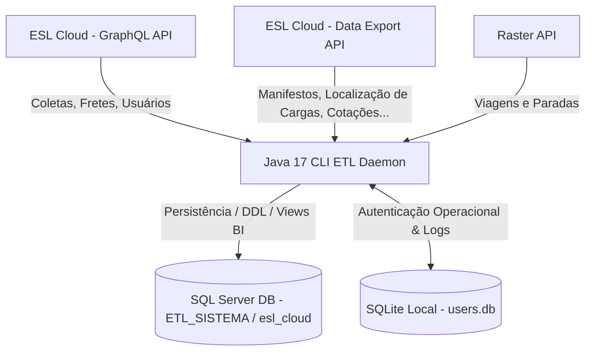

# ⚙️ ESL Cloud Integration System - CLI ETL Daemon

> **Atenção:** Este é um sistema de **ETL (Extract, Transform, Load)** empresarial baseado em **Java 17 CLI** robusto, projetado para extrair, validar e consolidar dados da plataforma **ESL Cloud** e da **Raster API** em um banco de dados central **SQL Server** para consumo analítico.

---

## 🗺️ Visão Geral & Fluxo de Dados

O Extrator opera em alto volume de processamento e possui forte orquestração de resiliência. O sistema divide a carga de dados em duas trilhas principais de integração da ESL Cloud (GraphQL e Data Export), valida a integridade referencial dos dados locais em tempo real e armazena logs de auditoria e watermarks para execuções seguras e idempotentes.

### Diagrama Arquitetural de Carga



---

## 🧱 Governança Estrutural do Banco e Views

O projeto **ETL Extração de Dados** é o **único owner estrutural** do banco/schema `ETL_SISTEMA` (`esl_cloud`) e de todas as views analíticas consumidas pelo Dashboard, incluindo `dbo.vw_*_powerbi` e `dbo.vw_dim_*`.

As tabelas base, migrations, índices, views operacionais, views dimensionais e materializações de BI devem ser alteradas neste repositório, principalmente em `database/tabelas/`, `database/migrations/`, `database/views/`, `database/views-dimensao/` e `database/indices/`.

O Dashboard é consumidor read-only desse contrato. Ele não possui permissão nem responsabilidade para executar DDL cross-database contra `ETL_SISTEMA`/`esl_cloud`, criar wrappers locais das views do ETL ou sincronizar estrutura analítica por migrations próprias.

Qualquer alteração de coluna, semântica de filtro, regra materializada, view `vw_*_powerbi` ou dependência dimensional deve nascer no ETL, ser validada aqui e então ser consumida pelo Dashboard como contrato publicado.

---

## 🏗️ Mapa de Camadas & Estrutura de Pacotes

O extrator adota uma arquitetura limpa e desacoplada, utilizando um **Composition Root** central para resolver dependências sem a necessidade de frameworks de injeção de dependência pesados (como Spring IoC no CLI).

### Fluxo de Dependência
```text
Main (CLI Entrypoint)
  └── CommandRegistry (Mapeamento de comandos CLI)
        └── Use Case (Fluxos de negócio, ex: FluxoCompletoUseCase)
              └── PipelineCompositionRoot (Wiring manual de serviços)
                    └── PipelineOrchestrator (Orquestrador de execução de Steps)
                          ├── Integration Gateways (Clientes HTTP / Paginadores GraphQL e DataExport)
                          ├── Repositories (Persistência e Auditorias SQL Server)
                          └── Observabilidade & Resiliência (Watchdogs, Retries, Circuit Breakers)
```

### Principais Pacotes
* **`bootstrap`**: Ponto de entrada (`Main`), wiring do contexto e isolamento físico de processos filhos.
* **`comandos/cli`**: Gerenciador e roteador de argumentos do CLI.
* **`aplicacao`**: Casos de uso centrais, regras de negócio e políticas globais de falha/retry.
* **`features/`**: Trilha modular contendo lógicas de aplicação e persistência isoladas por entidade (`coletas`, `manifestos`, `fretes`, `usuarios`).
* **`plataforma/`**: Componentes transversais reutilizáveis (`auditoria`, `observabilidade`, `seguranca`, `suporte`).
* **`integracao`**: Conectores de APIs de terceiros, serializadores e paginadores brutos.
* **`persistencia`**: Implementações JDBC/Hikari de Repositories e controle de Watermarks.

---

## 🛠️ Tecnologias Utilizadas (Tech Stack)

* **Linguagem**: Java 17 (Compiler Release 17 com codificação estrita em UTF-8)
* **Build System**: Maven (com `maven-shade-plugin` para geração de Fat JAR consolidado e limpo)
* **Banco de Dados Principal**: Microsoft SQL Server (`ETL_SISTEMA` / `esl_cloud`, via JDBC Driver `mssql-jdbc` v12.8.1)
* **Banco de Dados Local de Segurança**: SQLite JDBC (v3.49.1.0)
* **Pool de Conexões**: HikariCP (v5.1.0) para alta performance e reutilização de conexões SQL.
* **Manipulação de JSON**: Jackson Databind & Jackson JSR310 (v2.17.2)
* **Logs & Observabilidade**: SLF4J API & Logback Classic (v1.5.16)
* **Testes**: JUnit Jupiter v5.11.4 para suites de validação locais.

---

## 🧭 Modos de Execução & Comandos CLI

O sistema é operado inteiramente através da CLI. A tabela abaixo documenta todos os parâmetros vigentes e seus respectivos comportamentos:

| Comando | Descrição / Comportamento | Janela Operacional |
| --- | --- | --- |
| `[Nenhum]` ou `--fluxo-completo` | Executa o pipeline core diário de ponta a ponta. Realiza pré-backfill de coletas, executa GraphQL e Data Export, roda validações financeiras e finaliza atualizando Watermarks de sucesso. | `D-1..D` (Corrente) |
| `--extracao-intervalo` | Permite extrações sob demanda dividindo períodos longos em lotes automáticos de até 30 dias para evitar timeouts. | Customizado por CLI |
| `--recovery` | Aciona o replay manual/backfill idempotente para cobrir lacunas no banco de dados. | Customizado por CLI |
| `--testar-api` | Roda um pipeline reduzido para validar conectividade e chaves com a GraphQL e DataExport da ESL. | Teste de Preflight |
| `--loop-daemon-run` | Executa um ciclo individual contínuo do Daemon de extração em loop. | Automático (Reconciliação) |
| `--loop-daemon-start` | Inicializa o daemon em processo de segundo plano gravando o PID e gerando ciclos automáticos. | Contínuo / Daemon |
| `--loop-daemon-stop` | Solicita uma parada graciosa e segura do daemon ativo. | Parada Controlada |
| `--loop-daemon-status` | Exibe o status do daemon (RUNNING/STOPPED), PID ativo e integridade do JAR. | Diagnóstico |

### Comandos de Auditoria & Validação Extrema
* `--validar-api-banco-24h`: Gera relatório simples comparando contagens da API e banco de dados para as últimas 24h.
* `--validar-api-banco-24h-detalhado`: Detalha divergências por ID para correção.
* `--validar-etl-extremo`: Compara volumes históricos em lote entre a origem e banco.
* `--validar-etl-resiliencia`: Força testes em conexões lentas para validar a resposta dos Circuit Breakers.

---

## ⚙️ Variáveis de Ambiente & Configurações (`.env`)

A aplicação busca as configurações em arquivos `.env` ou variáveis de ambiente locais. O arquivo `.env.example` na pasta `/config` serve como fonte padrão:

```properties
# --- Integrações com APIs ---
API_BASEURL=https://rodogarcia.eslcloud.com.br
API_REST_TOKEN=token_aqui         # Utilizado para fluxos secundários (ocorrências)
API_GRAPHQL_TOKEN=token_aqui      # Integração de Coletas, Fretes e Usuários GraphQL
API_DATAEXPORT_TOKEN=token_aqui   # Integração de Manifestos, Cotações e Contas a Pagar

# --- Integração com API Raster ---
RASTER_ENABLED=auto               # Opções: auto, true, false
RASTER_LOGIN=seu_usuario
RASTER_SENHA=sua_senha
RASTER_AMBIENTE=Producao          # Producao ou Homologacao
RASTER_BASE_URL=https://integra.rastergr.com.br:8443/datasnap/rest/TWebService
RASTER_STATUS_VIAGEM=T            # Parâmetro técnico de consulta da Raster
RASTER_TIMEOUT_SECONDS=120
RASTER_LOOKBACK_DAYS=1

# --- Banco de Dados Central SQL Server ---
DB_URL=jdbc:sqlserver://localhost:1433;databaseName=esl_cloud;encrypt=false;
DB_USER=sa
DB_PASSWORD=sua_senha_sql

# --- Segurança Local SQLite ---
EXTRATOR_SECURITY_DB_PATH=        # Se vazio, assume fallback em ProgramData
EXTRATOR_AUTH_PEPPER=segredo-pepper-unico
EXTRATOR_AUTH_MAX_TENTATIVAS=3
EXTRATOR_AUTH_BLOQUEIO_MINUTOS=5

# --- Tolerâncias e Validações de Qualidade de Dados (Data Quality) ---
ETL_INVALIDOS_QUANTIDADE_MAX=500
ETL_INVALIDOS_PERCENTUAL_MAX=2.5
ETL_REFERENCIAL_MANIFESTOS_ORFAOS_QUANTIDADE_MAX=500
ETL_REFERENCIAL_MANIFESTOS_ORFAOS_PERCENTUAL_MAX=35.0

# --- Parâmetros Técnicos do Pool de Conexões (HikariCP) ---
DB_BATCH_SIZE=100
DB_POOL_CONN_TIMEOUT=30000
DB_POOL_INIT_FAIL_TIMEOUT=30000
DB_POOL_IDLE_TIMEOUT=600000
DB_POOL_MAX_LIFETIME=1800000
DB_POOL_MAX_SIZE=10
DB_POOL_MIN_IDLE=2
```

---

## 🔒 Mecanismos de Resiliência & Confiabilidade

Para operar de forma robusta 24 horas por dia em infraestruturas instáveis, o extrator implementa:

1. **Retries com Backoff Exponencial**: Falhas de conexões HTTP com a ESL Cloud são tratadas em até 3 tentativas por página, com delay progressivo.
2. **Watchdog Global**: No ciclo do daemon, um watchdog encerra e reinicia de forma isolada steps que entrarem em loop eterno ou travamento de rede.
3. **Lock Transacional no Banco**: O fluxo completo utiliza locks do próprio SQL Server (`sp_getapplock`) para impedir execuções simultâneas concorrentes na mesma base.
4. **Processamento em Micro-batches**: Suporte a execução de micro-batch para otimização e controle de memória durante a extração de grandes volumes (como via ChunkedDataExportEntityExtractor).
5. **Isolamento por Processo**: Steps sensíveis ou pesados podem ser disparados pelo CLI em processos Java filhos isolados, protegendo a JVM principal contra estouros de memória.

---

## 📂 Estrutura de Pastas do Repositório

```text
etl-extracao-dados/
├── .ci/                    # Configurações de Integração Contínua
├── config/                 # Arquivos de configurações do ETL (.env.example)
├── database/               # SSOT estrutural: tabelas, migrations, views, índices e validações SQL
│   ├── tabelas/            # Estrutura base de criação das tabelas no SQL Server
│   ├── views/              # Views operacionais de negócio
│   ├── views-dimensao/     # Views dimensionais de referência
│   └── migrations/         # Migrações incrementais do banco
├── docs/                   # Base Oficial de Conhecimento
│   ├── moderno/            # Documentação técnica e runbooks do runtime atual
│   └── legado/             # Histórico descontinuado arquivado para contexto
├── logs/                   # Diretório de logs gerados em tempo de execução
│   └── daemon/             # Logs, estados (PIDs) e ciclos do loop daemon
├── scripts/                # Scripts utilitários de suporte e automação Python/Bash
│   └── windows/            # Batch files (.bat) para operações no Windows
├── src/                    # Código-fonte Java 17
└── pom.xml                 # Configurações do Maven e dependências
```

---

## 📖 Runbook do Daemon: Operação Segura

O daemon é o mecanismo que mantém a extração viva de forma automatizada e contínua. Siga as instruções abaixo para manutenções controladas:

### 1. Consultar o Status Atual do Daemon
```powershell
java -jar target/extrator.jar --loop-daemon-status
```
* O sistema responderá se o daemon está `RUNNING` ou `STOPPED` e exibirá o PID.

### 2. Solicitar Parada Graciosa (Soft Stop)
```powershell
java -jar target/extrator.jar --loop-daemon-stop
```
* O daemon receberá um sinal, concluirá de forma segura o ciclo atual para evitar corrupção de dados e alterará o arquivo `.state` para `STOPPED`.

### 3. Procedimento de Manutenção Controlada
1. Pare o Daemon gracioso utilizando o comando acima.
2. Certifique-se no monitor de recursos do Windows de que o processo Java do PID correspondente foi finalizado.
3. Execute as alterações necessárias (aplicação de scripts SQL em `/database`, build do JAR com Maven).
4. Inicialize novamente o daemon informando as flags corretas:
   ```powershell
   java -jar target/extrator.jar --loop-daemon-start
   ```
5. Valide que o status retornou para `RUNNING`.

---

## 📚 Documentação de Apoio Consolidada

A pasta `/docs/moderno` contém detalhamentos minuciosos para novos desenvolvedores ou depuração profunda:

* 📂 [Guia Geral de Documentos](file:///C:/Users/suporte/Documents/projetos/etl-extracao-dados/docs/index.md): Índice unificado de conhecimento.
* ☕ [Arquitetura Detalhada](file:///C:/Users/suporte/Documents/projetos/etl-extracao-dados/docs/moderno/arquitetura.md): Mapa completo de pacotes e Composition Root.
* 📦 [Fluxo do Ciclo Completo](file:///C:/Users/suporte/Documents/projetos/etl-extracao-dados/docs/moderno/fluxos/ciclo-completo.md): Raciocínio de extração de ponta a ponta.
* ⚙️ [Runbook Operacional do Daemon](file:///C:/Users/suporte/Documents/projetos/etl-extracao-dados/docs/moderno/runbook-daemon.md): Passo a passo detalhado para manutenção em servidores de produção.
* 🛡️ [Manual de Resiliência e Timeouts](file:///C:/Users/suporte/Documents/projetos/etl-extracao-dados/docs/moderno/resiliencia.md): Como o sistema lida com falhas da API ESL Cloud.
* 📂 [Estrutura de Tabelas e Catálogo SQL](file:///C:/Users/suporte/Documents/projetos/etl-extracao-dados/database/README.md): Catálogo completo mapeando todas as colunas físicas e tabelas persistidas.
