# 📊 DER (Diagrama Entidade-Relacionamento) - Classes Java

**Sistema:** Extrator ESL Cloud  
**Versão:** 2.3.1  
**Data:** 23/01/2026  
**Linguagem:** Java 17

---

## 📋 Índice

1. [Visão Geral](#visão-geral)
2. [Padrões de Design Utilizados](#padrões-de-design-utilizados)
3. [Hierarquia de Classes](#hierarquia-de-classes)
4. [Interfaces e Implementações](#interfaces-e-implementações)
5. [Relacionamentos entre Classes](#relacionamentos-entre-classes)
6. [DER Completo em Texto](#der-completo-em-texto)
7. [Condições e Lógica de Negócio](#condições-e-lógica-de-negócio)
8. [Notação para Ferramentas de Modelagem](#notação-para-ferramentas-de-modelagem)

---

## 🎯 Visão Geral

O sistema Java possui **~130 classes** organizadas em pacotes especializados:

### Pacotes Principais

1. **`br.com.extrator`** - Classe principal (Main.java)
2. **`comandos`** - Padrão Command (15+ classes)
3. **`runners`** - Orquestradores de extração (GraphQL, DataExport)
4. **`api`** - Clientes de API (GraphQL, DataExport)
5. **`db/repository`** - Camada de persistência (12 repositórios)
6. **`db/entity`** - Entidades do banco (11 entidades)
7. **`modelo`** - DTOs e Mappers (40+ classes)
8. **`auditoria`** - Validação e auditoria (8 classes)
9. **`util`** - Utilitários (15+ classes)
10. **`servicos`** - Serviços auxiliares (2 classes)

---

## 🏗️ Padrões de Design Utilizados

### 1. **Padrão Command**
- **Interface:** `Comando`
- **Implementações:** 15+ comandos (ExecutarFluxoCompletoComando, ValidarManifestosComando, etc.)
- **Finalidade:** Encapsular requisições como objetos, permitindo parametrizar clientes

### 2. **Padrão Template Method**
- **Classe Base:** `AbstractRepository<T>`
- **Implementações:** 12 repositórios específicos
- **Finalidade:** Define esqueleto do algoritmo, delegando passos para subclasses

### 3. **Padrão Strategy**
- **Interface:** `EntityExtractor<T>`
- **Implementações:** Extractors específicos por entidade
- **Finalidade:** Encapsular algoritmos de extração intercambiáveis

### 4. **Padrão Singleton**
- **Classe:** `GerenciadorRequisicaoHttp` (Bill Pugh Holder Pattern)
- **Classe:** `GerenciadorConexao` (HikariCP DataSource)
- **Finalidade:** Garantir uma única instância compartilhada

### 5. **Padrão Factory (Implícito)**
- **Classes:** Extractors criam Repositories e Mappers
- **Finalidade:** Centralizar criação de objetos relacionados

### 6. **Padrão Mapper**
- **Classes:** `*Mapper` (ColetaMapper, FreteMapper, etc.)
- **Finalidade:** Transformar DTOs em Entities

---

## 📊 Hierarquia de Classes

### Hierarquia de Herança

```
Object
  │
  ├─► AbstractRepository<T>
  │   │
  │   ├─► ColetaRepository
  │   ├─► FreteRepository
  │   ├─► ManifestoRepository
  │   ├─► CotacaoRepository
  │   ├─► LocalizacaoCargaRepository
  │   ├─► ContasAPagarRepository
  │   ├─► FaturaPorClienteRepository
  │   ├─► FaturaGraphQLRepository
  │   ├─► UsuarioSistemaRepository
  │   ├─► LogExtracaoRepository
  │   └─► PageAuditRepository
  │
  └─► [Outras classes sem herança explícita]
```

### Hierarquia de Interfaces

```
Comando (interface)
  │
  ├─► ExecutarFluxoCompletoComando
  ├─► ExecutarExtracaoPorIntervaloComando
  ├─► LoopExtracaoComando
  ├─► ValidarManifestosComando
  ├─► ValidarDadosCompletoComando
  ├─► ValidarAcessoComando
  ├─► ExecutarAuditoriaComando
  ├─► ExportarCsvComando
  ├─► TestarApiComando
  ├─► LimparTabelasComando
  ├─► ExibirAjudaComando
  └─► [Outros comandos...]

EntityExtractor<T> (interface)
  │
  ├─► DataExportEntityExtractor<T> (interface)
  │   │
  │   ├─► ManifestoExtractor
  │   ├─► CotacaoExtractor
  │   ├─► LocalizacaoCargaExtractor
  │   ├─► ContasAPagarExtractor
  │   └─► FaturaPorClienteExtractor
  │
  └─► [GraphQL Extractors]
      ├─► ColetaExtractor
      ├─► FreteExtractor
      ├─► FaturaGraphQLExtractor
      └─► UsuarioSistemaExtractor
```

---

## 🔗 Interfaces e Implementações

### Interface: Comando

```java
public interface Comando {
    void executar(String[] args) throws Exception;
}
```

**Implementações:**
- `ExecutarFluxoCompletoComando` - Executa extração completa
- `ExecutarExtracaoPorIntervaloComando` - Extração por intervalo
- `LoopExtracaoComando` - Loop de extração
- `ValidarManifestosComando` - Validação de manifestos
- `ValidarDadosCompletoComando` - Validação completa
- `ValidarAcessoComando` - Validação de acesso
- `ExecutarAuditoriaComando` - Auditoria
- `ExportarCsvComando` - Exportação CSV
- `TestarApiComando` - Teste de API
- `LimparTabelasComando` - Limpeza de tabelas
- `ExibirAjudaComando` - Exibir ajuda
- `VerificarTimestampsComando` - Verificar timestamps
- `VerificarTimezoneComando` - Verificar timezone
- `RealizarIntrospeccaoGraphQLComando` - Introspecção GraphQL

### Interface: EntityExtractor<T>

```java
public interface EntityExtractor<T> {
    ResultadoExtracao<T> extract(LocalDate dataInicio, LocalDate dataFim);
    int save(List<T> dtos) throws SQLException;
    String getEntityName();
    String getEmoji();
}
```

**Implementações GraphQL:**
- `ColetaExtractor` - Extrai Coletas
- `FreteExtractor` - Extrai Fretes
- `FaturaGraphQLExtractor` - Extrai Faturas GraphQL
- `UsuarioSistemaExtractor` - Extrai Usuários

**Implementações DataExport:**
- `ManifestoExtractor` - Extrai Manifestos
- `CotacaoExtractor` - Extrai Cotações
- `LocalizacaoCargaExtractor` - Extrai Localização de Carga
- `ContasAPagarExtractor` - Extrai Contas a Pagar
- `FaturaPorClienteExtractor` - Extrai Faturas por Cliente

### Interface: DataExportEntityExtractor<T>

```java
public interface DataExportEntityExtractor<T> extends EntityExtractor<T> {
    // Herda todos os métodos de EntityExtractor
    // Especialização para DataExport
}
```

---

## 🔄 Relacionamentos entre Classes

### Relacionamento: Main → Comandos

```
Main
  │
  ├─► [usa] Map<String, Comando>
  │   │
  │   ├─► ExecutarFluxoCompletoComando
  │   ├─► ExecutarExtracaoPorIntervaloComando
  │   ├─► ValidarManifestosComando
  │   └─► [outros comandos...]
  │
  └─► [usa] LoggingService
```

**Tipo:** Agregação (Main possui referências a Comandos)

**Condição:**
- Se comando não encontrado → ExibirAjudaComando (padrão)
- Se comando lançar exceção → Log erro e exit(1)

### Relacionamento: Comando → Runner

```
ExecutarFluxoCompletoComando
  │
  ├─► [cria] ExecutorService (2 threads)
  │   │
  │   ├─► [submete] GraphQLRunner.executar()
  │   │   └─► Thread 1
  │   │
  │   └─► [submete] DataExportRunner.executar()
  │       └─► Thread 2
  │
  └─► [aguarda] Future.get()
      ├─► [sucesso?] → Incrementar contador
      └─► [falha?] → Capturar exceção, continuar
```

**Tipo:** Composição (ExecutorService gerencia ciclo de vida das threads)

**Condições:**
- Se ambas threads sucedem → Continuar para Fase 3
- Se uma thread falha → Continuar execução, registrar falha
- Se ambas falham → Exibir erro, não gravar timestamp

### Relacionamento: Runner → ExtractionService

```
GraphQLRunner
  │
  └─► [delega] GraphQLExtractionService.execute()
      │
      ├─► [usa] ClienteApiGraphQL
      ├─► [usa] LogExtracaoRepository
      ├─► [usa] ExtractionLogger
      └─► [cria] Extractors
          ├─► ColetaExtractor
          ├─► FreteExtractor
          └─► FaturaGraphQLExtractor
```

**Tipo:** Composição (Runner cria e gerencia ExtractionService)

**Condições:**
- Se entidade específica informada → Executar apenas essa entidade
- Se entidade == null → Executar todas as entidades
- Se executarColetas == true → Extrair Usuários primeiro (dependência)

### Relacionamento: ExtractionService → Extractor

```
GraphQLExtractionService
  │
  ├─► [cria] ColetaExtractor
  │   │
  │   ├─► [usa] ClienteApiGraphQL
  │   ├─► [usa] ColetaRepository
  │   └─► [usa] ColetaMapper
  │
  └─► [cria] FreteExtractor
      │
      ├─► [usa] ClienteApiGraphQL
      ├─► [usa] FreteRepository
      └─► [usa] FreteMapper
```

**Tipo:** Composição (Service cria Extractors)

**Condições:**
- Se shouldExecute(entidade, COLETAS) → Criar e executar ColetaExtractor
- Se shouldExecute(entidade, FRETES) → Criar e executar FreteExtractor
- Entre extrações → Aplicar delay (2 segundos)

### Relacionamento: Extractor → ClienteApi

```
ColetaExtractor
  │
  ├─► [usa] ClienteApiGraphQL
  │   │
  │   ├─► [usa] GerenciadorRequisicaoHttp (Singleton)
  │   │   ├─► [aplica] Throttling (2200ms mínimo)
  │   │   ├─► [aplica] Retry (até 5 tentativas)
  │   │   └─► [aplica] Backoff Exponencial
  │   │
  │   ├─► [usa] HttpClient
  │   ├─► [usa] ObjectMapper
  │   └─► [usa] PageAuditRepository
  │
  └─► [usa] ColetaRepository
      │
      └─► [usa] AbstractRepository
          │
          ├─► [usa] CarregadorConfig
          ├─► [usa] Connection (via DriverManager)
          └─► [executa] MERGE SQL
```

**Tipo:** Agregação (Extractor usa ClienteApi, mas não gerencia ciclo de vida)

**Condições:**
- Se requisição falhar → Retry até 5 tentativas
- Se HTTP 429 → Aguardar 2 segundos e retentar
- Se HTTP 5xx → Backoff exponencial
- Se timeout → Retentar com backoff

### Relacionamento: Extractor → Repository

```
ColetaExtractor
  │
  ├─► [usa] ColetaRepository extends AbstractRepository<ColetaEntity>
  │   │
  │   ├─► [herda] salvar(List<T>)
  │   │   ├─► [verifica] Tabela existe?
  │   │   │   └─► [NÃO?] → Lançar SQLException
  │   │   │
  │   │   ├─► [para cada entidade]
  │   │   │   ├─► [executa] executarMerge()
  │   │   │   ├─► [rowsAffected > 0?] → Contar sucesso
  │   │   │   └─► [rowsAffected == 0?] → Log warning
  │   │   │
  │   │   ├─► [a cada batchSize] → Commit
  │   │   └─► [commit final]
  │   │
  │   └─► [implementa] executarMerge(Connection, ColetaEntity)
  │       ├─► [constroi] SQL MERGE
  │       ├─► [define] Parâmetros
  │       └─► [executa] executeUpdate()
  │
  └─► [usa] ColetaMapper
      │
      ├─► [converte] ColetaNodeDTO → ColetaEntity
      ├─► [valida] Campos obrigatórios
      ├─► [trunca] Strings longas
      └─► [adiciona] metadata JSON completo
```

**Tipo:** Agregação (Extractor usa Repository e Mapper)

**Condições:**
- Se lista vazia → Retornar 0
- Se entidade null → Retornar 0
- Se tabela não existe → Lançar SQLException com mensagem clara
- Se rowsAffected == 0 → Log warning, não contar como sucesso
- Se continuarAposErro == false → Rollback e lançar exceção
- Se continuarAposErro == true → Continuar processando, manter sucessos

### Relacionamento: ClienteApi → GerenciadorRequisicaoHttp

```
ClienteApiGraphQL
  │
  └─► [usa] GerenciadorRequisicaoHttp.getInstance() (Singleton)
      │
      ├─► [aplica] Throttling Global
      │   ├─► [verifica] Tempo desde última requisição
      │   ├─► [< 2200ms?] → Aguardar diferença
      │   └─► [>= 2200ms?] → Prosseguir
      │
      ├─► [executa] Requisição HTTP
      │   ├─► [sucesso?] → Retornar resposta
      │   ├─► [HTTP 429?] → Aguardar 2s, retentar
      │   ├─► [HTTP 5xx?] → Backoff exponencial, retentar
      │   └─► [timeout?] → Retentar com backoff
      │
      └─► [atualiza] Timestamp última requisição
```

**Tipo:** Dependência (ClienteApi depende de GerenciadorRequisicaoHttp)

**Condições:**
- Throttling é GLOBAL (todas as threads compartilham)
- Lock ReentrantLock garante thread-safety
- Se maxTentativas atingido → Lançar exceção
- Se circuit breaker ativo → Retornar lista vazia

### Relacionamento: Repository → AbstractRepository

```
ColetaRepository extends AbstractRepository<ColetaEntity>
  │
  ├─► [herda] salvar(List<T>)
  │   ├─► [usa] obterConexao()
  │   ├─► [usa] verificarTabelaExisteOuLancarErro()
  │   ├─► [chama] executarMerge() (abstrato)
  │   └─► [usa] Helpers (setStringParameter, etc.)
  │
  ├─► [implementa] executarMerge(Connection, ColetaEntity)
  │   ├─► [constroi] SQL MERGE
  │   ├─► [define] Parâmetros (usando helpers)
  │   └─► [executa] executeUpdate()
  │
  └─► [implementa] getNomeTabela()
      └─► [retorna] "coletas
```

**Tipo:** Herança (Repository herda de AbstractRepository)

**Condições:**
- Cada Repository implementa executarMerge() específico
- Cada Repository implementa getNomeTabela()
- Helpers do AbstractRepository tratam NULL automaticamente

### Relacionamento: Mapper → Entity

```
ColetaMapper
  │
  ├─► [usa] ObjectMapper (Jackson)
  │   └─► [registra] JavaTimeModule
  │
  └─► [converte] toEntity(ColetaNodeDTO)
      │
      ├─► [se dto == null] → Retornar null
      │
      ├─► [mapeia] Campos essenciais
      │   ├─► id, sequenceCode, status
      │   ├─► Datas (converte String → LocalDate)
      │   └─► Valores (converte String → BigDecimal)
      │
      ├─► [valida] Campos obrigatórios
      │   └─► [se obrigatório null] → Log warning
      │
      ├─► [trunca] Strings longas
      │   └─► [se > tamanho máximo] → Truncar e log warning
      │
      └─► [serializa] metadata JSON completo
          └─► [usa] objectMapper.writeValueAsString(dto)
```

**Tipo:** Dependência (Mapper depende de DTO e Entity)

**Condições:**
- Se campo obrigatório null → Log warning, continuar
- Se string > tamanho máximo → Truncar, log warning
- Se erro na serialização JSON → Log error, usar "{}"

---

## 📐 DER Completo em Texto

### Representação Textual do DER de Classes

```
┌─────────────────────────────────────────────────────────────────┐
│              DER - CLASSES JAVA - ESTRUTURA COMPLETA            │
│                  Extrator ESL Cloud v2.3.1                      │
└─────────────────────────────────────────────────────────────────┘

┌──────────────────────┐
│       Main            │
├──────────────────────┤
│ - COMANDOS: Map       │
│ - logger: Logger      │
│                      │
│ + main(String[])     │
│ + organizarLogs()    │
└──────────┬──────────────┘
         │
         │ [usa]
         │
         ▼
┌──────────────────────┐
│    Comando           │◄─── Interface
│  (interface)         │
├──────────────────────┤
│ + executar(String[]) │
└──────────┬──────────────┘
           │
           │ [implementa]
           │
           ├──────────────────────────────────────────────┐
           │                                              │
           ▼                                              ▼
┌──────────────────────┐              ┌──────────────────────┐
│ExecutarFluxoCompleto│              │ValidarManifestos    │
│      Comando         │              │      Comando         │
├──────────────────────┤              ├──────────────────────┤
│ - NUMERO_DE_THREADS  │              │ + executar(String[]) │
│                      │              └──────────────────────┘
│ + executar(String[]) │
│ - criarCallable()    │
│ - gravarDataExec()   │
└──────────┬──────────────┘
           │
           │ [cria]
           │
           ▼
┌──────────────────────┐
│   ExecutorService     │
│  (2 threads)          │
├──────────────────────┤
│ + submit(Callable)   │
└──────────┬──────────────┘
           │
           ├──────────────────────────────┐
           │                              │
           ▼                              ▼
┌──────────────────────┐      ┌──────────────────────┐
│  GraphQLRunner       │      │  DataExportRunner     │
│  (Thread 1)          │      │  (Thread 2)            │
├──────────────────────┤      ├──────────────────────┤
│ + executar(LocalDate)│      │ + executar(LocalDate) │
└──────────┬──────────────┘      └──────────┬──────────────┘
           │                                  │
           │ [delega]                         │ [delega]
           │                                  │
           ▼                                  ▼
┌──────────────────────┐      ┌──────────────────────┐
│GraphQLExtraction     │      │DataExportExtraction   │
│      Service         │      │      Service          │
├──────────────────────┤      ├──────────────────────┤
│ - apiClient          │      │ - apiClient           │
│ - logRepository      │      │ - logRepository       │
│ - logger             │      │ - logger              │
│                      │      │                       │
│ + execute(...)       │      │ + execute(...)        │
│ - extractColetas()   │      │ - extractManifestos()│
│ - extractFretes()    │      │ - extractCotacoes()   │
│ - extractFaturas()   │      │ - extractLocalizacao()│
└──────────┬──────────────┘      │ - extractContasAPagar()│
           │                      │ - extractFaturasCliente()│
           │ [cria]               └──────────┬──────────────┘
           │                                  │
           ├──────────────────────────────────┘
           │ [cria]
           │
           ▼
┌──────────────────────┐
│  EntityExtractor<T>   │◄─── Interface
│  (interface)          │
├──────────────────────┤
│ + extract(...)       │
│ + save(List<T>)      │
│ + getEntityName()    │
│ + getEmoji()         │
└──────────┬──────────────┘
           │
           │ [implementa]
           │
           ├──────────────────────────────────────────────┐
           │                                              │
           ▼                                              ▼
┌──────────────────────┐              ┌──────────────────────┐
│  ColetaExtractor     │              │  ManifestoExtractor   │
├──────────────────────┤              ├──────────────────────┤
│ - apiClient          │              │ - apiClient          │
│ - repository         │              │ - repository         │
│ - mapper             │              │ - mapper             │
│                      │              │                      │
│ + extract(...)       │              │ + extract(...)        │
│ + save(List<T>)      │              │ + save(List<T>)      │
└──────────┬──────────────┘              └──────────┬──────────────┘
           │                                          │
           │ [usa]                                    │ [usa]
           │                                          │
           ├──────────────────────────────────────────┘
           │
           ▼
┌──────────────────────┐
│  ClienteApiGraphQL    │
├──────────────────────┤
│ - urlBase            │
│ - token              │
│ - httpClient         │
│ - objectMapper       │
│ - gerenciadorRequisicao│
│                      │
│ + buscarColetas()    │
│ + buscarFretes()      │
│ + buscarFaturas()     │
└──────────┬──────────────┘
           │
           │ [usa]
           │
           ▼
┌──────────────────────┐
│GerenciadorRequisicao │
│        Http          │◄─── Singleton
├──────────────────────┤
│ - lockThrottling     │
│ - ultimaRequisicao   │
│ - maxTentativas      │
│                      │
│ + getInstance()      │
│ + executarRequisicao()│
│ - aplicarThrottling()│
│ - aplicarRetry()     │
└──────────────────────┘

┌──────────────────────┐
│  ColetaRepository    │
├──────────────────────┤
│ extends AbstractRepo  │
│                      │
│ + executarMerge()    │
│ + getNomeTabela()    │
└──────────┬──────────────┘
           │
           │ [herda]
           │
           ▼
┌──────────────────────┐
│ AbstractRepository<T>│◄─── Classe Abstrata
├──────────────────────┤
│ - urlConexao         │
│ - usuario            │
│ - senha              │
│                      │
│ + salvar(List<T>)    │
│ + salvar(T)          │
│ # executarMerge()    │◄─── Abstrato
│ # getNomeTabela()    │◄─── Abstrato
│ # obterConexao()     │
│ # verificarTabela()  │
│ # setStringParameter()│
│ # setBigDecimalParam()│
└──────────────────────┘

┌──────────────────────┐
│   ColetaMapper       │
├──────────────────────┤
│ - objectMapper       │
│                      │
│ + toEntity(DTO)      │
│ - converterTipos()  │
│ - validarCampos()    │
│ - truncarStrings()   │
│ - serializarMetadata()│
└──────────┬──────────────┘
           │
           │ [converte]
           │
           ▼
┌──────────────────────┐
│   ColetaNodeDTO      │
├──────────────────────┤
│ - id                 │
│ - sequenceCode       │
│ - status             │
│ - [outros campos]    │
└──────────────────────┘
           │
           │ [mapeia para]
           │
           ▼
┌──────────────────────┐
│   ColetaEntity       │
├──────────────────────┤
│ - id                 │
│ - sequenceCode       │
│ - status             │
│ - metadata           │
│ - dataExtracao       │
│ - [outros campos]    │
└──────────────────────┘
```

---

## 🔍 Condições e Lógica de Negócio

### Condições no Main.java

```
main(String[] args)
  │
  ├─► [args.length == 0?]
  │   ├─► SIM → nomeComando = "--fluxo-completo"
  │   └─► NÃO → nomeComando = args[0].toLowerCase()
  │
  ├─► [COMANDOS.containsKey(nomeComando)?]
  │   ├─► SIM → comando = COMANDOS.get(nomeComando)
  │   └─► NÃO → comando = new ExibirAjudaComando()
  │              └─► Log: "Comando desconhecido"
  │
  ├─► comando.executar(args)
  │   │
  │   └─► [Exception?]
  │       ├─► SIM → Log error, exit(1)
  │       └─► NÃO → Continuar
  │
  └─► loggingService.pararCaptura()
```

### Condições no ExecutarFluxoCompletoComando

```
executar(String[] args)
  │
  ├─► [Criar ExecutorService com 2 threads]
  │
  ├─► [Submeter GraphQLRunner]
  │   └─► Future 1
  │
  ├─► [Submeter DataExportRunner]
  │   └─► Future 2
  │
  ├─► [Para cada Future]
  │   │
  │   ├─► future.get()
  │   │   │
  │   ├─► [ExecutionException?]
  │   │   ├─► SIM → totalFalhas++, runnersFalhados.add()
  │   │   └─► NÃO → totalSucessos++
  │   │
  │   └─► [InterruptedException?]
  │       ├─► SIM → Thread.interrupt(), totalFalhas++
  │       └─► NÃO → Continuar
  │
  ├─► [totalFalhas == 0?]
  │   ├─► SIM → Banner sucesso, gravarDataExecucao()
  │   └─► NÃO → Banner erro, não gravar timestamp
  │
  ├─► [Executar Faturas GraphQL (Fase 3)]
  │   └─► GraphQLRunner.executarFaturasGraphQLPorIntervalo()
  │
  └─► [Executar Validação]
      ├─► CompletudeValidator.validarCompletude()
      ├─► [se completude OK] → validarGaps()
      └─► [se completude OK] → validarJanelaTemporal()
```

### Condições no GraphQLExtractionService

```
execute(dataInicio, dataFim, entidade)
  │
  ├─► [Validar conexão banco]
  │   └─► [FALHAR?] → Lançar exceção
  │
  ├─► [Validar tabelas essenciais]
  │   └─► [FALTANDO?] → Lançar exceção
  │
  ├─► executarColetas = shouldExecute(entidade, COLETAS)
  ├─► executarFretes = shouldExecute(entidade, FRETES)
  ├─► executarFaturas = shouldExecute(entidade, FATURAS_GRAPHQL)
  │
  ├─► [executarColetas == true?]
  │   ├─► SIM → extractUsuarios() (dependência)
  │   │        └─► [FALHAR?] → Log error, continuar
  │   │
  │   └─► NÃO → [executarUsuariosSistema == true?]
  │              └─► SIM → extractUsuarios()
  │
  ├─► [executarColetas == true?]
  │   ├─► SIM → extractColetas()
  │   │        └─► [FALHAR?] → Log error, adicionar resultado erro
  │   │
  │   └─► Aplicar delay (2 segundos)
  │
  ├─► [executarFretes == true?]
  │   ├─► SIM → extractFretes()
  │   │        └─► [FALHAR?] → Log error, adicionar resultado erro
  │   │
  │   └─► Aplicar delay (2 segundos)
  │
  └─► [executarFaturas == true?]
      ├─► SIM → extractFaturas()
      │        └─► [FALHAR?] → Log error, adicionar resultado erro
      │
      └─► [Gerar resumo consolidado]
          ├─► Calcular estatísticas totais
          └─► Log resumo formatado
```

### Condições no AbstractRepository

```
salvar(List<T> entidades)
  │
  ├─► [entidades == null || vazia?]
  │   └─► SIM → Retornar 0
  │
  ├─► [Abrir conexão]
  │   └─► conexao.setAutoCommit(false)
  │
  ├─► [Verificar tabela existe]
  │   └─► [NÃO?] → Lançar SQLException com mensagem clara
  │
  ├─► [Para cada entidade]
  │   │
  │   ├─► executarMerge(conexao, entidade)
  │   │   │
  │   ├─► [rowsAffected > 0?]
  │   │   ├─► SIM → totalSucesso++
  │   │   └─► NÃO → Log warning, não contar
  │   │
  │   ├─► [SQLException?]
  │   │   ├─► SIM → totalFalhas++
  │   │   │       │
  │   │   │       ├─► [continuarAposErro == false?]
  │   │   │       │   ├─► SIM → Rollback, lançar exceção
  │   │   │       │   └─► NÃO → Continuar processando
  │   │   │       │
  │   │   └─► NÃO → Continuar
  │   │
  │   └─► [registroAtual % batchSize == 0?]
  │       ├─► SIM → conexao.commit()
  │       └─► NÃO → Continuar
  │
  ├─► [Commit final]
  │
  └─► [Retornar totalSucesso]
```

### Condições no GerenciadorRequisicaoHttp

```
executarRequisicao(HttpRequest, String contexto)
  │
  ├─► [Aplicar Throttling]
  │   │
  │   ├─► lockThrottling.lock()
  │   │
  │   ├─► tempoDesdeUltima = now - ultimaRequisicao
  │   │
  │   ├─► [tempoDesdeUltima < throttlingMinimoMs?]
  │   │   ├─► SIM → Aguardar (throttlingMinimoMs - tempoDesdeUltima)
  │   │   └─► NÃO → Prosseguir
  │   │
  │   └─► atualizar ultimaRequisicao = now
  │
  ├─► [Loop de Retry (até maxTentativas)]
  │   │
  │   ├─► [Tentar requisição]
  │   │   │
  │   ├─► [Sucesso?]
  │   │   ├─► SIM → Retornar resposta
  │   │   │
  │   │   └─► NÃO → [Verificar status code]
  │   │       │
  │   │       ├─► [HTTP 429?]
  │   │       │   ├─► SIM → Aguardar 2s, retentar
  │   │       │   └─► NÃO → Continuar
  │   │       │
  │   │       ├─► [HTTP 5xx?]
  │   │       │   ├─► SIM → Backoff exponencial, retentar
  │   │       │   └─► NÃO → Continuar
  │   │       │
  │   │       └─► [Timeout?]
  │   │           ├─► SIM → Backoff exponencial, retentar
  │   │           └─► NÃO → Continuar
  │   │
  │   └─► [tentativa >= maxTentativas?]
  │       ├─► SIM → Lançar exceção
  │       └─► NÃO → Continuar loop
  │
  └─► [Retornar resposta]
```

### Condições no ClienteApiGraphQL

```
executarQueryPaginada(query, nomeEntidade, variaveis, tipoClasse)
  │
  ├─► [Circuit breaker ativo?]
  │   └─► SIM → Retornar ResultadoExtracao.completo(vazio)
  │
  ├─► [Loop de paginação]
  │   │
  │   ├─► [paginaAtual > limitePaginas?]
  │   │   └─► SIM → Log warning, interromper
  │   │
  │   ├─► [cursor repetido?]
  │   │   ├─► SIM → Log warning, tratar como última página
  │   │   └─► NÃO → Continuar
  │   │
  │   ├─► [Executar requisição via GerenciadorRequisicaoHttp]
  │   │   │
  │   ├─► [Sucesso?]
  │   │   ├─► SIM → Deserializar JSON, adicionar à lista
  │   │   │
  │   │   └─► NÃO → [Incrementar falhas consecutivas]
  │   │       │
  │   │       ├─► [falhas >= MAX_FALHAS_CONSECUTIVAS?]
  │   │       │   ├─► SIM → Abrir circuit breaker
  │   │       │   └─► NÃO → Continuar
  │   │       │
  │   │       └─► [Retentar?]
  │   │           ├─► SIM → Continuar loop
  │   │           └─► NÃO → Interromper
  │   │
  │   ├─► [hasNextPage == true?]
  │   │   ├─► SIM → Atualizar cursor, próxima iteração
  │   │   └─► NÃO → Sair do loop
  │   │
  │   └─► [Atualizar página atual]
  │
  └─► [Retornar ResultadoExtracao]
```

### Condições no ColetaMapper

```
toEntity(ColetaNodeDTO dto)
  │
  ├─► [dto == null?]
  │   └─► SIM → Retornar null
  │
  ├─► [Criar ColetaEntity]
  │
  ├─► [Mapear campos essenciais]
  │   │
  │   ├─► [id == null?]
  │   │   └─► SIM → Log warning (campo obrigatório)
  │   │
  │   └─► [sequenceCode == null?]
  │       └─► SIM → Log warning (campo obrigatório)
  │
  ├─► [Converter tipos]
  │   │
  │   ├─► [Converter String → LocalDate]
  │   │   └─► [Erro?] → Log warning, usar null
  │   │
  │   └─► [Converter String → BigDecimal]
  │       └─► [Erro?] → Log warning, usar null
  │
  ├─► [Truncar strings longas]
  │   │
  │   ├─► [clienteNome.length() > 255?]
  │   │   ├─► SIM → Truncar para 255, log warning
  │   │   └─► NÃO → Usar valor original
  │   │
  │   └─► [Aplicar para todos os campos String]
  │
  └─► [Serializar metadata JSON]
      │
      ├─► [Tentar serializar dto completo]
      │   │
      ├─► [Sucesso?]
      │   │   ├─► SIM → entity.setMetadata(json)
      │   │   └─► NÃO → Log error, entity.setMetadata("{}")
      │
      └─► [Retornar entity]
```

### Condições no CompletudeValidator

```
validarCompletude(totaisEslCloud, dataReferencia)
  │
  ├─► [Para cada entidade em totaisEslCloud]
  │   │
  │   ├─► [Buscar total do banco]
  │   │   └─► SELECT COUNT(*) FROM tabela WHERE ...
  │   │
  │   ├─► [Comparar contagens]
  │   │   │
  │   │   ├─► [API == Banco?]
  │   │   │   ├─► SIM → StatusValidacao.OK
  │   │   │   └─► NÃO → [API > Banco?]
  │   │   │       │
  │   │   │       ├─► SIM → StatusValidacao.INCOMPLETO
  │   │   │       └─► NÃO → StatusValidacao.DUPLICADOS
  │   │   │
  │   │   └─► [Erro na query?]
  │   │       └─► SIM → StatusValidacao.ERRO
  │   │
  │   └─► [Adicionar resultado ao Map]
  │
  ├─► [Gerar relatório]
  │   ├─► Contar OK, INCOMPLETO, DUPLICADOS, ERROS
  │   └─► Log resumo formatado
  │
  └─► [Retornar Map<entidade, status>]
```

---

## 🛠️ Notação para Ferramentas de Modelagem

### Formato PlantUML (Diagrama de Classes)

```plantuml
@startuml DER_Classes_Java_Completo

package "br.com.extrator" {
  class Main {
    - COMANDOS: Map<String, Comando>
    - logger: Logger
    + main(String[]): void
    - organizarLogsTxtNaPastaLogs(): void
  }
}

package "comandos.base" {
  interface Comando {
    + executar(String[]): void
  }
}

package "comandos.extracao" {
  class ExecutarFluxoCompletoComando {
    - NUMERO_DE_THREADS: int = 2
    - log: LoggerConsole
    + executar(String[]): void
    - criarCallableRunner(): Callable
    - gravarDataExecucao(): void
  }
  
  class ExecutarExtracaoPorIntervaloComando {
    + executar(String[]): void
  }
  
  class LoopExtracaoComando {
    + executar(String[]): void
  }
}

package "comandos.validacao" {
  class ValidarManifestosComando {
    + executar(String[]): void
  }
  
  class ValidarDadosCompletoComando {
    + executar(String[]): void
  }
  
  class ValidarAcessoComando {
    + executar(String[]): void
  }
}

package "runners.graphql" {
  class GraphQLRunner {
    - log: LoggerConsole
    + executar(LocalDate): void
    + executarPorIntervalo(...): void
    + executarFaturasGraphQLPorIntervalo(...): void
  }
}

package "runners.dataexport" {
  class DataExportRunner {
    - log: LoggerConsole
    + executar(LocalDate): void
    + executarPorIntervalo(...): void
  }
}

package "runners.graphql.services" {
  class GraphQLExtractionService {
    - apiClient: ClienteApiGraphQL
    - logRepository: LogExtracaoRepository
    - logger: ExtractionLogger
    - log: LoggerConsole
    + execute(LocalDate, LocalDate, String): void
    - extractColetas(...): ExtractionResult
    - extractFretes(...): ExtractionResult
    - extractFaturas(...): ExtractionResult
    - shouldExecute(String, String): boolean
  }
}

package "runners.dataexport.services" {
  class DataExportExtractionService {
    - apiClient: ClienteApiDataExport
    - logRepository: LogExtracaoRepository
    - logger: ExtractionLogger
    - log: LoggerConsole
    + execute(LocalDate, LocalDate, String): void
    - extractManifestos(...): ExtractionResult
    - extractCotacoes(...): ExtractionResult
    - extractLocalizacao(...): ExtractionResult
    - extractContasAPagar(...): ExtractionResult
    - extractFaturasPorCliente(...): ExtractionResult
  }
}

package "runners.common" {
  interface EntityExtractor<T> {
    + extract(LocalDate, LocalDate): ResultadoExtracao<T>
    + save(List<T>): int
    + getEntityName(): String
    + getEmoji(): String
  }
  
  interface DataExportEntityExtractor<T> {
    -- extends EntityExtractor<T>
  }
}

package "runners.graphql.extractors" {
  class ColetaExtractor {
    - apiClient: ClienteApiGraphQL
    - repository: ColetaRepository
    - mapper: ColetaMapper
    + extract(...): ResultadoExtracao<ColetaNodeDTO>
    + save(List<ColetaNodeDTO>): int
    + getEntityName(): String
    + getEmoji(): String
  }
  
  class FreteExtractor {
    - apiClient: ClienteApiGraphQL
    - repository: FreteRepository
    - mapper: FreteMapper
    + extract(...): ResultadoExtracao<FreteNodeDTO>
    + save(List<FreteNodeDTO>): int
  }
  
  class FaturaGraphQLExtractor {
    - apiClient: ClienteApiGraphQL
    - repository: FaturaGraphQLRepository
    - mapper: FaturaGraphQLMapper
    + extract(...): ResultadoExtracao<CreditCustomerBillingNodeDTO>
    + save(List<CreditCustomerBillingNodeDTO>): int
  }
}

package "runners.dataexport.extractors" {
  class ManifestoExtractor {
    - apiClient: ClienteApiDataExport
    - repository: ManifestoRepository
    - mapper: ManifestoMapper
    + extract(...): ResultadoExtracao<ManifestoDTO>
    + save(List<ManifestoDTO>): int
  }
  
  class CotacaoExtractor {
    - apiClient: ClienteApiDataExport
    - repository: CotacaoRepository
    - mapper: CotacaoMapper
    + extract(...): ResultadoExtracao<CotacaoDTO>
    + save(List<CotacaoDTO>): int
  }
}

package "api" {
  class ClienteApiGraphQL {
    - urlBase: String
    - token: String
    - httpClient: HttpClient
    - objectMapper: ObjectMapper
    - gerenciadorRequisicao: GerenciadorRequisicaoHttp
    - pageAuditRepository: PageAuditRepository
    - executionUuid: String
    + buscarColetas(...): ResultadoExtracao<ColetaNodeDTO>
    + buscarFretes(...): ResultadoExtracao<FreteNodeDTO>
    + buscarFaturas(...): ResultadoExtracao<CreditCustomerBillingNodeDTO>
    - executarQueryPaginada(...): ResultadoExtracao<T>
  }
  
  class ClienteApiDataExport {
    - urlBase: String
    - token: String
    - httpClient: HttpClient
    - objectMapper: ObjectMapper
    - gerenciadorRequisicao: GerenciadorRequisicaoHttp
    - pageAuditRepository: PageAuditRepository
    - executionUuid: String
    + buscarManifestos(...): ResultadoExtracao<ManifestoDTO>
    + buscarCotacoes(...): ResultadoExtracao<CotacaoDTO>
    + buscarLocalizacaoCarga(...): ResultadoExtracao<LocalizacaoCargaDTO>
    + buscarContasAPagar(...): ResultadoExtracao<ContasAPagarDTO>
    + buscarFaturasPorCliente(...): ResultadoExtracao<FaturaPorClienteDTO>
    - executarRequisicaoPaginada(...): ResultadoExtracao<T>
  }
}

package "util.http" {
  class GerenciadorRequisicaoHttp {
    - lockThrottling: ReentrantLock
    - ultimaRequisicaoTimestamp: AtomicLong
    - maxTentativas: int
    - delayBaseMs: long
    - multiplicador: double
    - throttlingMinimoMs: long
    + {static} getInstance(): GerenciadorRequisicaoHttp
    + executarRequisicao(...): HttpResponse<String>
    - aplicarThrottling(): void
    - aplicarRetry(...): HttpResponse<String>
    - aguardarComTratamentoInterrupcao(...): void
  }
}

package "db.repository" {
  abstract class AbstractRepository<T> {
    - urlConexao: String
    - usuario: String
    - senha: String
    + salvar(List<T>): int
    + salvar(T): int
    # {abstract} executarMerge(Connection, T): int
    # {abstract} getNomeTabela(): String
    # obterConexao(): Connection
    # verificarTabelaExiste(...): boolean
    # verificarTabelaExisteOuLancarErro(...): void
    # setStringParameter(...): void
    # setBigDecimalParameter(...): void
    # setDateParameter(...): void
    # setInstantParameter(...): void
    # setOffsetDateTimeParameter(...): void
  }
  
  class ColetaRepository {
    + executarMerge(Connection, ColetaEntity): int
    + getNomeTabela(): String
  }
  
  class FreteRepository {
    + executarMerge(Connection, FreteEntity): int
    + getNomeTabela(): String
    + enriquecerNfse(...): int
  }
  
  class ManifestoRepository {
    + executarMerge(Connection, ManifestoEntity): int
    + getNomeTabela(): String
  }
  
  class CotacaoRepository {
    + executarMerge(Connection, CotacaoEntity): int
    + getNomeTabela(): String
  }
  
  class LocalizacaoCargaRepository {
    + executarMerge(Connection, LocalizacaoCargaEntity): int
    + getNomeTabela(): String
  }
  
  class ContasAPagarRepository {
    + executarMerge(Connection, ContasAPagarDataExportEntity): int
    + getNomeTabela(): String
  }
  
  class FaturaPorClienteRepository {
    + executarMerge(Connection, FaturaPorClienteEntity): int
    + getNomeTabela(): String
  }
  
  class FaturaGraphQLRepository {
    + executarMerge(Connection, FaturaGraphQLEntity): int
    + getNomeTabela(): String
  }
}

package "modelo.graphql.coletas" {
  class ColetaMapper {
    - objectMapper: ObjectMapper
    + toEntity(ColetaNodeDTO): ColetaEntity
    - converterData(...): LocalDate
    - converterBigDecimal(...): BigDecimal
    - truncarString(...): String
    - serializarMetadata(...): String
  }
  
  class ColetaNodeDTO {
    - id: String
    - sequenceCode: Long
    - status: String
    - requestDate: String
    - [outros campos]
  }
}

package "db.entity" {
  class ColetaEntity {
    - id: String
    - sequenceCode: Long
    - status: String
    - requestDate: LocalDate
    - metadata: String
    - dataExtracao: LocalDateTime
    - [outros campos]
  }
  
  class FreteEntity {
    - id: Long
    - servicoEm: OffsetDateTime
    - status: String
    - metadata: String
    - dataExtracao: LocalDateTime
    - [outros campos]
  }
  
  class ManifestoEntity {
    - id: Long
    - sequenceCode: Long
    - identificadorUnico: String
    - pickSequenceCode: Long
    - mdfeNumber: Integer
    - metadata: String
    - dataExtracao: LocalDateTime
    - [outros campos]
    + calcularIdentificadorUnico(): String
  }
}

package "auditoria.servicos" {
  class CompletudeValidator {
    - clienteApiGraphQL: ClienteApiGraphQL
    - clienteApiDataExport: ClienteApiDataExport
    + buscarTotaisEslCloud(LocalDate): Optional<Map<String, Integer>>
    + validarCompletude(...): Map<String, StatusValidacao>
    + validarGapsOcorrencias(...): StatusValidacao
    + validarJanelaTemporal(...): Map<String, StatusValidacao>
  }
  
  enum StatusValidacao {
    OK
    INCOMPLETO
    DUPLICADOS
    ERRO
  }
}

package "util.configuracao" {
  class CarregadorConfig {
    + {static} obterUrlBancoDados(): String
    + {static} obterUsuarioBancoDados(): String
    + {static} obterSenhaBancoDados(): String
    + {static} obterUrlBaseApi(): String
    + {static} obterTokenApiGraphQL(): String
    + {static} obterTokenApiDataExport(): String
    + {static} obterThrottlingMinimo(): long
    + {static} obterMaxTentativasRetry(): int
    + {static} validarConexaoBancoDados(): void
    + {static} validarTabelasEssenciais(): void
  }
}

' Relacionamentos

Main --> Comando : usa
Comando <|.. ExecutarFluxoCompletoComando : implements
Comando <|.. ValidarManifestosComando : implements
Comando <|.. ValidarDadosCompletoComando : implements

ExecutarFluxoCompletoComando ..> GraphQLRunner : cria
ExecutarFluxoCompletoComando ..> DataExportRunner : cria

GraphQLRunner ..> GraphQLExtractionService : delega
DataExportRunner ..> DataExportExtractionService : delega

GraphQLExtractionService ..> ColetaExtractor : cria
GraphQLExtractionService ..> FreteExtractor : cria
GraphQLExtractionService ..> FaturaGraphQLExtractor : cria

DataExportExtractionService ..> ManifestoExtractor : cria
DataExportExtractionService ..> CotacaoExtractor : cria

EntityExtractor <|.. ColetaExtractor : implements
EntityExtractor <|.. FreteExtractor : implements
EntityExtractor <|.. ManifestoExtractor : implements
DataExportEntityExtractor <|.. ManifestoExtractor : implements

ColetaExtractor --> ClienteApiGraphQL : usa
ColetaExtractor --> ColetaRepository : usa
ColetaExtractor --> ColetaMapper : usa

ManifestoExtractor --> ClienteApiDataExport : usa
ManifestoExtractor --> ManifestoRepository : usa
ManifestoExtractor --> ManifestoMapper : usa

ClienteApiGraphQL --> GerenciadorRequisicaoHttp : usa
ClienteApiDataExport --> GerenciadorRequisicaoHttp : usa

AbstractRepository <|-- ColetaRepository : extends
AbstractRepository <|-- FreteRepository : extends
AbstractRepository <|-- ManifestoRepository : extends

ColetaMapper ..> ColetaNodeDTO : recebe
ColetaMapper ..> ColetaEntity : retorna

ColetaRepository ..> ColetaEntity : gerencia

CompletudeValidator --> ClienteApiGraphQL : usa
CompletudeValidator --> ClienteApiDataExport : usa

AbstractRepository ..> CarregadorConfig : usa
GerenciadorRequisicaoHttp ..> CarregadorConfig : usa

@enduml
```



### Formato Mermaid (Diagrama de Classes)

```mermaid
classDiagram
    class Main {
        -Map~String,Comando~ COMANDOS
        -Logger logger
        +main(String[] args)
    }
    
    class Comando {
        <<interface>>
        +executar(String[] args)
    }
    
    class ExecutarFluxoCompletoComando {
        -int NUMERO_DE_THREADS
        +executar(String[] args)
        -criarCallableRunner()
    }
    
    class GraphQLRunner {
        +executar(LocalDate)
        +executarPorIntervalo(...)
    }
    
    class DataExportRunner {
        +executar(LocalDate)
        +executarPorIntervalo(...)
    }
    
    class GraphQLExtractionService {
        -ClienteApiGraphQL apiClient
        -LogExtracaoRepository logRepository
        +execute(...)
        -extractColetas()
        -extractFretes()
    }
    
    class DataExportExtractionService {
        -ClienteApiDataExport apiClient
        -LogExtracaoRepository logRepository
        +execute(...)
        -extractManifestos()
        -extractCotacoes()
    }
    
    class EntityExtractor {
        <<interface>>
        +extract(...) ResultadoExtracao
        +save(List~T~) int
        +getEntityName() String
    }
    
    class ColetaExtractor {
        -ClienteApiGraphQL apiClient
        -ColetaRepository repository
        -ColetaMapper mapper
        +extract(...) ResultadoExtracao
        +save(List~ColetaNodeDTO~) int
    }
    
    class ManifestoExtractor {
        -ClienteApiDataExport apiClient
        -ManifestoRepository repository
        -ManifestoMapper mapper
        +extract(...) ResultadoExtracao
        +save(List~ManifestoDTO~) int
    }
    
    class ClienteApiGraphQL {
        -String urlBase
        -String token
        -HttpClient httpClient
        -GerenciadorRequisicaoHttp gerenciadorRequisicao
        +buscarColetas(...) ResultadoExtracao
        +buscarFretes(...) ResultadoExtracao
    }
    
    class ClienteApiDataExport {
        -String urlBase
        -String token
        -HttpClient httpClient
        -GerenciadorRequisicaoHttp gerenciadorRequisicao
        +buscarManifestos(...) ResultadoExtracao
        +buscarCotacoes(...) ResultadoExtracao
    }
    
    class GerenciadorRequisicaoHttp {
        -ReentrantLock lockThrottling
        -AtomicLong ultimaRequisicaoTimestamp
        +{static} getInstance() GerenciadorRequisicaoHttp
        +executarRequisicao(...) HttpResponse
    }
    
    class AbstractRepository {
        <<abstract>>
        -String urlConexao
        +salvar(List~T~) int
        #executarMerge(Connection, T) int*
        #getNomeTabela() String*
    }
    
    class ColetaRepository {
        +executarMerge(Connection, ColetaEntity) int
        +getNomeTabela() String
    }
    
    class ManifestoRepository {
        +executarMerge(Connection, ManifestoEntity) int
        +getNomeTabela() String
    }
    
    class ColetaMapper {
        -ObjectMapper objectMapper
        +toEntity(ColetaNodeDTO) ColetaEntity
    }
    
    class ColetaNodeDTO {
        -String id
        -Long sequenceCode
        -String status
    }
    
    class ColetaEntity {
        -String id
        -Long sequenceCode
        -String status
        -String metadata
    }
    
    class CompletudeValidator {
        -ClienteApiGraphQL clienteApiGraphQL
        -ClienteApiDataExport clienteApiDataExport
        +validarCompletude(...) Map
        +validarGapsOcorrencias(...) StatusValidacao
    }
    
    Main --> Comando : usa
    Comando <|.. ExecutarFluxoCompletoComando : implements
    ExecutarFluxoCompletoComando ..> GraphQLRunner : cria
    ExecutarFluxoCompletoComando ..> DataExportRunner : cria
    GraphQLRunner ..> GraphQLExtractionService : delega
    DataExportRunner ..> DataExportExtractionService : delega
    GraphQLExtractionService ..> ColetaExtractor : cria
    DataExportExtractionService ..> ManifestoExtractor : cria
    EntityExtractor <|.. ColetaExtractor : implements
    EntityExtractor <|.. ManifestoExtractor : implements
    ColetaExtractor --> ClienteApiGraphQL : usa
    ColetaExtractor --> ColetaRepository : usa
    ColetaExtractor --> ColetaMapper : usa
    ManifestoExtractor --> ClienteApiDataExport : usa
    ManifestoExtractor --> ManifestoRepository : usa
    ClienteApiGraphQL --> GerenciadorRequisicaoHttp : usa
    ClienteApiDataExport --> GerenciadorRequisicaoHttp : usa
    AbstractRepository <|-- ColetaRepository : extends
    AbstractRepository <|-- ManifestoRepository : extends
    ColetaMapper ..> ColetaNodeDTO : recebe
    ColetaMapper ..> ColetaEntity : retorna
    CompletudeValidator --> ClienteApiGraphQL : usa
    CompletudeValidator --> ClienteApiDataExport : usa
```

### Formato Texto Estruturado (para Draw.io, Lucidchart, etc.)

```
┌─────────────────────────────────────────────────────────────────┐
│                    DER - CLASSES JAVA                           │
│                  Extrator ESL Cloud v2.3.1                       │
└─────────────────────────────────────────────────────────────────┘

┌──────────────────────┐
│       Main           │
│  (Orquestrador)      │
├──────────────────────┤
│ - COMANDOS: Map      │
│                      │
│ + main(String[])     │
└──────────┬──────────────┘
           │ [usa]
           │
           ▼
┌──────────────────────┐
│    Comando           │◄─── Interface
│  (interface)         │
├──────────────────────┤
│ + executar(String[]) │
└──────────┬──────────────┘
           │ [implementa]
           │
           ├──────────────────────────────────────────────┐
           │                                              │
           ▼                                              ▼
┌──────────────────────┐              ┌──────────────────────┐
│ExecutarFluxoCompleto │              │ValidarManifestos    │
│      Comando         │              │      Comando         │
├──────────────────────┤              ├──────────────────────┤
│ - NUMERO_DE_THREADS  │              │ + executar(String[]) │
│                      │              └──────────────────────┘
│ + executar(String[]) │
│                      │
│ [CONDIÇÕES]          │
│ - Se args vazio →    │
│   usar --fluxo-completo│
│ - Se comando não     │
│   encontrado → Ajuda │
│ - Se exceção →       │
│   Log + exit(1)      │
└──────────┬──────────────┘
           │
           │ [cria ExecutorService]
           │
           ├──────────────────────────────┐
           │                              │
           ▼                              ▼
┌──────────────────────┐      ┌──────────────────────┐
│  GraphQLRunner       │      │  DataExportRunner     │
│  (Thread 1)          │      │  (Thread 2)            │
├──────────────────────┤      ├──────────────────────┤
│ + executar(LocalDate)│      │ + executar(LocalDate) │
│                      │      │                      │
│ [CONDIÇÕES]          │      │ [CONDIÇÕES]          │
│ - Delega para       │      │ - Delega para         │
│   GraphQLExtraction │      │   DataExportExtraction│
│   Service           │      │   Service             │
└──────────┬──────────────┘      └──────────┬──────────────┘
           │                                  │
           │ [delega]                         │ [delega]
           │                                  │
           ▼                                  ▼
┌──────────────────────┐      ┌──────────────────────┐
│GraphQLExtraction     │      │DataExportExtraction   │
│      Service         │      │      Service          │
├──────────────────────┤      ├──────────────────────┤
│ - apiClient          │      │ - apiClient           │
│ - logRepository      │      │ - logRepository       │
│                      │      │                       │
│ + execute(...)       │      │ + execute(...)        │
│                      │      │                       │
│ [CONDIÇÕES]          │      │ [CONDIÇÕES]          │
│ - Se entidade == null│      │ - Se entidade == null │
│   → Executar todas   │      │   → Executar todas    │
│ - Se executarColetas │      │ - Se executarManifestos│
│   → Extrair Usuários│      │   → Extrair Manifestos │
│     primeiro (dep)   │      │ - Entre extrações:     │
│ - Entre extrações:   │      │   Delay 2s            │
│   Delay 2s           │      │ - Se falha: Log error,│
│ - Se falha: Log error│      │   continuar           │
│   continuar          │      │                       │
└──────────┬──────────────┘      └──────────┬──────────────┘
           │                                  │
           │ [cria]                           │ [cria]
           │                                  │
           ├──────────────────────────────────┘
           │
           ▼
┌──────────────────────┐
│  EntityExtractor<T>  │◄─── Interface
│  (interface)         │
├──────────────────────┤
│ + extract(...)       │
│ + save(List<T>)      │
│ + getEntityName()    │
└──────────┬──────────────┘
           │ [implementa]
           │
           ├──────────────────────────────────────────────┐
           │                                              │
           ▼                                              ▼
┌──────────────────────┐              ┌──────────────────────┐
│  ColetaExtractor     │              │  ManifestoExtractor   │
├──────────────────────┤              ├──────────────────────┤
│ - apiClient          │              │ - apiClient          │
│ - repository         │              │ - repository         │
│ - mapper             │              │ - mapper             │
│                      │              │                      │
│ + extract(...)       │              │ + extract(...)       │
│   └─► apiClient.     │              │   └─► apiClient.      │
│       buscarColetas()│              │       buscarManifestos()│
│                      │              │                      │
│ + save(List<T>)      │              │ + save(List<T>)      │
│   └─► mapper.toEntity│              │   └─► mapper.toEntity│
│   └─► repository.    │              │   └─► repository.    │
│       salvar()       │              │       salvar()       │
└──────────┬──────────────┘              └──────────┬──────────────┘
           │                                          │
           │ [usa]                                    │ [usa]
           │                                          │
           ├──────────────────────────────────────────┘
           │
           ▼
┌──────────────────────┐
│  ClienteApiGraphQL   │
├──────────────────────┤
│ - urlBase            │
│ - token              │
│ - httpClient         │
│ - gerenciadorRequisicao│
│                      │
│ + buscarColetas()    │
│   └─► Loop paginação│
│       └─► [CONDIÇÕES]│
│           - Se cursor│
│             repetido →│
│             Última pg │
│           - Se página│
│             > limite →│
│             Interromper│
│           - Se falhas│
│             >= 5 →    │
│             Circuit   │
│             breaker   │
└──────────┬──────────────┘
           │
           │ [usa]
           │
           ▼
┌──────────────────────┐
│GerenciadorRequisicao │◄─── Singleton
│        Http          │
├──────────────────────┤
│ - lockThrottling     │
│ - ultimaRequisicao   │
│                      │
│ + getInstance()      │
│ + executarRequisicao()│
│   └─► [CONDIÇÕES]    │
│       - Se tempo <   │
│         2200ms →    │
│         Aguardar     │
│       - Se HTTP 429 →│
│         Aguardar 2s, │
│         retentar     │
│       - Se HTTP 5xx →│
│         Backoff exp, │
│         retentar     │
│       - Se timeout → │
│         Retentar     │
│       - Se tentativas│
│         >= max →     │
│         Lançar exc    │
└──────────────────────┘

┌──────────────────────┐
│  ColetaRepository    │
├──────────────────────┤
│ extends AbstractRepo  │
│                      │
│ + executarMerge()    │
│   └─► [CONDIÇÕES]    │
│       - Construir SQL│
│         MERGE        │
│       - Se existe →  │
│         UPDATE       │
│       - Se não existe│
│         → INSERT     │
│       - Validar      │
│         rowsAffected │
└──────────┬──────────────┘
           │
           │ [herda]
           │
           ▼
┌──────────────────────┐
│ AbstractRepository<T>│◄─── Classe Abstrata
├──────────────────────┤
│ - urlConexao         │
│                      │
│ + salvar(List<T>)    │
│   └─► [CONDIÇÕES]    │
│       - Se lista     │
│         vazia → 0    │
│       - Se tabela    │
│         não existe → │
│         SQLException │
│       - Para cada    │
│         entidade:    │
│         executarMerge│
│       - Se rowsAffected│
│         > 0 → Sucesso│
│       - Se rowsAffected│
│         == 0 → Warning│
│       - Se erro:     │
│         [continuarApos│
│         Erro?]       │
│         - SIM →      │
│           Continuar  │
│         - NÃO →      │
│           Rollback,  │
│           lançar exc │
│       - A cada       │
│         batchSize →   │
│         Commit       │
│                      │
│ # executarMerge()*   │◄─── Abstrato
│ # getNomeTabela()*   │◄─── Abstrato
└──────────────────────┘

┌──────────────────────┐
│   ColetaMapper       │
├──────────────────────┤
│ - objectMapper       │
│                      │
│ + toEntity(DTO)      │
│   └─► [CONDIÇÕES]    │
│       - Se dto ==    │
│         null → null  │
│       - Mapear campos│
│       - Se campo     │
│         obrigatório  │
│         null →       │
│         Log warning  │
│       - Se string >  │
│         max →        │
│         Truncar      │
│       - Serializar   │
│         metadata JSON│
└──────────┬──────────────┘
           │
           │ [converte]
           │
           ├──────────────────────────────┐
           │                              │
           ▼                              ▼
┌──────────────────────┐      ┌──────────────────────┐
│   ColetaNodeDTO      │      │   ColetaEntity        │
├──────────────────────┤      ├──────────────────────┤
│ - id: String         │      │ - id: String          │
│ - sequenceCode: Long │      │ - sequenceCode: Long  │
│ - status: String      │      │ - status: String      │
│ - requestDate: String│      │ - requestDate: LocalDate│
│ - [outros campos]    │      │ - metadata: String    │
│                      │      │ - dataExtracao: DateTime│
└──────────────────────┘      └──────────────────────┘

┌──────────────────────┐
│CompletudeValidator   │
├──────────────────────┤
│ - clienteApiGraphQL  │
│ - clienteApiDataExport│
│                      │
│ + validarCompletude()│
│   └─► [CONDIÇÕES]    │
│       - Para cada    │
│         entidade:    │
│         Buscar total │
│         API          │
│         Buscar total │
│         Banco        │
│       - Se API ==    │
│         Banco → OK   │
│       - Se API >     │
│         Banco →      │
│         INCOMPLETO   │
│       - Se API <     │
│         Banco →      │
│         DUPLICADOS   │
│       - Se erro →    │
│         ERRO         │
│                      │
│ + validarGaps()      │
│   └─► [CONDIÇÕES]    │
│       - Se completude│
│         OK →         │
│         Validar gaps │
│       - Gerar        │
│         sequência    │
│         esperada     │
│       - Comparar com │
│         encontrada   │
│                      │
│ + validarJanelaTemporal()│
│   └─► [CONDIÇÕES]    │
│       - Se completude│
│         OK →         │
│         Validar      │
│       - Verificar    │
│         registros    │
│         criados      │
│         durante      │
│         extração     │
└──────────────────────┘
```

---

## 🔑 Condições e Lógica de Negócio Detalhadas

### 1. Main.java - Seleção de Comando

**Condições:**
- `args.length == 0` → Usar `--fluxo-completo` (padrão)
- `COMANDOS.containsKey(nomeComando)` → Executar comando encontrado
- `!COMANDOS.containsKey(nomeComando)` → Executar `ExibirAjudaComando`
- `Exception durante execução` → Log error, `exit(1)`

### 2. ExecutarFluxoCompletoComando - Execução Paralela

**Condições:**
- Criar `ExecutorService` com 2 threads
- Submeter `GraphQLRunner` e `DataExportRunner` em paralelo
- Para cada `Future`:
  - `ExecutionException` → Capturar, incrementar falhas, continuar
  - `InterruptedException` → Interromper thread, incrementar falhas
  - Sucesso → Incrementar sucessos
- `totalFalhas == 0` → Banner sucesso, gravar timestamp
- `totalFalhas > 0` → Banner erro, não gravar timestamp
- Após threads → Executar Faturas GraphQL (Fase 3)
- Após Faturas → Executar Validação

### 3. GraphQLExtractionService - Orquestração

**Condições:**
- `entidade == null || entidade.isBlank()` → Executar todas
- `shouldExecute(entidade, COLETAS)` → Executar Coletas
- `executarColetas == true` → Extrair Usuários primeiro (dependência)
- Entre extrações → Aplicar delay (2 segundos)
- Se extração falhar → Log error, adicionar resultado erro, continuar
- Após todas → Gerar resumo consolidado

### 4. AbstractRepository - Persistência

**Condições:**
- `entidades == null || vazia` → Retornar 0
- `verificarTabelaExiste()` → Se não existe, lançar SQLException
- Para cada entidade:
  - `executarMerge()` → Retornar rowsAffected
  - `rowsAffected > 0` → Contar como sucesso
  - `rowsAffected == 0` → Log warning, não contar
  - `SQLException` → Incrementar falhas
    - `continuarAposErro == false` → Rollback, lançar exceção
    - `continuarAposErro == true` → Continuar processando
  - `registroAtual % batchSize == 0` → Commit batch
- Commit final dos registros restantes
- Retornar totalSucesso

### 5. GerenciadorRequisicaoHttp - Throttling e Retry

**Condições:**
- Throttling GLOBAL (todas threads compartilham)
- `lockThrottling.lock()` → Garantir exclusão mútua
- `tempoDesdeUltima < throttlingMinimoMs` → Aguardar diferença
- Loop de retry (até maxTentativas):
  - Tentar requisição
  - `HTTP 200-299` → Retornar resposta
  - `HTTP 429` → Aguardar 2s, retentar
  - `HTTP 5xx` → Backoff exponencial, retentar
  - `TimeoutException` → Backoff exponencial, retentar
  - `tentativa >= maxTentativas` → Lançar exceção
- Atualizar timestamp última requisição

### 6. ClienteApiGraphQL - Paginação

**Condições:**
- `circuitBreakerAtivo` → Retornar lista vazia
- Loop de paginação:
  - `paginaAtual > limitePaginas` → Log warning, interromper
  - `cursor repetido` → Tratar como última página
  - Executar requisição
  - `Sucesso` → Deserializar, adicionar à lista
  - `Falha` → Incrementar falhas consecutivas
    - `falhas >= MAX_FALHAS` → Abrir circuit breaker
  - `hasNextPage == true` → Atualizar cursor, continuar
  - `hasNextPage == false` → Sair do loop

### 7. ColetaMapper - Transformação

**Condições:**
- `dto == null` → Retornar null
- Mapear campos essenciais
- `campo obrigatório == null` → Log warning, continuar
- Converter tipos:
  - `String → LocalDate` → Se erro, log warning, usar null
  - `String → BigDecimal` → Se erro, log warning, usar null
- Truncar strings:
  - `string.length() > max` → Truncar, log warning
- Serializar metadata:
  - Tentar serializar DTO completo
  - `Sucesso` → entity.setMetadata(json)
  - `Erro` → Log error, entity.setMetadata("{}")

### 8. CompletudeValidator - Validação

**Condições:**
- Para cada entidade:
  - Buscar total API
  - Buscar total Banco
  - Comparar:
    - `API == Banco` → StatusValidacao.OK
    - `API > Banco` → StatusValidacao.INCOMPLETO
    - `API < Banco` → StatusValidacao.DUPLICADOS
    - `Erro` → StatusValidacao.ERRO
- `completude OK` → Validar gaps
- `completude OK` → Validar janela temporal

---

## 📌 Observações Importantes

1. **Singleton Thread-Safe**: `GerenciadorRequisicaoHttp` usa Bill Pugh Holder Pattern
2. **Template Method**: `AbstractRepository` define algoritmo, subclasses implementam detalhes
3. **Strategy Pattern**: `EntityExtractor` permite algoritmos intercambiáveis
4. **Command Pattern**: `Comando` encapsula requisições como objetos
5. **Fail-Fast**: Validações ocorrem antes de processar (tabelas, conexão)
6. **Resiliência**: Falhas individuais não interrompem processamento completo
7. **Batch Commits**: Commits em lotes para evitar transações gigantes
8. **Circuit Breaker**: Proteção contra falhas consecutivas

---

## 🔗 Referências

- **README Principal**: [../README.md](../README.md)
- **Fluxograma do Sistema**: [FLUXOGRAMA-COMPLETO-SISTEMA.md](FLUXOGRAMA-COMPLETO-SISTEMA.md)
- **DER Banco de Dados**: [DER-COMPLETO-BANCO-DADOS.md](DER-COMPLETO-BANCO-DADOS.md)

---

**Última Atualização:** 23/01/2026  
**Versão do Sistema:** 2.3.1  
**Status:** ✅ Estável e em Produção
