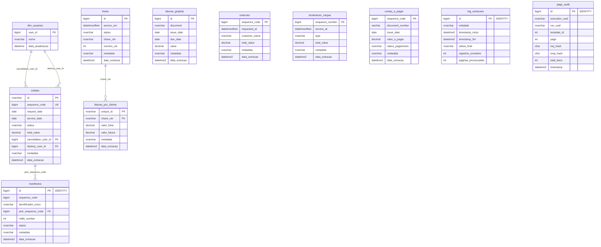
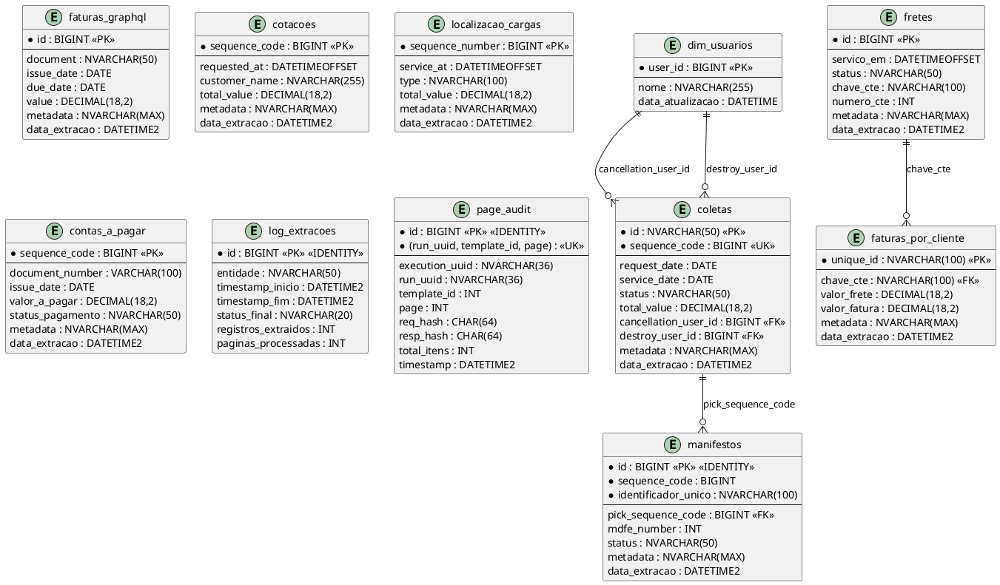

# 📊 DER (Diagrama Entidade-Relacionamento) - Banco de Dados

**Sistema:** Extrator ESL Cloud  
**Versão:** 2.3.1  
**Data:** 23/01/2026  
**Banco de Dados:** SQL Server

---

## 📋 Índice

1. [Visão Geral](#visão-geral)
2. [Entidades Principais](#entidades-principais)
3. [Tabelas de Auditoria](#tabelas-de-auditoria)
4. [Tabelas Dimensão](#tabelas-dimensão)
5. [Relacionamentos](#relacionamentos)
6. [DER Completo em Texto](#der-completo-em-texto)
7. [Notação para Ferramentas de Modelagem](#notação-para-ferramentas-de-modelagem)

---

## 🎯 Visão Geral

O banco de dados do Extrator ESL Cloud possui **11 tabelas principais**:

### Tabelas de Dados (8)
1. `coletas` - Dados de coletas (API GraphQL)
2. `fretes` - Dados de fretes (API GraphQL)
3. `faturas_graphql` - Faturas via GraphQL
4. `manifestos` - Manifestos de transporte (API Data Export)
5. `cotacoes` - Cotações de frete (API Data Export)
6. `localizacao_cargas` - Localização de cargas (API Data Export)
7. `contas_a_pagar` - Contas a pagar (API Data Export)
8. `faturas_por_cliente` - Faturas por cliente (API Data Export)

### Tabelas de Auditoria (2)
9. `log_extracoes` - Logs de execução das extrações
10. `page_audit` - Auditoria de páginas processadas

### Tabelas Dimensão (1)
11. `dim_usuarios` - Dimensão de usuários

---

## 📊 Entidades Principais

### 1. COLETAS

**Tabela:** `coletas`  
**Fonte:** API GraphQL  
**Chave Primária:** `id` (NVARCHAR(50))  
**Chave Única:** `sequence_code` (BIGINT) - Constraint UNIQUE

**Campos Principais:**
- `id` (NVARCHAR(50), PK) - ID único da coleta
- `sequence_code` (BIGINT, UNIQUE) - Código sequencial da coleta
- `request_date` (DATE) - Data da solicitação
- `service_date` (DATE) - Data do serviço
- `status` (NVARCHAR(50)) - Status da coleta
- `total_value` (DECIMAL(18,2)) - Valor total
- `total_weight` (DECIMAL(18,3)) - Peso total
- `total_volumes` (INT) - Total de volumes
- `cliente_nome` (NVARCHAR(255)) - Nome do cliente
- `cliente_doc` (NVARCHAR(50)) - Documento do cliente
- `local_coleta` (NVARCHAR(500)) - Local da coleta
- `cidade_coleta` (NVARCHAR(255)) - Cidade
- `uf_coleta` (NVARCHAR(10)) - UF
- `filial_nome` (NVARCHAR(255)) - Nome da filial
- `usuario_nome` (NVARCHAR(255)) - Nome do usuário
- `cancellation_user_id` (BIGINT) - ID do usuário que cancelou
- `destroy_user_id` (BIGINT) - ID do usuário que excluiu
- `metadata` (NVARCHAR(MAX)) - JSON completo dos dados
- `data_extracao` (DATETIME2) - Data de extração

**Índices:**
- PK: `id`
- UNIQUE: `sequence_code`

**Relacionamentos:**
- `cancellation_user_id` → `dim_usuarios.user_id` (lógico)
- `destroy_user_id` → `dim_usuarios.user_id` (lógico)
- `sequence_code` ← `manifestos.pick_sequence_code` (lógico)

---

### 2. FRETES

**Tabela:** `fretes`  
**Fonte:** API GraphQL  
**Chave Primária:** `id` (BIGINT)

**Campos Principais:**
- `id` (BIGINT, PK) - ID único do frete
- `servico_em` (DATETIMEOFFSET) - Data/hora do serviço
- `criado_em` (DATETIMEOFFSET) - Data/hora de criação
- `status` (NVARCHAR(50)) - Status do frete
- `modal` (NVARCHAR(50)) - Modal de transporte
- `tipo_frete` (NVARCHAR(100)) - Tipo de frete
- `valor_total` (DECIMAL(18,2)) - Valor total
- `valor_notas` (DECIMAL(18,2)) - Valor das notas
- `peso_notas` (DECIMAL(18,3)) - Peso das notas
- `pagador_id` (BIGINT) - ID do pagador
- `pagador_nome` (NVARCHAR(255)) - Nome do pagador
- `remetente_id` (BIGINT) - ID do remetente
- `remetente_nome` (NVARCHAR(255)) - Nome do remetente
- `destinatario_id` (BIGINT) - ID do destinatário
- `destinatario_nome` (NVARCHAR(255)) - Nome do destinatário
- `origem_cidade` (NVARCHAR(255)) - Cidade de origem
- `origem_uf` (NVARCHAR(10)) - UF de origem
- `destino_cidade` (NVARCHAR(255)) - Cidade de destino
- `destino_uf` (NVARCHAR(10)) - UF de destino
- `chave_cte` (NVARCHAR(100)) - Chave do CT-e
- `numero_cte` (INT) - Número do CT-e
- `nfse_number` (INT) - Número da NFS-e
- `metadata` (NVARCHAR(MAX)) - JSON completo dos dados
- `data_extracao` (DATETIME2) - Data de extração

**Índices:**
- PK: `id`

**Relacionamentos:**
- `chave_cte` ← `faturas_por_cliente.chave_cte` (lógico)

---

### 3. FATURAS_GRAPHQL

**Tabela:** `faturas_graphql`  
**Fonte:** API GraphQL  
**Chave Primária:** `id` (BIGINT)

**Campos Principais:**
- `id` (BIGINT, PK) - ID único da fatura
- `document` (NVARCHAR(50)) - Número do documento
- `issue_date` (DATE) - Data de emissão
- `due_date` (DATE) - Data de vencimento
- `value` (DECIMAL(18,2)) - Valor
- `paid_value` (DECIMAL(18,2)) - Valor pago
- `value_to_pay` (DECIMAL(18,2)) - Valor a pagar
- `paid` (BIT) - Indica se foi pago
- `status` (NVARCHAR(50)) - Status
- `type` (NVARCHAR(50)) - Tipo
- `corporation_id` (BIGINT) - ID da corporação
- `corporation_name` (NVARCHAR(255)) - Nome da corporação
- `metadata` (NVARCHAR(MAX)) - JSON completo
- `data_extracao` (DATETIME2) - Data de extração

**Índices:**
- PK: `id`
- IX: `document`
- IX: `due_date`
- IX: `corporation_id`

---

### 4. MANIFESTOS

**Tabela:** `manifestos`  
**Fonte:** API Data Export  
**Chave Primária:** `id` (BIGINT, IDENTITY)  
**Chave de Negócio:** `(sequence_code, pick_sequence_code, mdfe_number)`  
**Constraint UNIQUE:** `(sequence_code, identificador_unico)`

**Campos Principais:**
- `id` (BIGINT, PK, IDENTITY) - ID auto-incrementado
- `sequence_code` (BIGINT, NOT NULL) - Código sequencial do manifesto
- `identificador_unico` (NVARCHAR(100), NOT NULL) - Identificador único calculado
- `status` (NVARCHAR(50)) - Status do manifesto
- `created_at` (DATETIMEOFFSET) - Data de criação
- `departured_at` (DATETIMEOFFSET) - Data de partida
- `closed_at` (DATETIMEOFFSET) - Data de fechamento
- `finished_at` (DATETIMEOFFSET) - Data de finalização
- `mdfe_number` (INT) - Número do MDF-e
- `mdfe_key` (NVARCHAR(100)) - Chave do MDF-e
- `pick_sequence_code` (BIGINT) - Código sequencial da coleta relacionada
- `vehicle_plate` (NVARCHAR(10)) - Placa do veículo
- `driver_name` (NVARCHAR(255)) - Nome do motorista
- `branch_nickname` (NVARCHAR(255)) - Apelido da filial
- `invoices_value` (DECIMAL(18,2)) - Valor das notas
- `total_cost` (DECIMAL(18,2)) - Custo total
- `paying_total` (DECIMAL(18,2)) - Total a pagar
- `metadata` (NVARCHAR(MAX)) - JSON completo
- `data_extracao` (DATETIME2) - Data de extração

**Índices:**
- PK: `id`
- UNIQUE: `(sequence_code, identificador_unico)`
- IX: `sequence_code`

**Relacionamentos:**
- `pick_sequence_code` → `coletas.sequence_code` (lógico)

---

### 5. COTAÇÕES

**Tabela:** `cotacoes`  
**Fonte:** API Data Export  
**Chave Primária:** `sequence_code` (BIGINT)

**Campos Principais:**
- `sequence_code` (BIGINT, PK) - Código sequencial da cotação
- `requested_at` (DATETIMEOFFSET) - Data da solicitação
- `operation_type` (NVARCHAR(100)) - Tipo de operação
- `customer_doc` (NVARCHAR(14)) - Documento do cliente
- `customer_name` (NVARCHAR(255)) - Nome do cliente
- `origin_city` (NVARCHAR(100)) - Cidade de origem
- `origin_state` (NVARCHAR(2)) - UF de origem
- `destination_city` (NVARCHAR(100)) - Cidade de destino
- `destination_state` (NVARCHAR(2)) - UF de destino
- `total_value` (DECIMAL(18,2)) - Valor total
- `volumes` (INT) - Volumes
- `taxed_weight` (DECIMAL(18,3)) - Peso taxado
- `metadata` (NVARCHAR(MAX)) - JSON completo
- `data_extracao` (DATETIME2) - Data de extração

**Índices:**
- PK: `sequence_code`

---

### 6. LOCALIZAÇÃO_CARGAS

**Tabela:** `localizacao_cargas`  
**Fonte:** API Data Export  
**Chave Primária:** `sequence_number` (BIGINT)

**Campos Principais:**
- `sequence_number` (BIGINT, PK) - Número sequencial (N° Minuta)
- `type` (NVARCHAR(100)) - Tipo
- `service_at` (DATETIMEOFFSET) - Data do frete
- `invoices_volumes` (INT) - Volumes
- `taxed_weight` (NVARCHAR(50)) - Peso Taxado
- `invoices_value` (NVARCHAR(50)) - Valor NF
- `total_value` (DECIMAL(18,2)) - Valor Frete
- `service_type` (NVARCHAR(50)) - Tipo Serviço
- `branch_nickname` (NVARCHAR(255)) - Filial Emissora
- `predicted_delivery_at` (DATETIMEOFFSET) - Previsão Entrega
- `destination_location_name` (NVARCHAR(255)) - Região Destino
- `origin_location_name` (NVARCHAR(255)) - Região Origem
- `status` (NVARCHAR(50)) - Status Carga
- `metadata` (NVARCHAR(MAX)) - JSON completo
- `data_extracao` (DATETIME2) - Data de extração

**Índices:**
- PK: `sequence_number`

---

### 7. CONTAS_A_PAGAR

**Tabela:** `contas_a_pagar`  
**Fonte:** API Data Export  
**Chave Primária:** `sequence_code` (BIGINT)

**Campos Principais:**
- `sequence_code` (BIGINT, PK) - Código sequencial
- `document_number` (VARCHAR(100)) - Número do documento
- `issue_date` (DATE) - Data de emissão
- `tipo_lancamento` (NVARCHAR(100)) - Tipo de lançamento
- `valor_original` (DECIMAL(18,2)) - Valor original
- `valor_a_pagar` (DECIMAL(18,2)) - Valor a pagar
- `valor_pago` (DECIMAL(18,2)) - Valor pago
- `status_pagamento` (NVARCHAR(50)) - Status do pagamento
- `mes_competencia` (INT) - Mês de competência
- `ano_competencia` (INT) - Ano de competência
- `data_criacao` (DATETIMEOFFSET) - Data de criação
- `data_liquidacao` (DATE) - Data de liquidação
- `nome_fornecedor` (NVARCHAR(255)) - Nome do fornecedor
- `nome_filial` (NVARCHAR(255)) - Nome da filial
- `nome_centro_custo` (NVARCHAR(255)) - Nome do centro de custo
- `metadata` (NVARCHAR(MAX)) - JSON completo
- `data_extracao` (DATETIME2) - Data de extração

**Índices:**
- PK: `sequence_code`
- IX: `issue_date`
- IX: `status_pagamento`
- IX: `nome_fornecedor`
- IX: `nome_filial`
- IX: `(ano_competencia, mes_competencia)`

---

### 8. FATURAS_POR_CLIENTE

**Tabela:** `faturas_por_cliente`  
**Fonte:** API Data Export  
**Chave Primária:** `unique_id` (NVARCHAR(100))

**Campos Principais:**
- `unique_id` (NVARCHAR(100), PK) - ID único
- `valor_frete` (DECIMAL(18,2)) - Valor do frete
- `valor_fatura` (DECIMAL(18,2)) - Valor da fatura
- `numero_cte` (BIGINT) - Número do CT-e
- `chave_cte` (NVARCHAR(100)) - Chave do CT-e
- `numero_nfse` (BIGINT) - Número da NFS-e
- `status_cte` (NVARCHAR(255)) - Status do CT-e
- `data_emissao_cte` (DATETIMEOFFSET) - Data de emissão do CT-e
- `numero_fatura` (NVARCHAR(50)) - Número da fatura
- `data_emissao_fatura` (DATE) - Data de emissão da fatura
- `data_vencimento_fatura` (DATE) - Data de vencimento
- `data_baixa_fatura` (DATE) - Data de baixa
- `filial` (NVARCHAR(255)) - Filial
- `tipo_frete` (NVARCHAR(100)) - Tipo de frete
- `pagador_nome` (NVARCHAR(255)) - Nome do pagador
- `remetente_nome` (NVARCHAR(255)) - Nome do remetente
- `destinatario_nome` (NVARCHAR(255)) - Nome do destinatário
- `metadata` (NVARCHAR(MAX)) - JSON completo
- `data_extracao` (DATETIME2) - Data de extração

**Índices:**
- PK: `unique_id`
- IX: `data_vencimento_fatura`
- IX: `pagador_nome`
- IX: `filial`
- IX: `chave_cte`

**Relacionamentos:**
- `chave_cte` → `fretes.chave_cte` (lógico)

---

## 📋 Tabelas de Auditoria

### 9. LOG_EXTRAÇÕES

**Tabela:** `log_extracoes`  
**Finalidade:** Registrar logs de execução das extrações

**Campos:**
- `id` (BIGINT, PK, IDENTITY) - ID auto-incrementado
- `entidade` (NVARCHAR(50), NOT NULL) - Nome da entidade extraída
- `timestamp_inicio` (DATETIME2, NOT NULL) - Início da extração
- `timestamp_fim` (DATETIME2, NOT NULL) - Fim da extração
- `status_final` (NVARCHAR(20), NOT NULL) - Status final (COMPLETO, INCOMPLETO, ERRO_API)
- `registros_extraidos` (INT, NOT NULL) - Quantidade de registros extraídos
- `paginas_processadas` (INT, NOT NULL) - Quantidade de páginas processadas
- `mensagem` (NVARCHAR(MAX)) - Mensagem adicional

**Índices:**
- PK: `id`
- IX: `(entidade, timestamp_fim DESC)`

---

### 10. PAGE_AUDIT

**Tabela:** `page_audit`  
**Finalidade:** Auditoria detalhada de páginas processadas

**Campos:**
- `id` (BIGINT, PK, IDENTITY) - ID auto-incrementado
- `execution_uuid` (NVARCHAR(36), NOT NULL) - UUID da execução
- `run_uuid` (NVARCHAR(36), NOT NULL) - UUID do run
- `template_id` (INT, NOT NULL) - ID do template (Data Export)
- `page` (INT, NOT NULL) - Número da página
- `per` (INT, NOT NULL) - Registros por página
- `janela_inicio` (DATE) - Início da janela temporal
- `janela_fim` (DATE) - Fim da janela temporal
- `req_hash` (CHAR(64), NOT NULL) - Hash da requisição
- `resp_hash` (CHAR(64), NOT NULL) - Hash da resposta
- `total_itens` (INT, NOT NULL) - Total de itens na página
- `id_key` (NVARCHAR(50)) - Chave do ID
- `id_min_num` (BIGINT) - ID mínimo numérico
- `id_max_num` (BIGINT) - ID máximo numérico
- `id_min_str` (NVARCHAR(80)) - ID mínimo string
- `id_max_str` (NVARCHAR(80)) - ID máximo string
- `status_code` (INT, NOT NULL) - Código HTTP de status
- `duracao_ms` (INT, NOT NULL) - Duração em milissegundos
- `timestamp` (DATETIME2, NOT NULL) - Timestamp da auditoria

**Índices:**
- PK: `id`
- UNIQUE: `(run_uuid, template_id, page)`
- IX: `(execution_uuid, timestamp DESC)`

**Constraints:**
- `status_code` BETWEEN 100 AND 599
- `LEN(req_hash) = 64 AND LEN(resp_hash) = 64`
- `page >= 1 AND per >= 1 AND total_itens >= 0`
- `id_min_num <= id_max_num` (se ambos não NULL)

---

## 📊 Tabelas Dimensão

### 11. DIM_USUARIOS

**Tabela:** `dim_usuarios`  
**Finalidade:** Tabela dimensão de usuários para enriquecimento de dados

**Campos:**
- `user_id` (BIGINT, PK) - ID do usuário
- `nome` (NVARCHAR(255)) - Nome do usuário
- `data_atualizacao` (DATETIME) - Data de atualização

**Índices:**
- PK: `user_id`

**Relacionamentos:**
- `user_id` ← `coletas.cancellation_user_id` (lógico)
- `user_id` ← `coletas.destroy_user_id` (lógico)

---

## 🔗 Relacionamentos

### Relacionamentos Lógicos (Sem Foreign Keys)

O banco de dados **não possui Foreign Keys explícitas**, mas existem relacionamentos lógicos:

1. **coletas ↔ dim_usuarios**
   - `coletas.cancellation_user_id` → `dim_usuarios.user_id`
   - `coletas.destroy_user_id` → `dim_usuarios.user_id`

2. **manifestos ↔ coletas**
   - `manifestos.pick_sequence_code` → `coletas.sequence_code`

3. **faturas_por_cliente ↔ fretes**
   - `faturas_por_cliente.chave_cte` → `fretes.chave_cte`

### Observações

- Os relacionamentos são **lógicos** e não são garantidos por constraints do banco
- As views do Power BI fazem JOINs baseados nesses relacionamentos
- A integridade referencial é mantida pela aplicação, não pelo banco

---

## 📐 DER Completo em Texto

### Representação Textual do DER

```
┌─────────────────────────────────────────────────────────────────┐
│                    DER - BANCO DE DADOS                         │
│                  Extrator ESL Cloud v2.3.1                      │
└─────────────────────────────────────────────────────────────────┘

┌──────────────────────┐
│   dim_usuarios       │
├──────────────────────┤
│ PK user_id (BIGINT)  │
│    nome (NVARCHAR)   │
│    data_atualizacao  │
└──────────┬───────────┘
           │
           │ (1:N)
           │
           ├──────────────────────────────┐
           │                              │
           ▼                              ▼
┌──────────────────────┐      ┌──────────────────────┐
│      coletas         │      │      coletas         │
├──────────────────────┤      ├──────────────────────┤
│ PK id (NVARCHAR)     │      │ cancellation_user_id │
│ UK sequence_code     │      │ destroy_user_id      │
│    request_date      │      └──────────────────────┘
│    service_date      │
│    status            │
│    total_value       │
│    ...               │
│    metadata          │
│    data_extracao     │
└──────────┬───────────┘
           │
           │ (1:N)
           │ pick_sequence_code
           │
           ▼
┌──────────────────────┐
│     manifestos       │
├──────────────────────┤
│ PK id (BIGINT, ID)   │
│    sequence_code     │
│ UK (seq, ident)      │
│    pick_sequence_code│
│    mdfe_number       │
│    status            │
│    ...               │
│    metadata          │
│    data_extracao     │
└──────────────────────┘

┌──────────────────────┐
│      fretes         │
├──────────────────────┤
│ PK id (BIGINT)       │
│    servico_em        │
│    status            │
│    chave_cte         │
│    numero_cte        │
│    ...               │
│    metadata          │
│    data_extracao     │
└──────────┬───────────┘
           │
           │ (1:N)
           │ chave_cte
           │
           ▼
┌──────────────────────┐
│ faturas_por_cliente  │
├──────────────────────┤
│ PK unique_id (NV)    │
│    chave_cte         │
│    valor_frete       │
│    valor_fatura      │
│    ...               │
│    metadata          │
│    data_extracao     │
└──────────────────────┘

┌──────────────────────┐
│    faturas_graphql   │
├──────────────────────┤
│ PK id (BIGINT)       │
│    document          │
│    issue_date        │
│    due_date          │
│    value             │
│    ...               │
│    metadata          │
│    data_extracao     │
└──────────────────────┘

┌──────────────────────┐
│      cotacoes        │
├──────────────────────┤
│ PK sequence_code     │
│    requested_at       │
│    customer_name     │
│    total_value       │
│    ...               │
│    metadata          │
│    data_extracao     │
└──────────────────────┘

┌──────────────────────┐
│ localizacao_cargas   │
├──────────────────────┤
│ PK sequence_number   │
│    service_at        │
│    type              │
│    total_value       │
│    ...               │
│    metadata          │
│    data_extracao     │
└──────────────────────┘

┌──────────────────────┐
│  contas_a_pagar      │
├──────────────────────┤
│ PK sequence_code     │
│    document_number   │
│    issue_date        │
│    valor_a_pagar     │
│    status_pagamento  │
│    ...               │
│    metadata          │
│    data_extracao     │
└──────────────────────┘

┌──────────────────────┐
│   log_extracoes      │
├──────────────────────┤
│ PK id (BIGINT, ID)   │
│    entidade          │
│    timestamp_inicio  │
│    timestamp_fim     │
│    status_final      │
│    registros_extraidos│
│    paginas_processadas│
└──────────────────────┘

┌──────────────────────┐
│     page_audit       │
├──────────────────────┤
│ PK id (BIGINT, ID)   │
│ UK (run, template, p)│
│    execution_uuid    │
│    run_uuid          │
│    template_id       │
│    page              │
│    req_hash          │
│    resp_hash         │
│    ...               │
└──────────────────────┘
```

---

## 🛠️ Notação para Ferramentas de Modelagem

### Formato Mermaid (para GitHub, GitLab, etc.)



### Formato PlantUML



### Formato SQL (para DBDesigner, MySQL Workbench, etc.)

```sql
-- ============================================
-- DER - Extrator ESL Cloud v2.3.1
-- ============================================

-- Tabela Dimensão
CREATE TABLE dim_usuarios (
    user_id BIGINT PRIMARY KEY,
    nome NVARCHAR(255),
    data_atualizacao DATETIME DEFAULT GETDATE()
);

-- Tabelas Principais
CREATE TABLE coletas (
    id NVARCHAR(50) PRIMARY KEY,
    sequence_code BIGINT UNIQUE,
    request_date DATE,
    service_date DATE,
    status NVARCHAR(50),
    total_value DECIMAL(18,2),
    cancellation_user_id BIGINT, -- FK lógica → dim_usuarios.user_id
    destroy_user_id BIGINT, -- FK lógica → dim_usuarios.user_id
    metadata NVARCHAR(MAX),
    data_extracao DATETIME2 DEFAULT GETDATE()
);

CREATE TABLE fretes (
    id BIGINT PRIMARY KEY,
    servico_em DATETIMEOFFSET,
    status NVARCHAR(50),
    chave_cte NVARCHAR(100),
    numero_cte INT,
    metadata NVARCHAR(MAX),
    data_extracao DATETIME2 DEFAULT GETDATE()
);

CREATE TABLE manifestos (
    id BIGINT IDENTITY(1,1) PRIMARY KEY,
    sequence_code BIGINT NOT NULL,
    identificador_unico NVARCHAR(100) NOT NULL,
    pick_sequence_code BIGINT, -- FK lógica → coletas.sequence_code
    mdfe_number INT,
    status NVARCHAR(50),
    metadata NVARCHAR(MAX),
    data_extracao DATETIME2 DEFAULT GETDATE(),
    CONSTRAINT UQ_manifestos_sequence_identificador UNIQUE (sequence_code, identificador_unico)
);

CREATE TABLE faturas_por_cliente (
    unique_id NVARCHAR(100) PRIMARY KEY,
    chave_cte NVARCHAR(100), -- FK lógica → fretes.chave_cte
    valor_frete DECIMAL(18,2),
    valor_fatura DECIMAL(18,2),
    metadata NVARCHAR(MAX),
    data_extracao DATETIME2 DEFAULT GETDATE()
);

CREATE TABLE faturas_graphql (
    id BIGINT PRIMARY KEY,
    document NVARCHAR(50),
    issue_date DATE,
    due_date DATE,
    value DECIMAL(18,2),
    metadata NVARCHAR(MAX),
    data_extracao DATETIME2 DEFAULT GETDATE()
);

CREATE TABLE cotacoes (
    sequence_code BIGINT PRIMARY KEY,
    requested_at DATETIMEOFFSET,
    customer_name NVARCHAR(255),
    total_value DECIMAL(18,2),
    metadata NVARCHAR(MAX),
    data_extracao DATETIME2 DEFAULT GETDATE()
);

CREATE TABLE localizacao_cargas (
    sequence_number BIGINT PRIMARY KEY,
    service_at DATETIMEOFFSET,
    type NVARCHAR(100),
    total_value DECIMAL(18,2),
    metadata NVARCHAR(MAX),
    data_extracao DATETIME2 DEFAULT GETDATE()
);

CREATE TABLE contas_a_pagar (
    sequence_code BIGINT PRIMARY KEY,
    document_number VARCHAR(100),
    issue_date DATE,
    valor_a_pagar DECIMAL(18,2),
    status_pagamento NVARCHAR(50),
    metadata NVARCHAR(MAX),
    data_extracao DATETIME2 DEFAULT GETDATE()
);

-- Tabelas de Auditoria
CREATE TABLE log_extracoes (
    id BIGINT IDENTITY(1,1) PRIMARY KEY,
    entidade NVARCHAR(50) NOT NULL,
    timestamp_inicio DATETIME2 NOT NULL,
    timestamp_fim DATETIME2 NOT NULL,
    status_final NVARCHAR(20) NOT NULL,
    registros_extraidos INT NOT NULL,
    paginas_processadas INT NOT NULL,
    mensagem NVARCHAR(MAX)
);

CREATE TABLE page_audit (
    id BIGINT IDENTITY(1,1) PRIMARY KEY,
    execution_uuid NVARCHAR(36) NOT NULL,
    run_uuid NVARCHAR(36) NOT NULL,
    template_id INT NOT NULL,
    page INT NOT NULL,
    per INT NOT NULL,
    req_hash CHAR(64) NOT NULL,
    resp_hash CHAR(64) NOT NULL,
    total_itens INT NOT NULL,
    timestamp DATETIME2 NOT NULL DEFAULT SYSUTCDATETIME(),
    CONSTRAINT UQ_page_audit_run_template_page UNIQUE (run_uuid, template_id, page)
);
```

---

## 📌 Observações Importantes

1. **Sem Foreign Keys Explícitas**: O banco não possui Foreign Keys definidas, mas existem relacionamentos lógicos que são utilizados nas views do Power BI

2. **Chaves Compostas**: A tabela `manifestos` usa chave composta `(sequence_code, pick_sequence_code, mdfe_number)` para o MERGE, mas tem constraint UNIQUE em `(sequence_code, identificador_unico)`

3. **Coluna Metadata**: Todas as tabelas principais possuem coluna `metadata` (NVARCHAR(MAX)) com JSON completo para garantir 100% de completude

4. **Coluna data_extracao**: Todas as tabelas principais possuem coluna `data_extracao` (DATETIME2) para rastreabilidade

5. **Índices**: As tabelas possuem índices estratégicos para otimizar consultas frequentes (datas, status, nomes, etc.)

---

## 🔗 Referências

- **README Principal**: [../README.md](../README.md)
- **Fluxograma do Sistema**: [FLUXOGRAMA-COMPLETO-SISTEMA.md](FLUXOGRAMA-COMPLETO-SISTEMA.md)
- **Scripts SQL**: [../database/tabelas/](../database/tabelas/)

---

**Última Atualização:** 23/01/2026  
**Versão do Sistema:** 2.3.1  
**Status:** ✅ Estável e em Produção
