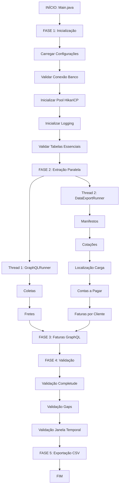
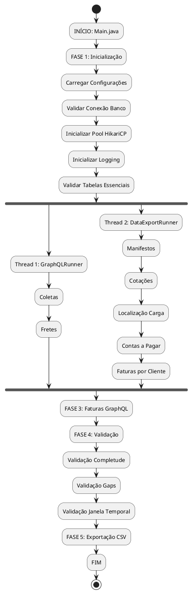

# 📊 Fluxograma Completo do Sistema - Extrator ESL Cloud

**Versão:** 2.3.1  
**Data:** 23/01/2026  
**Status:** ✅ Estável e em Produção

---

## 📋 Índice

1. [Visão Geral](#visão-geral)
2. [Arquitetura do Sistema](#arquitetura-do-sistema)
3. [Fluxograma Principal](#fluxograma-principal)
4. [Fluxograma Detalhado por Fase](#fluxograma-detalhado-por-fase)
5. [Fluxograma de Execução Paralela](#fluxograma-de-execução-paralela)
6. [Fluxograma de Entidades por API](#fluxograma-de-entidades-por-api)
7. [Fluxograma de Validação](#fluxograma-de-validação)
8. [Diagrama de Componentes](#diagrama-de-componentes)
9. [Notação para Ferramentas de Modelagem](#notação-para-ferramentas-de-modelagem)

---

## 🎯 Visão Geral

O **Extrator ESL Cloud** é um sistema ETL (Extract, Transform, Load) desenvolvido em Java que:

- **Extrai** dados de 2 APIs do ESL Cloud (GraphQL e Data Export) em execução paralela
- **Transforma** dados JSON em entidades estruturadas
- **Carrega** dados em SQL Server usando operações MERGE (UPSERT)
- **Valida** completude, gaps e janela temporal
- **Exporta** dados para CSV para análise externa

### Entidades Extraídas

**API GraphQL:**
- Coletas
- Fretes
- Faturas GraphQL (executado por último devido ao tempo de processamento)

**API Data Export:**
- Manifestos
- Cotações
- Localização de Carga
- Contas a Pagar
- Faturas por Cliente

---

## 🏗️ Arquitetura do Sistema

### Padrão Arquitetural

```
Main.java (Orquestrador)
    ├── ExecutarFluxoCompletoComando.java
    │   ├── Execução Paralela (2 threads)
    │   │   ├── GraphQLRunner.java (Thread 1)
    │   │   │   ├── Coletas
    │   │   │   └── Fretes
    │   │   └── DataExportRunner.java (Thread 2)
    │   │       ├── Manifestos
    │   │       ├── Cotações
    │   │       ├── Localização de Carga
    │   │       ├── Contas a Pagar
    │   │       └── Faturas por Cliente
    │   ├── Faturas GraphQL (Fase 3 - Sequencial)
    │   ├── Validação de Completude
    │   ├── Validação de Gaps
    │   └── Validação de Janela Temporal
    └── Outros Comandos (Auditoria, Validação, etc.)
```

### Componentes Principais

1. **Main.java** - Orquestrador principal, interpreta argumentos CLI
2. **Comandos** - ExecutarFluxoCompletoComando, ValidarManifestosComando, etc.
3. **Runners** - GraphQLRunner, DataExportRunner (execução paralela)
4. **Clientes de API** - ClienteApiGraphQL, ClienteApiDataExport
5. **Repositories** - Persistência no banco (MERGE/UPSERT)
6. **Validators** - CompletudeValidator, AuditoriaValidator
7. **Utilitários** - ExportadorCSV, GerenciadorConexao, LoggingService

---

## 🔄 Fluxograma Principal

### Fluxo Completo de Execução

```
┌─────────────────────────────────────────────────────────────────┐
│                    INÍCIO DO SISTEMA                            │
│                    (Main.java)                                  │
└──────────────────────────┬──────────────────────────────────────┘
                           │
                           ▼
┌─────────────────────────────────────────────────────────────────┐
│  FASE 1: INICIALIZAÇÃO                                         │
│  ├── Carregar configurações (config.properties)                │
│  ├── Carregar variáveis de ambiente (DB_URL, tokens, etc.)     │
│  ├── Validar conexão com banco de dados                        │
│  ├── Inicializar pool de conexões HikariCP                     │
│  ├── Inicializar sistema de logging                            │
│  └── Validar existência de tabelas essenciais                  │
└──────────────────────────┬──────────────────────────────────────┘
                           │
                           ▼
┌─────────────────────────────────────────────────────────────────┐
│  FASE 2: EXTRAÇÃO PARALELA (2 Threads)                         │
│  ┌──────────────────────────┐  ┌──────────────────────────┐  │
│  │ Thread 1: GraphQLRunner  │  │ Thread 2: DataExportRunner│  │
│  │                          │  │                          │  │
│  │ ┌──────────────────────┐ │  │ ┌──────────────────────┐ │  │
│  │ │ 1. Coletas           │ │  │ │ 1. Manifestos        │ │  │
│  │ │    (2 dias)          │ │  │ │    (24h)              │ │  │
│  │ └──────────────────────┘ │  │ └──────────────────────┘ │  │
│  │                          │  │                          │  │
│  │ ┌──────────────────────┐ │  │ ┌──────────────────────┐ │  │
│  │ │ 2. Fretes            │ │  │ │ 2. Cotações           │ │  │
│  │ │    (24h)             │ │  │ │    (24h)              │ │  │
│  │ └──────────────────────┘ │  │ └──────────────────────┘ │  │
│  │                          │  │                          │  │
│  │                          │  │ ┌──────────────────────┐ │  │
│  │                          │  │ │ 3. Localização Carga  │ │  │
│  │                          │  │ │    (24h)              │ │  │
│  │                          │  │ └──────────────────────┘ │  │
│  │                          │  │                          │  │
│  │                          │  │ ┌──────────────────────┐ │  │
│  │                          │  │ │ 4. Contas a Pagar     │ │  │
│  │                          │  │ │    (24h)              │ │  │
│  │                          │  │ └──────────────────────┘ │  │
│  │                          │  │                          │  │
│  │                          │  │ ┌──────────────────────┐ │  │
│  │                          │  │ │ 5. Faturas por Cliente│ │  │
│  │                          │  │ │    (24h)              │ │  │
│  │                          │  │ └──────────────────────┘ │  │
│  └──────────────────────────┘  └──────────────────────────┘  │
└──────────────────────────┬──────────────────────────────────────┘
                           │
                           ▼
┌─────────────────────────────────────────────────────────────────┐
│  FASE 3: FATURAS GRAPHQL (Sequencial - Por Último)             │
│  ├── Executar Faturas GraphQL                                   │
│  └── Motivo: Processo de enriquecimento demorado (50+ min)     │
└──────────────────────────┬──────────────────────────────────────┘
                           │
                           ▼
┌─────────────────────────────────────────────────────────────────┐
│  FASE 4: VALIDAÇÃO                                              │
│  ├── Validação de Completude (contagens API vs Banco)           │
│  ├── Validação de Gaps (IDs sequenciais faltantes)             │
│  └── Validação de Janela Temporal (registros criados durante)  │
└──────────────────────────┬──────────────────────────────────────┘
                           │
                           ▼
┌─────────────────────────────────────────────────────────────────┐
│  FASE 5: EXPORTAÇÃO CSV (Opcional)                             │
│  ├── Exportar todas as entidades para CSV                      │
│  └── Usar views PowerBI para formatação                        │
└──────────────────────────┬──────────────────────────────────────┘
                           │
                           ▼
┌─────────────────────────────────────────────────────────────────┐
│                    FIM DO PROCESSO                              │
│                    (Logs e Relatórios)                         │
└─────────────────────────────────────────────────────────────────┘
```

---

## 🔍 Fluxograma Detalhado por Fase

### FASE 1: INICIALIZAÇÃO

```
INÍCIO
  │
  ├─► Carregar config.properties
  │   └─► Ler configurações do arquivo
  │
  ├─► Carregar Variáveis de Ambiente
  │   ├─► DB_URL (jdbc:sqlserver://...)
  │   ├─► DB_USER
  │   ├─► DB_PASSWORD
  │   ├─► API_BASEURL
  │   ├─► API_GRAPHQL_TOKEN
  │   └─► API_DATAEXPORT_TOKEN
  │
  ├─► Validar Conexão com Banco
  │   ├─► Testar conexão SQL Server
  │   └─► [ERRO?] → Falhar com mensagem clara
  │
  ├─► Inicializar Pool HikariCP
  │   ├─► Configurar pool de conexões
  │   └─► Definir tamanho máximo do pool
  │
  ├─► Inicializar Sistema de Logging
  │   ├─► Configurar Logback
  │   ├─► Criar arquivo de log (logs/extracao_dados_YYYY-MM-DD_HH-MM-SS.log)
  │   └─► Iniciar captura de logs
  │
  └─► Validar Tabelas Essenciais
      ├─► Verificar log_extracoes
      ├─► Verificar page_audit
      ├─► Verificar dim_usuarios
      └─► [FALTANDO?] → Falhar com mensagem clara
      │
      └─► FIM INICIALIZAÇÃO
```

### FASE 2: EXTRAÇÃO PARALELA - Thread GraphQL

```
INÍCIO GraphQLRunner
  │
  ├─► Criar ClienteApiGraphQL
  │   ├─► Configurar URL base
  │   ├─► Configurar token de autenticação
  │   └─► Configurar GerenciadorRequisicaoHttp (throttling 2200ms)
  │
  ├─► EXTRAIR COLETAS
  │   │
  │   ├─► Construir Query GraphQL (BuscarColetasExpandidaV2)
  │   │   ├─► Filtro: 2 dias (dia anterior + dia atual)
  │   │   └─► Paginação: cursor-based (first, after)
  │   │
  │   ├─► Loop de Paginação
  │   │   ├─► Fazer requisição HTTP POST
  │   │   │   ├─► Adicionar Authorization: Bearer token
  │   │   │   ├─► Aplicar throttling (mínimo 2200ms)
  │   │   │   ├─► Retry até 5 tentativas (backoff exponencial)
  │   │   │   └─► Timeout: 30 segundos
  │   │   │
  │   │   ├─► Deserializar JSON → List<ColetaNodeDTO>
  │   │   │
  │   │   ├─► Para cada DTO:
  │   │   │   ├─► Mapper: ColetaNodeDTO → ColetaEntity
  │   │   │   ├─► Validar campos obrigatórios
  │   │   │   ├─► Truncar strings longas (se necessário)
  │   │   │   └─► Adicionar metadata JSON completo
  │   │   │
  │   │   ├─► Salvar no banco (ColetaRepository)
  │   │   │   ├─► Verificar se tabela existe
  │   │   │   ├─► Executar MERGE (UPSERT)
  │   │   │   │   ├─► Chave: id (VARCHAR)
  │   │   │   │   ├─► Se existe → UPDATE
  │   │   │   │   └─► Se não existe → INSERT
  │   │   │   └─► Validar rowsAffected > 0
  │   │   │
  │   │   ├─► Verificar cursor para próxima página
  │   │   └─► [Última página?] → Sair do loop
  │   │
  │   └─► Registrar LogExtracaoEntity
  │       ├─► Entidade: coletas
  │       ├─► Timestamps (início, fim)
  │       ├─► Status: COMPLETO/INCOMPLETO/ERRO_API
  │       └─► Contagens (registros extraídos, páginas)
  │
  ├─► Aguardar 2 segundos (throttling entre entidades)
  │
  ├─► EXTRAIR FRETES
  │   │
  │   ├─► Construir Query GraphQL (BuscarFretesExpandidaV3)
  │   │   ├─► Filtro: últimas 24 horas
  │   │   └─► Paginação: cursor-based (first, after)
  │   │
  │   └─► [Mesmo processo de Coletas]
  │       ├─► Loop de paginação
  │       ├─► Mapper: FreteNodeDTO → FreteEntity
  │       ├─► Salvar no banco (FreteRepository)
  │       │   └─► Chave: id (BIGINT)
  │       └─► Registrar LogExtracaoEntity
  │
  └─► FIM GraphQLRunner
```

### FASE 2: EXTRAÇÃO PARALELA - Thread Data Export

```
INÍCIO DataExportRunner
  │
  ├─► Criar ClienteApiDataExport
  │   ├─► Configurar URL base
  │   ├─► Configurar token de autenticação
  │   └─► Configurar GerenciadorRequisicaoHttp (throttling 2200ms)
  │
  ├─► EXTRAIR MANIFESTOS
  │   │
  │   ├─► Construir Requisição GET
  │   │   ├─► Endpoint: /api/analytics/reports/6399/data
  │   │   ├─► Filtro: últimas 24 horas
  │   │   └─► Paginação: page e per (até 10000 registros/página)
  │   │
  │   ├─► Loop de Paginação
  │   │   ├─► Fazer requisição HTTP GET
  │   │   │   ├─► Adicionar Authorization: Bearer token
  │   │   │   ├─► Aplicar throttling (mínimo 2200ms)
  │   │   │   ├─► Retry até 5 tentativas (backoff exponencial)
  │   │   │   └─► Timeout: 120 segundos (especial para manifestos)
  │   │   │
  │   │   ├─► Deserializar JSON → List<ManifestoDTO>
  │   │   │
  │   │   ├─► Para cada DTO:
  │   │   │   ├─► Mapper: ManifestoDTO → ManifestoEntity
  │   │   │   ├─► Calcular identificador_unico
  │   │   │   │   ├─► Se pick_sequence_code E mdfe_number → "pick_MDFE_mdfe"
  │   │   │   │   ├─► Se apenas pick_sequence_code → pick
  │   │   │   │   ├─► Se apenas mdfe_number → "sequence_MDFE_mdfe"
  │   │   │   │   └─► Se ambos NULL → Hash SHA-256 do metadata (sem campos voláteis)
  │   │   │   ├─► Validar campos obrigatórios
  │   │   │   └─► Adicionar metadata JSON completo
  │   │   │
  │   │   ├─► DEDUPLICAÇÃO (antes de salvar)
  │   │   │   ├─► Chave: (sequence_code, pick_sequence_code, mdfe_number)
  │   │   │   └─► Manter registro mais recente (Keep Last)
  │   │   │
  │   │   ├─► Salvar no banco (ManifestoRepository)
  │   │   │   ├─► Verificar se tabela existe
  │   │   │   ├─► Executar MERGE (UPSERT)
  │   │   │   │   ├─► Chave composta: (sequence_code, pick_sequence_code, mdfe_number)
  │   │   │   │   ├─► Se existe → UPDATE
  │   │   │   │   └─► Se não existe → INSERT
  │   │   │   └─► Validar rowsAffected > 0
  │   │   │
  │   │   ├─► Verificar próxima página
  │   │   └─► [Última página?] → Sair do loop
  │   │
  │   └─► Registrar LogExtracaoEntity
  │
  ├─► Aguardar 2 segundos (throttling entre entidades)
  │
  ├─► EXTRAIR COTAÇÕES
  │   │
  │   ├─► Template ID: 6906
  │   ├─► Paginação: page e per (até 1000 registros/página)
  │   │
  │   └─► [Mesmo processo de Manifestos]
  │       ├─► Mapper: CotacaoDTO → CotacaoEntity
  │       ├─► DEDUPLICAÇÃO (chave: sequence_code)
  │       └─► Salvar no banco (CotacaoRepository)
  │
  ├─► Aguardar 2 segundos
  │
  ├─► EXTRAIR LOCALIZAÇÃO DE CARGA
  │   │
  │   ├─► Template ID: 8656
  │   ├─► Paginação: page e per (até 10000 registros/página)
  │   │
  │   └─► [Mesmo processo]
  │       ├─► Mapper: LocalizacaoCargaDTO → LocalizacaoCargaEntity
  │       ├─► DEDUPLICAÇÃO (chave: sequence_number)
  │       └─► Salvar no banco (LocalizacaoCargaRepository)
  │
  ├─► Aguardar 2 segundos
  │
  ├─► EXTRAIR CONTAS A PAGAR
  │   │
  │   ├─► Template ID: 8636
  │   ├─► Paginação: page e per (até 100 registros/página)
  │   │
  │   └─► [Mesmo processo]
  │       ├─► Mapper: ContasAPagarDTO → ContasAPagarDataExportEntity
  │       ├─► SEM deduplicação (MERGE já previne duplicados)
  │       └─► Salvar no banco (ContasAPagarRepository)
  │
  ├─► Aguardar 2 segundos
  │
  ├─► EXTRAIR FATURAS POR CLIENTE
  │   │
  │   ├─► Template ID: 4924
  │   ├─► Paginação: page e per (até 100 registros/página)
  │   │
  │   └─► [Mesmo processo]
  │       ├─► Mapper: FaturaPorClienteDTO → FaturaPorClienteEntity
  │       ├─► SEM deduplicação (MERGE já previne duplicados)
  │       └─► Salvar no banco (FaturaPorClienteRepository)
  │
  └─► FIM DataExportRunner
```

### FASE 3: FATURAS GRAPHQL (Sequencial)

```
INÍCIO Faturas GraphQL
  │
  ├─► Executar GraphQLRunner.executarFaturasGraphQLPorIntervalo()
  │   │
  │   ├─► Construir Query GraphQL (BuscarFaturasExpandida)
  │   │   ├─► Filtro: intervalo de datas
  │   │   └─► Paginação: cursor-based
  │   │
  │   ├─► Loop de Paginação
  │   │   ├─► Fazer requisição HTTP POST
  │   │   ├─► Deserializar JSON → List<FaturaGraphQLDTO>
  │   │   │
  │   │   ├─► Para cada DTO:
  │   │   │   ├─► Mapper: FaturaGraphQLDTO → FaturaGraphQLEntity
  │   │   │   └─► Adicionar metadata JSON completo
  │   │   │
  │   │   ├─► Salvar no banco (FaturaGraphQLRepository)
  │   │   │   ├─► Executar MERGE (chave: id)
  │   │   │   └─► Validar rowsAffected > 0
  │   │   │
  │   │   └─► Verificar cursor para próxima página
  │   │
  │   └─► Registrar LogExtracaoEntity
  │
  └─► FIM Faturas GraphQL
```

### FASE 4: VALIDAÇÃO

```
INÍCIO Validação
  │
  ├─► VALIDAÇÃO DE COMPLETUDE
  │   │
  │   ├─► Buscar Totais das APIs
  │   │   ├─► GraphQL: Contar Coletas, Fretes, Faturas
  │   │   └─► Data Export: Contar Manifestos, Cotações, etc.
  │   │
  │   ├─► Buscar Totais do Banco
  │   │   ├─► SELECT COUNT(*) FROM coletas WHERE ...
  │   │   ├─► SELECT COUNT(*) FROM fretes WHERE ...
  │   │   └─► [Para cada entidade]
  │   │
  │   ├─► Comparar Contagens
  │   │   ├─► API == Banco? → ✅ OK
  │   │   ├─► API != Banco? → ❌ INCOMPLETO
  │   │   └─► Erro na validação? → 💥 ERROS
  │   │
  │   └─► Gerar Relatório
  │       └─► Status por entidade: OK, INCOMPLETO, DUPLICADOS, ERROS
  │
  ├─► VALIDAÇÃO DE GAPS (se completude OK)
  │   │
  │   ├─► Para entidades com campos sequenciais:
  │   │   ├─► Verificar gaps na sequência
  │   │   └─► Reportar gaps encontrados
  │   │
  │   └─► Status: ✅ OK ou ⚠️ Gaps detectados
  │
  ├─► VALIDAÇÃO DE JANELA TEMPORAL (se completude OK)
  │   │
  │   ├─► Registrar timestamp de início da extração
  │   ├─► Registrar timestamp de fim da extração
  │   ├─► Verificar registros criados durante extração
  │   │   └─► SELECT COUNT(*) WHERE data_criacao BETWEEN inicio AND fim
  │   │
  │   └─► Status: ✅ OK (nenhum registro criado durante extração)
  │
  └─► FIM Validação
```

### FASE 5: EXPORTAÇÃO CSV (Opcional)

```
INÍCIO Exportação CSV
  │
  ├─► Para cada entidade:
  │   │
  │   ├─► Executar SELECT * FROM view_powerbi
  │   │   └─► Usar views PowerBI para formatação
  │   │
  │   ├─► Escrever Cabeçalho CSV
  │   │   └─► Nomes de colunas formatados
  │   │
  │   ├─► Escrever Dados CSV
  │   │   ├─► Para cada linha do ResultSet
  │   │   ├─► Formatar valores (datas, decimais, etc.)
  │   │   └─► Escrever linha no arquivo CSV
  │   │
  │   ├─► Validar Integridade
  │   │   ├─► Contar linhas escritas
  │   │   └─► Comparar com contagem do banco
  │   │
  │   └─► Salvar arquivo: exports/entidade_YYYY-MM-DD.csv
  │
  └─► FIM Exportação CSV
```

---

## 🔄 Fluxograma de Execução Paralela

### Execução Paralela com ExecutorService

```
INÍCIO ExecutarFluxoCompletoComando
  │
  ├─► Criar ExecutorService (2 threads)
  │   └─► Executors.newFixedThreadPool(2)
  │
  ├─► Submeter Tarefas em Paralelo
  │   │
  │   ├─► Future 1: GraphQLRunner.executar(dataHoje)
  │   │   └─► Thread 1 executa:
  │   │       ├─► Coletas
  │   │       └─► Fretes
  │   │
  │   └─► Future 2: DataExportRunner.executar(dataHoje)
  │       └─► Thread 2 executa:
  │           ├─► Manifestos
  │           ├─► Cotações
  │           ├─► Localização de Carga
  │           ├─► Contas a Pagar
  │           └─► Faturas por Cliente
  │
  ├─► Aguardar Conclusão (Future.get())
  │   │
  │   ├─► Para cada Future:
  │   │   ├─► future.get() (bloqueante)
  │   │   ├─► [Sucesso?] → Incrementar contador de sucessos
  │   │   └─► [Falha?] → Capturar exceção, incrementar contador de falhas
  │   │
  │   └─► Tratar Falhas Individualmente
  │       └─► Continuar execução mesmo se uma thread falhar
  │
  ├─► Resumo da Execução
  │   ├─► Total de sucessos: X/2
  │   └─► Total de falhas: Y/2
  │
  ├─► Executar Faturas GraphQL (Sequencial - Fase 3)
  │   └─► GraphQLRunner.executarFaturasGraphQLPorIntervalo()
  │
  ├─► Executar Validação
  │   └─► CompletudeValidator.validarCompletude()
  │
  └─► FIM ExecutarFluxoCompletoComando
```

---

## 📊 Fluxograma de Entidades por API

### API GraphQL - Entidades

```
API GraphQL
  │
  ├─► COLETAS
  │   ├─► Query: BuscarColetasExpandidaV2
  │   ├─► Tipo: Pick
  │   ├─► Filtro: 2 dias (dia anterior + dia atual)
  │   ├─► Paginação: cursor-based (first, after)
  │   ├─► Chave Primária: id (VARCHAR)
  │   ├─► Chave de Negócio: sequence_code (BIGINT)
  │   ├─► Repository: ColetaRepository
  │   └─► Tabela: coletas
  │
  ├─► FRETES
  │   ├─► Query: BuscarFretesExpandidaV3
  │   ├─► Tipo: FreightBase
  │   ├─► Filtro: últimas 24 horas
  │   ├─► Paginação: cursor-based (first, after)
  │   ├─► Chave Primária: id (BIGINT)
  │   ├─► Repository: FreteRepository
  │   └─► Tabela: fretes
  │
  └─► FATURAS GRAPHQL
      ├─► Query: BuscarFaturasExpandida
      ├─► Filtro: intervalo de datas
      ├─► Paginação: cursor-based (first, after)
      ├─► Chave Primária: id
      ├─► Repository: FaturaGraphQLRepository
      └─► Tabela: faturas_graphql
```

### API Data Export - Entidades

```
API Data Export
  │
  ├─► MANIFESTOS
  │   ├─► Template ID: 6399
  │   ├─► Filtro: últimas 24 horas
  │   ├─► Paginação: page e per (até 10000/página)
  │   ├─► Timeout: 120 segundos
  │   ├─► Chave Primária: id (BIGINT, auto-incrementado)
  │   ├─► Chave de Negócio: (sequence_code, pick_sequence_code, mdfe_number)
  │   ├─► Constraint UNIQUE: (sequence_code, identificador_unico)
  │   ├─► Deduplicação: SIM (antes de salvar)
  │   ├─► Repository: ManifestoRepository
  │   └─► Tabela: manifestos
  │
  ├─► COTAÇÕES
  │   ├─► Template ID: 6906
  │   ├─► Filtro: últimas 24 horas
  │   ├─► Paginação: page e per (até 1000/página)
  │   ├─► Chave Primária: sequence_code (BIGINT)
  │   ├─► Deduplicação: SIM (antes de salvar)
  │   ├─► Repository: CotacaoRepository
  │   └─► Tabela: cotacoes
  │
  ├─► LOCALIZAÇÃO DE CARGA
  │   ├─► Template ID: 8656
  │   ├─► Filtro: últimas 24 horas
  │   ├─► Paginação: page e per (até 10000/página)
  │   ├─► Chave Primária: sequence_number (BIGINT)
  │   ├─► Deduplicação: SIM (antes de salvar)
  │   ├─► Repository: LocalizacaoCargaRepository
  │   └─► Tabela: localizacao_cargas
  │
  ├─► CONTAS A PAGAR
  │   ├─► Template ID: 8636
  │   ├─► Filtro: últimas 24 horas
  │   ├─► Paginação: page e per (até 100/página)
  │   ├─► Chave Primária: sequence_code (BIGINT)
  │   ├─► Deduplicação: NÃO (MERGE previne duplicados)
  │   ├─► Repository: ContasAPagarRepository
  │   └─► Tabela: contas_a_pagar
  │
  └─► FATURAS POR CLIENTE
      ├─► Template ID: 4924
      ├─► Filtro: últimas 24 horas
      ├─► Paginação: page e per (até 100/página)
      ├─► Chave Primária: unique_id (NVARCHAR)
      ├─► Deduplicação: NÃO (MERGE previne duplicados)
      ├─► Repository: FaturaPorClienteRepository
      └─► Tabela: faturas_por_cliente
```

---

## ✅ Fluxograma de Validação

### Processo de Validação Completo

```
INÍCIO Validação
  │
  ├─► VALIDAÇÃO DE COMPLETUDE
  │   │
  │   ├─► Buscar Totais das APIs
  │   │   ├─► ClienteApiGraphQL.buscarTotalColetas()
  │   │   ├─► ClienteApiGraphQL.buscarTotalFretes()
  │   │   ├─► ClienteApiDataExport.buscarTotalManifestos()
  │   │   └─► [Para cada entidade]
  │   │
  │   ├─► Buscar Totais do Banco
  │   │   ├─► SELECT COUNT(*) FROM coletas WHERE ...
  │   │   ├─► SELECT COUNT(*) FROM fretes WHERE ...
  │   │   └─► [Para cada entidade]
  │   │
  │   ├─► Comparar Contagens
  │   │   ├─► Para cada entidade:
  │   │   │   ├─► API == Banco? → StatusValidacao.OK
  │   │   │   ├─► API > Banco? → StatusValidacao.INCOMPLETO
  │   │   │   ├─► API < Banco? → StatusValidacao.DUPLICADOS
  │   │   │   └─► Erro? → StatusValidacao.ERRO
  │   │   │
  │   │   └─► Gerar Relatório
  │   │       ├─► ✅ OK: X entidades
  │   │       ├─► ❌ INCOMPLETO: Y entidades
  │   │       ├─► ⚠️ DUPLICADOS: Z entidades
  │   │       └─► 💥 ERROS: W entidades
  │   │
  │   └─► [Completude OK?] → Continuar para validação de gaps
  │
  ├─► VALIDAÇÃO DE GAPS (se completude OK)
  │   │
  │   ├─► Para entidades com campos sequenciais:
  │   │   ├─► Coletas: sequence_code
  │   │   ├─► Fretes: id
  │   │   └─► [Outras entidades]
  │   │
  │   ├─► Verificar Gaps na Sequência
  │   │   ├─► SELECT MIN(sequence_code), MAX(sequence_code) FROM ...
  │   │   ├─► Gerar sequência esperada (MIN até MAX)
  │   │   ├─► SELECT sequence_code FROM ... ORDER BY sequence_code
  │   │   └─► Comparar: esperado vs encontrado
  │   │
  │   └─► Reportar Gaps
  │       ├─► ✅ OK: Nenhum gap encontrado
  │       └─► ⚠️ GAPS: Lista de IDs faltantes
  │
  ├─► VALIDAÇÃO DE JANELA TEMPORAL (se completude OK)
  │   │
  │   ├─► Obter Timestamp de Início
  │   │   └─► timestamp_inicio (do log_extracoes)
  │   │
  │   ├─► Obter Timestamp de Fim
  │   │   └─► timestamp_fim (do log_extracoes)
  │   │
  │   ├─► Verificar Registros Criados Durante Extração
  │   │   ├─► Para cada entidade:
  │   │   │   ├─► SELECT COUNT(*) FROM entidade
  │   │   │   │   WHERE data_criacao BETWEEN timestamp_inicio AND timestamp_fim
  │   │   │   │
  │   │   │   └─► [Count > 0?] → ⚠️ Registros criados durante extração
  │   │   │
  │   │   └─► [Count == 0?] → ✅ OK
  │   │
  │   └─► Reportar Resultado
  │       ├─► ✅ OK: Nenhum registro criado durante extração
  │       └─► ❌ CRÍTICO: X registros criados durante extração
  │
  └─► FIM Validação
```

---

## 🏗️ Diagrama de Componentes

### Relacionamento entre Componentes

```
┌─────────────────────────────────────────────────────────────────┐
│                         Main.java                                │
│                    (Orquestrador Principal)                      │
└──────────────────────────┬──────────────────────────────────────┘
                           │
                           ▼
┌─────────────────────────────────────────────────────────────────┐
│              ExecutarFluxoCompletoComando                       │
│              (Comando de Extração Completa)                     │
└──────────┬───────────────────────────────┬──────────────────────┘
           │                               │
           ▼                               ▼
┌──────────────────────┐      ┌──────────────────────┐
│   GraphQLRunner       │      │  DataExportRunner    │
│   (Thread 1)          │      │  (Thread 2)          │
└──────────┬────────────┘      └──────────┬───────────┘
           │                               │
           ▼                               ▼
┌──────────────────────┐      ┌──────────────────────┐
│ ClienteApiGraphQL     │      │ ClienteApiDataExport  │
│                       │      │                       │
│ ├─ Coletas            │      │ ├─ Manifestos         │
│ └─ Fretes             │      │ ├─ Cotações           │
└──────────┬────────────┘      │ ├─ Localização Carga  │
           │                   │ ├─ Contas a Pagar     │
           ▼                   │ └─ Faturas por Cliente│
┌──────────────────────┐      └──────────┬───────────┘
│  GerenciadorRequisicaoHttp  │          │
│  (Throttling + Retry)        │          │
└──────────────────────────────┘          │
           │                               │
           └───────────┬──────────────────┘
                       ▼
           ┌──────────────────────┐
           │      DTOs            │
           │  (JSON → Objetos)    │
           └──────────┬───────────┘
                      ▼
           ┌──────────────────────┐
           │      Mappers         │
           │  (DTO → Entity)      │
           └──────────┬───────────┘
                      ▼
           ┌──────────────────────┐
           │   Repositories       │
           │  (MERGE/UPSERT)      │
           └──────────┬───────────┘
                      ▼
           ┌──────────────────────┐
           │   SQL Server          │
           │  (Banco de Dados)     │
           └──────────────────────┘
                      │
                      ▼
           ┌──────────────────────┐
           │  CompletudeValidator  │
           │  (Validação)          │
           └──────────────────────┘
```

---

## 📝 Notação para Ferramentas de Modelagem

### Formato Mermaid (para GitHub, GitLab, etc.)



### Formato PlantUML



### Formato Texto Estruturado (para Draw.io, Lucidchart, etc.)

```
INÍCIO
  │
  ├─► FASE 1: INICIALIZAÇÃO
  │   ├─► Carregar Configurações
  │   ├─► Validar Conexão Banco
  │   ├─► Inicializar Pool HikariCP
  │   ├─► Inicializar Logging
  │   └─► Validar Tabelas Essenciais
  │
  ├─► FASE 2: EXTRAÇÃO PARALELA
  │   ├─► [PARALELO] Thread 1: GraphQLRunner
  │   │   ├─► Coletas
  │   └─► Fretes
  │   │
  │   └─► [PARALELO] Thread 2: DataExportRunner
  │       ├─► Manifestos
  │       ├─► Cotações
  │       ├─► Localização Carga
  │       ├─► Contas a Pagar
  │       └─► Faturas por Cliente
  │
  ├─► FASE 3: FATURAS GRAPHQL
  │   └─► Faturas GraphQL (Sequencial)
  │
  ├─► FASE 4: VALIDAÇÃO
  │   ├─► Validação Completude
  │   ├─► Validação Gaps
  │   └─► Validação Janela Temporal
  │
  ├─► FASE 5: EXPORTAÇÃO CSV
  │   └─► Exportar para CSV
  │
  └─► FIM
```

---

## 🔑 Chaves de Negócio por Entidade

### Tabela de Chaves

| Entidade | Chave Primária | Chave de Negócio (MERGE) | Deduplicação |
|----------|---------------|--------------------------|--------------|
| **Coletas** | `id` (VARCHAR) | `id` | NÃO |
| **Fretes** | `id` (BIGINT) | `id` | NÃO |
| **Faturas GraphQL** | `id` | `id` | NÃO |
| **Manifestos** | `id` (BIGINT, auto) | `(sequence_code, pick_sequence_code, mdfe_number)` | SIM |
| **Cotações** | `sequence_code` (BIGINT) | `sequence_code` | SIM |
| **Localização Carga** | `sequence_number` (BIGINT) | `sequence_number` | SIM |
| **Contas a Pagar** | `sequence_code` (BIGINT) | `sequence_code` | NÃO |
| **Faturas por Cliente** | `unique_id` (NVARCHAR) | `unique_id` | NÃO |

---

## 🔄 Fluxo de Dados (ETL)

### Transformação de Dados

```
API (JSON)
  │
  ├─► ClienteApi (HTTP Request)
  │   ├─► Adicionar Authorization Header
  │   ├─► Aplicar Throttling (2200ms)
  │   ├─► Retry (até 5 tentativas)
  │   └─► Backoff Exponencial
  │
  ├─► Deserialização JSON
  │   └─► Jackson → DTO (Data Transfer Object)
  │
  ├─► Mapper (DTO → Entity)
  │   ├─► Converter tipos
  │   ├─► Calcular campos derivados
  │   ├─► Validar campos obrigatórios
  │   ├─► Truncar strings longas
  │   └─► Adicionar metadata JSON completo
  │
  ├─► Deduplicação (opcional)
  │   └─► Remover duplicados antes de salvar
  │
  ├─► Repository (MERGE/UPSERT)
  │   ├─► Verificar se tabela existe
  │   ├─► Executar MERGE SQL
  │   │   ├─► Se existe → UPDATE
  │   │   └─► Se não existe → INSERT
  │   └─► Validar rowsAffected > 0
  │
  └─► SQL Server (Banco de Dados)
      └─► Tabela com dados estruturados + metadata JSON
```

---

## 📊 Métricas e Logs

### Logs Gerados

1. **Logs de Execução**
   - Arquivo: `logs/extracao_dados_YYYY-MM-DD_HH-MM-SS.log`
   - Conteúdo: Todas as operações, erros, métricas

2. **Logs de Extração (Banco)**
   - Tabela: `log_extracoes`
   - Campos: entidade, timestamp_inicio, timestamp_fim, status, registros_extraidos, paginas_processadas

3. **Métricas de Performance**
   - Tempo de execução por entidade
   - Taxa de registros/segundo
   - Páginas processadas
   - Estatísticas de deduplicação

---

## 🛡️ Tratamento de Erros

### Estratégias de Resiliência

1. **Retry Automático**
   - Até 5 tentativas por requisição
   - Backoff exponencial entre tentativas
   - Timeout configurável por template

2. **Throttling**
   - Mínimo 2200ms entre requisições
   - Previne rate limiting da API

3. **Validação Fail-Fast**
   - Verifica tabelas essenciais antes de iniciar
   - Valida conexão com banco antes de processar
   - Mensagens de erro claras e informativas

4. **Execução Paralela Resiliente**
   - Falha em uma thread não interrompe a outra
   - Tratamento individual de exceções
   - Continuidade mesmo com falhas parciais

---

## 📌 Observações Importantes

1. **Faturas GraphQL** são executadas por último (Fase 3) devido ao processo de enriquecimento demorado (50+ minutos)

2. **Manifestos** usam chave composta no MERGE para preservar múltiplos MDF-es e coletas

3. **Deduplicação** é aplicada apenas para Manifestos, Cotações e Localização de Carga (antes de salvar)

4. **Validação de Completude** compara contagens entre API e banco para garantir integridade

5. **Validação de Janela Temporal** garante que nenhum registro foi criado durante a extração

---

## 🔗 Referências

- **README Principal**: [../README.md](../README.md)
- **Documentação Completa**: [README.md](README.md)
- **Especificações Técnicas**: [04-especificacoes-tecnicas/](04-especificacoes-tecnicas/)

---

**Última Atualização:** 23/01/2026  
**Versão do Sistema:** 2.3.1  
**Status:** ✅ Estável e em Produção
